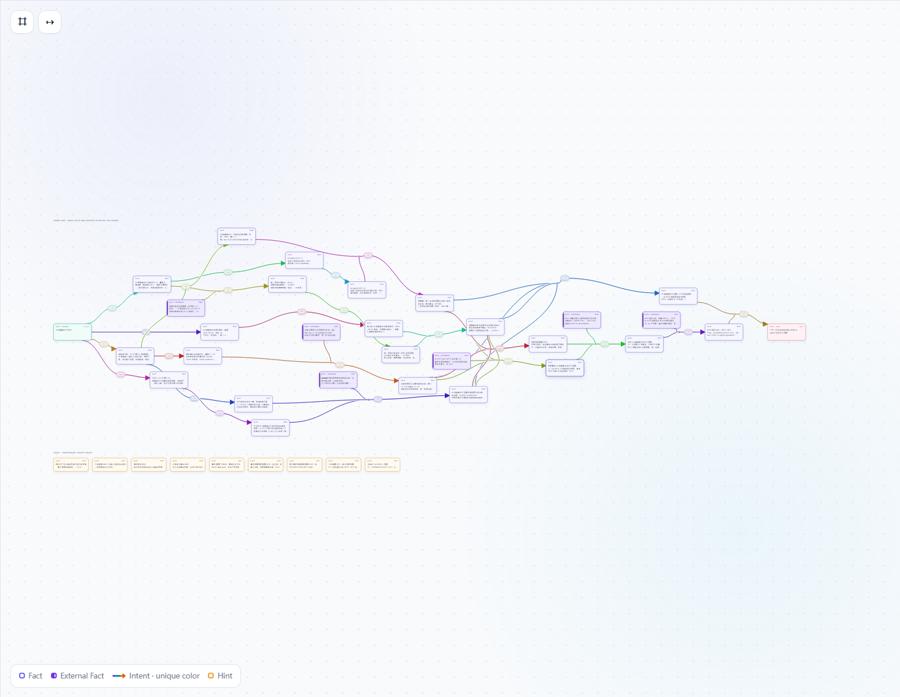

# Peak

Peak 是 HTTP 原生的分布式图（Graph）Agent 运行时。每个 **Project** 拥有一个独立的 UUID Graph 分片（SQLite + 内容寻址 Artifact）；Project 之间通过不可变 **`FactRef`** 超链接节点组成证明链，每个节点包含 `projectId`、`id` 与源 Fact 的规范 `description`。Graph 与 HTTP Server 绑定，其 API 是唯一在线 Graph 协议。内置 Web UI 是可选的展示客户端，不是 Graph 依赖。



运行时要求：Node.js `>=22.19.0`（ESM）。

## 核心概念

- **Board** —— 包含 `task.json` 的目录：Project 集合与共享运行配置。它自身没有 Goal、Graph 或完成状态。
- **Project** —— 一张持久化 Graph（`origin` 与 `goal` 两个保留 Fact，加上由 Facts/Intents/Hints 组成的证明 DAG）。Fact 不可变；Plan AI 自主判断证明 DAG 应如何分支、深化、合并或完成。
- **Plan / Supervise / Execute / Finalize** —— 固定运行单元。Plan 决定下一步 Intent（或完成）；Supervise 审计并可每轮提交一个 Hint；Execute 执行一个原子 Intent 并产出恰好一个 Fact；Finalize 对失败的 Execute 恢复一次。
- **Artifact** —— Worker 不写文件、不分配 workspace。当 Fact 需要详细证据时，Execute 在合同内联返回文件内容；Runtime 将其作为内容寻址 Artifact 存储。完成时，交付类 Artifact 会物化到 Project shard 的 `out/` 目录。
- **Federation** —— 同 scope 的已注册 Project 交换当前叶 `FactRef`；目标只持久化超链接节点，绝不复制源 Fact 实体或 Artifact。

## 快速开始

```bash
npm install
npm run build

peak init ./my-board            # 脚手架一个带空 task.json 的 Board
peak run ./my-board             # 创建/附加 Project 并运行 Plan/Supervise/Execute
peak serve                      # 只提供持久化 Graph API + Web UI，不启动 Worker
```

运行前请配置并鉴权 `opencode`、`codex`、`pi` 或 `claude-code` 中的一种。完整使用说明见 docs 目录。

## 文档

用户指南（English / 中文）：

- [`docs/zh/usage.md`](docs/zh/usage.md) —— 中文使用指南：快速开始、Board 配置、CLI 参考、Web UI、示例。
- [`docs/en/usage.md`](docs/en/usage.md) —— English usage guide: quick start, Board configuration, CLI reference, Web UI, examples.

参考与贡献者文档（按语言分 `docs/zh/` 与 `docs/en/`，内容分开发与用法 / 架构 / 数据流三类，索引见 [`docs/README.md`](docs/README.md)）：

- [`docs/zh/architecture.md`](docs/zh/architecture.md) —— 架构说明：设计目标、模块职责、Graph 模型、Runtime 阶段、调度、Worker、Federation、CLI、Web UI、安全。
- [`docs/zh/data-flow.md`](docs/zh/data-flow.md) —— 数据流说明：数据模型与不变量、持久化布局、HTTP API、任务协议 JSON 合同、Board 配置 schema、端到端数据流。
- [`docs/zh/development.md`](docs/zh/development.md) —— 构建、测试与发布工作流（中文）。
- [`docs/en/development.md`](docs/en/development.md) —— build, test, and release workflow.
- [`AGENTS.md`](AGENTS.md) —— 源码布局与贡献者不可越界的边界。

## License

GPL-3.0 —— 见 [`LICENSE`](LICENSE)。
