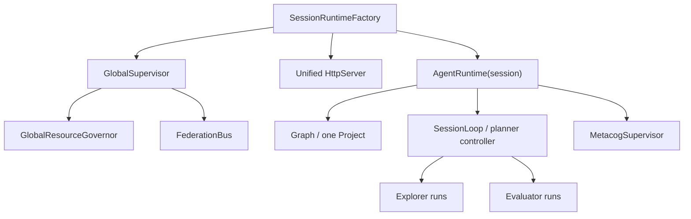
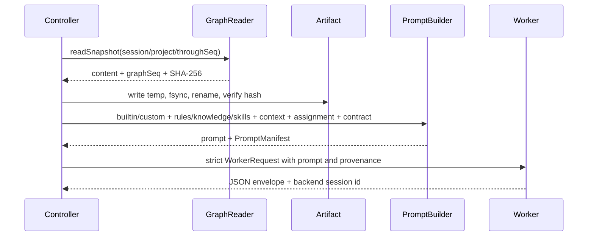

# Session 时序、角色协同、跨 Session 与 Prompt 注入审计

> 当前实现复核，2026-07-16。本文只描述当前工作树；目标和后续顺序见 [target.md](./target.md) 与 [修改计划](./12-cairn-inspired-generic-graph-agent-plan.md)。

## 1. 对象所有权与生命周期



创建顺序是 Graph → SessionLoop/planner → Metacog → Project → supervisor membership → optional HTTP binding。注册失败时 federation membership 会回滚；相同 binding 重复设置是幂等的。

关闭是单向操作：runtime 先标记 closed 并 abort idle/run 等待，再从 supervisor/federation 和 HTTP 注销、abort 并等待 SessionLoop/Metacog 的 in-flight worker，停止 HTTP，最后关闭 Graph。所有启动/执行入口在关闭开始后立即拒绝。factory 关闭统一 HTTP 和所有 runtime；只有 factory 自建的 supervisor/bus 由 factory 终结。

## 2. 单次调度的真实顺序

```text
SessionLoop.step(project)
  1. validate project is active and recover persistent coordinator cursors
  2. renew/reclaim expired Run and Intent leases
  3. consume directives and cancellation state
  4. process federation deliveries through evaluator
  5. evaluate candidate Facts
  6. run metacog triggers/final review and persist outbox
  7. run planner when graph events/cooldown permit
  8. atomically apply planner decisions and dispatch requests
  9. claim and launch eligible explorers under profile/global permits
 10. re-check terminal state and TaskGroup barrier
```

外部 worker I/O 不在 project mutex 内执行。角色先持久 claim/owner/leaseEpoch，再释放短锁执行，提交时用 fencing CAS 校验 owner 仍有效。pause/stop/lease-loss 会通过 AbortSignal 撤销相关 worker。

## 3. 不同角色如何判定开始与结束

| 角色 | 开始 | 结束与可见证据 |
|---|---|---|
| planner | 初始无计划、Graph event/hint/directive/verdict 或结束复核，且 cooldown 满足 | planner Run terminal；decision 已原子写回；EndFact 仅是 finish-ready 提议 |
| explorer | Intent 为 open、`dispatchRequested=true`、profile 有配额且 claim 成功 | candidate Fact、Intent terminal、Run terminal 在一次 fenced commit 中完成 |
| evaluator | 本地 candidate Fact 或待处理 broadcast delivery | Fact 状态或 delivery 状态与 Evaluator Run terminal 原子提交 |
| metacog | pass Fact、步/时间/停滞 trigger、planner 结束前 final review | Hint/outbox 与 Metacog Run terminal 原子提交；trigger cursor 持久化 |

Run 的 `ownerId + attempt + leaseEpoch + heartbeatAt + expiresAt` 是“角色是否仍在运行”的判据，不能仅以进程内 Promise 或 status 字符串判断。过期 owner 可重领，旧 owner 的迟到结果因 epoch 不匹配被丢弃。

## 4. Prompt 注入保证

每一次角色调用都走同一链路：



Run 保存 artifact、graph seq、PromptManifest、最终 prompt hash 和 backend session id。因此可以证明某个角色在某次执行中实际收到哪一版 task prompt、领域知识和 Graph 快照。

每次 Run 都读取完整 Graph snapshot 并物化为自包含 artifact；不维护跨 Run 的外部 session 或 delta checkpoint。

## 5. 跨 session 分析与 TaskGroup

session Graph 之间不互写。pass Fact/dead-end/condition/summary 经本地 outbox 发布到持久 FederationBus；目标 session 创建 delivery，由自身 Evaluator 判断 relevant/irrelevant/condition_satisfied。广播只能补充本地判断，不能直接成为 pass Fact。

`federation.scope` 是 TaskGroup 身份。未配置时 scope=session id，两个无关 session 永不共享完成屏障。显式相同 scope 时，成员增减会提升 generation，旧 generation 的完成 CAS 失效。

组完成要求所有 planner 已 finish-ready、final metacog/outbox 完成、无 pending/failed delivery、所有 cursor 到稳定 head，并在事务中再次验证 generation。任何新广播或成员变化都会使静默条件失效。

## 6. 死锁、活锁与关闭结论

当前核心路径没有发现互斥锁顺序环：worker I/O 已移出短锁；Graph/Federation 事务不跨库嵌套；GlobalResourceGovernor 的 FIFO waiter 在 abort 时移除并在 finally 单次释放 permit。

已修复的活性缺陷包括：

- supervisor 模式的 idle `AgentRuntime.run()` 在 close 后永久轮询；现由关闭信号立即中断；
- broadcast evaluator 的 poison delivery 无限重试；现按 profile retry 上限显式失败 session；
- HTTP 端口占用未 reject、HTTP binding 生命周期不清晰；
- runtime 关闭前直接关闭 SQLite，导致迟到 worker 写入 closed DB；
- 未配置 scope 的所有 session 被放进同一个默认 TaskGroup。

无法由核心代码替第三方消除的风险：自定义 WorkerPool 若忽略 AbortSignal 且永不 settle，安全 shutdown 只能等待它；官方 Node backend 会传播 signal 并终止进程树。当前全局 permit 只覆盖单 Node 进程，多进程部署需要外部 permit/lease。

## 7. 剩余高优先级

1. SQLite/outbox/delivery/artifact 每个提交点的 crash/reopen 故障矩阵。
2. 常驻 daemon 自动恢复 session registry、HTTP binding 和 TaskGroup owner。
3. Linux/macOS 真实进程树取消证据。
4. runtime 创建在 Project 已持久化但 supervisor/HTTP 注册失败时的幂等恢复策略。
