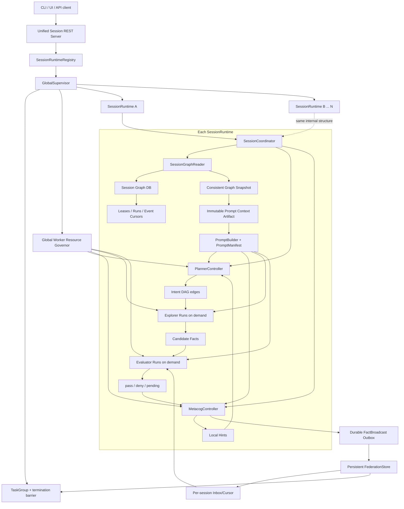
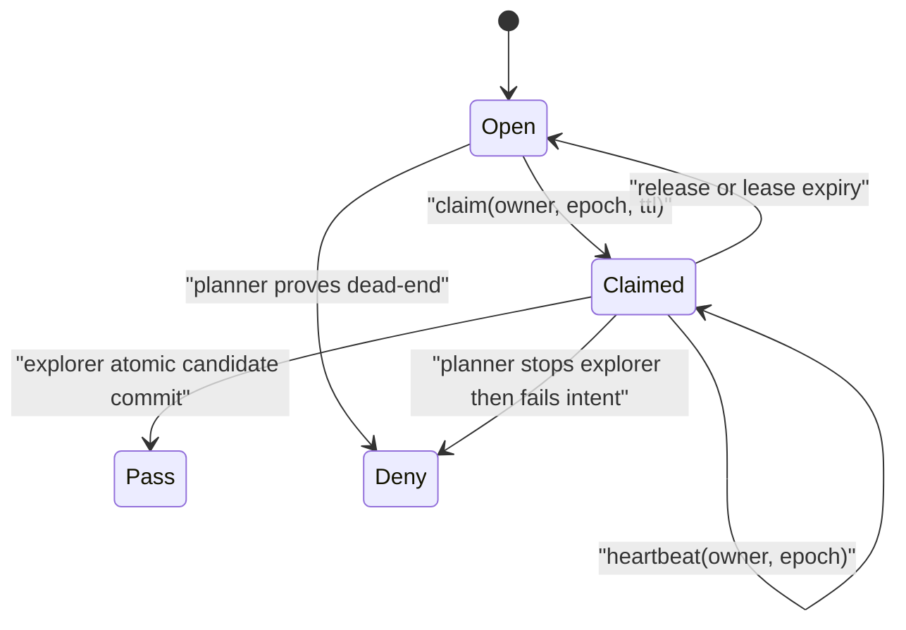
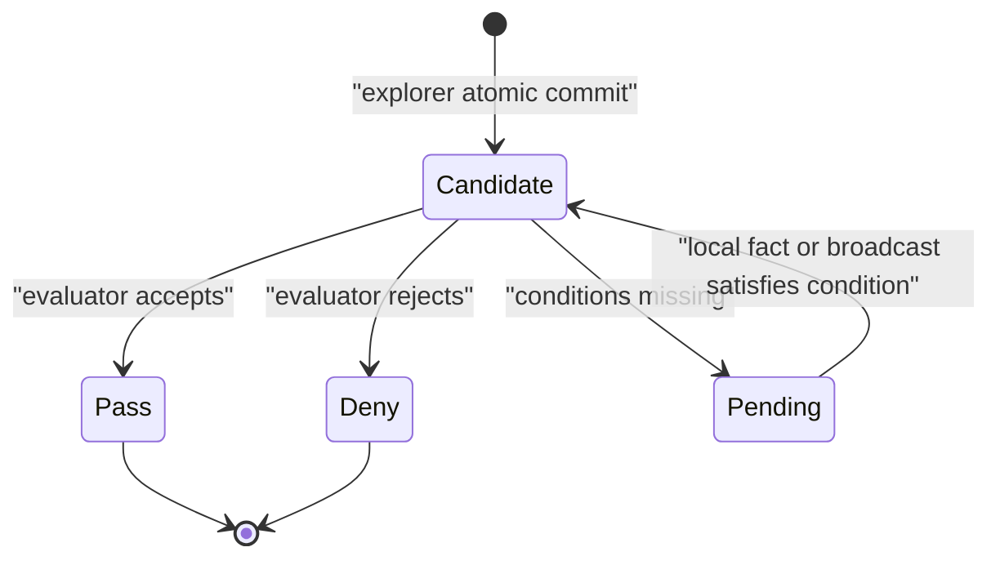
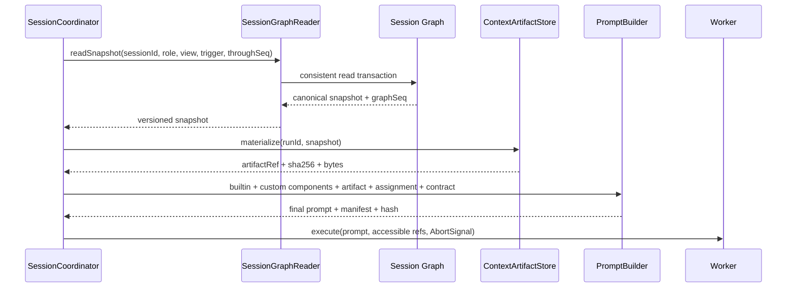
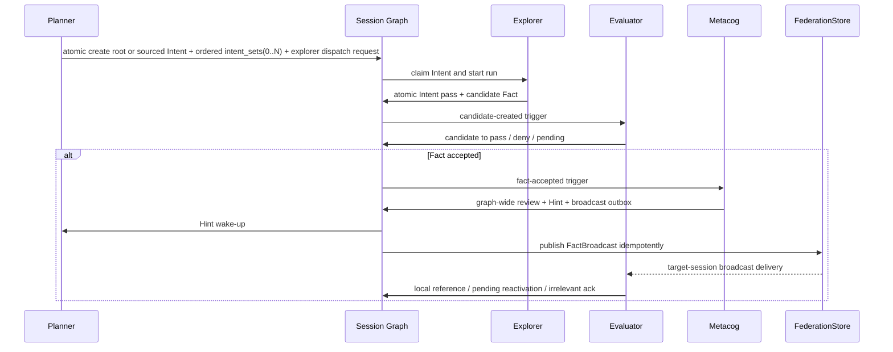
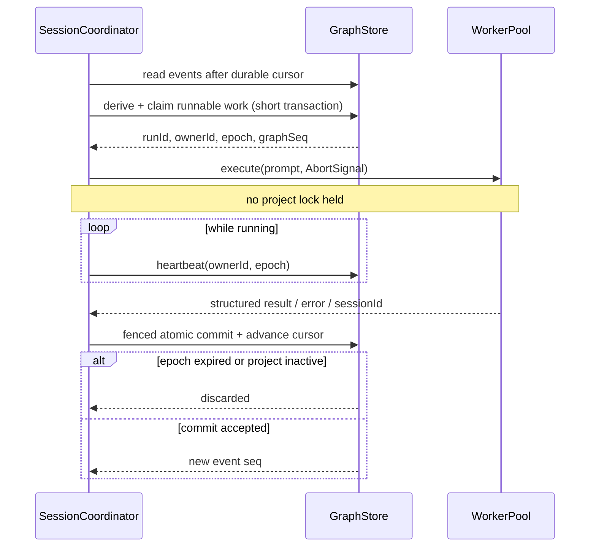

# 参考 Cairn 的通用图结构分析 Agent 修改计划

> 日期：2026-07-16
> 范围：`peak` 当前工作树与 `oritera/Cairn` commit `2b86fba0fb11d3aac569cdd9a9c4e767d3322863`
> 目标：借鉴 Cairn 的状态空间搜索与调度协议，形成跨平台、非渗透测试专用、可恢复的通用图结构分析 Agent。
> 目标状态规范：[target.md](./target.md)。当本文与目标状态描述冲突时，以 `target.md` 为准。
> 修订：已按 `target.md` 2026-07-16 最新版完成第二次对齐。当前工作树已接通统一 session/TaskGroup REST read model、Graph 上下文文件物化与 PromptBuilder 注入链路、`intent_sets` canonical read，以及带 generation/成员终态的 TaskGroup 完成屏障；真实 OpenCode 端到端任务已验证 Run provenance。第 1.2 节是滚动进度账本；第 10 节同时保留已完成项和产品化余项，不能仅凭阶段标题推断实现状态。
>
> **第一版收敛说明：** 本文保留的 worker session reuse、delta ContextCheckpoint、fact tiering 与 SSE 方案已被最新 `target.md` 和实现取代。正式实现固定为“每次 Run 完整 snapshot artifact”与全 POST API；这些历史条目不再是待办。
> **数据库与角色边界：** 本文保留的 `:memory:`、`LocalSessionGraphReader`、inline context 和角色 `get_graph` 描述同样已废弃。正式实现只使用持久 SQLite；server 生成输入 JSON，角色读取引用并输出 JSON，只有 metacog 保留显式 `get_graph`。

## 1. 结论

`peak` 不应改成 Cairn 的 TypeScript 复刻。正确方向是：

1. 保留 `peak` 已有的图、验证、profile、权限和 Node worker 基础，并把目标中的 `supervisor + 每 session 四角色` 固化为控制协议。
2. 吸收 Cairn 的协议边界：图是唯一真相源；执行器只接收 prompt 并返回结构化结果；调度器先持久化 claim，再执行，最后以原子事务提交结果。
3. 用持久化事件游标、owner lease、fencing token 和 `AbortSignal`，替换当前的内存唤醒状态、整步持锁和构造时直接回收所有 running run。
4. `planner / explorer / evaluator / metacog` 是稳定的 session 角色和能力边界；profile 负责配置每个角色的 prompt、模型、worker 和策略，领域语义仍不得写死在源码。
5. session 创建时初始化本地 Graph、planner controller 和 metacog controller；explorer/evaluator 是按 Intent、candidate Fact 或广播动态创建的短生命周期 SubagentRun。
6. Fact 明确使用 `candidate → pass/deny/pending`；其中 `pending` 只表示 evaluator 已审但条件未齐，不能再兼任“尚未审查”。
7. Server 是按 session 暴露 Graph 只读视图、控制指令和 UI 聚合状态的统一边界，不是新的真相源。每次角色请求前由 controller 取得一致性 Graph 快照，以 Node 原子文件操作物化为不可变上下文 artifact，再由 PromptBuilder 组合标准 prompt、定制 prompt、artifact 引用/内容和输出合同。
8. Intent 是有向超边：首轮/根 Intent 可以没有 parent；一旦 planner 以一个或多个 pass Fact 作为 parent，就必须在 `intent_sets` 中显式、有序记录全部来源。parent 集合与 Intent 创建必须原子提交，不能靠 description 或事后推断。
9. 每个 pass Fact 都持久化触发 metacog；metacog 整体纠偏后通过 outbox 广播；其他 session 的 evaluator 消费广播，但广播不能绕过本地验证直接成为 pass Fact。
10. session planner 只能提出本 session 结束；关联 session 组只有在所有 planner 都提出结束、所有 metacog/broadcast 已落盘、所有成员已消费到同一广播水位后，才由 supervisor 完成分布式静默确认。
11. 一个 session 只承载一个 task、一个 session-local Graph 数据库、一个 planner controller 和一个 metacog controller。若同一用户目标需要并行分析多个子任务，由 supervisor 创建多个关联 session；不得在一个 session 中复用多个 Project 来模拟跨 session。

原始第一优先级不是添加更多 agent，而是先把图协议、执行所有权、唤醒和恢复语义做成持久化状态机；当前工作树已经形成这层基础。最新版目标要求的统一 Server/context artifact、`intent_sets` canonical read 和 TaskGroup generation 已完成核心实现。后续优先级应转向逐提交点故障注入、token-budget context rotation、daemon 恢复入口与 Linux/macOS 真实进程取消证据，不能继续横向增加角色或文件来掩盖这些耐久性缺口。

### 1.1 最新 `target.md` 对计划的约束

| 目标描述 | 计划中的不可变约束 | 验收证据 |
| --- | --- | --- |
| supervisor 分派 session | session 必须由统一 factory/composition root 创建并注册，supervisor 不接管 session-local 图写入 | 创建两个关联 session 后，各自只有一个 task/Graph，且能被全局配额与完成屏障统一调度 |
| 每个 session 初始化 planner、metacog 和图数据库 | planner/metacog 是 session 生命周期 controller；explorer/evaluator 是事件触发的短生命周期 run | session 创建测试可观察四项绑定：task、Graph、planner profile、metacog profile |
| Server 按 session 提供统一 REST Graph 访问 | 一个 server 维护 `sessionId → SessionRuntime/GraphReader` 注册表；所有读请求显式带 session，角色 mutation 仍只能走 contract + permission + fenced Graph API | 同一 server 注册两个 session 后可独立查询 snapshot/events/runs；不存在跨 session 串读，REST 与本地 reader 对同一 graph seq 产生相同规范快照 |
| planner 请求前查询、落地文件并注入 PromptBuilder | “planner 调用”指 planner controller 在 worker 请求前调用 `SessionGraphReader`，不是给模型开放 REST 工具；快照以原子写入形成不可变 artifact，并把 path/ref、graph seq、SHA-256 和注入方式写入 PromptManifest | 任意 planner run 可从 Run 记录定位 artifact 并校验内容 hash；直接 API worker 即使不能读本地路径也通过 inline 内容获得同一快照 |
| planner 创建 Intent 并启动 explorer | `create_intent` 与 `create_subagent_explorer` 是两个显式、可审计动作；Intent 不因“存在 open 状态”而被隐式视为已获 planner 派发许可 | 未产生 dispatch request 的 open Intent 不启动；同一 Intent 并发派发只能产生一个有效 owner epoch |
| 固定四角色能力 | profile 可以缩小权限、替换 prompt/model/worker/知识/skill，但不能改变 `planner/explorer/evaluator/metacog` 协议或扩大角色 capability 上限 | config loader 与所有写回路径均有越权反例测试 |
| Intent/Fact/`intent_sets` | Intent 是有向超边，Fact 是节点；`intent_sets` 是来源集合的 canonical storage；根 Intent 可为空 source，非根 Intent 只能引用本 session 同 task 的 pass Fact | InMemory 与 SQLite 运行同一状态迁移/事务回滚测试；REST/FederatedGraph 也按 `ordinal` 从 `intent_sets` 还原，不再读取 JSON 副本 |
| 全部 planner 结束且无广播后结束 | EndFact 只是单 session planner 的结束提议；TaskGroup 完成还要求 final metacog、outbox/delivery 清空、所有 cursor 到同一 head，并在事务前后双检 | 双 session crash/resume 测试证明不会漏广播或提前完成 |
| UI 绘制统一图状态 | UI 只消费 server 的 session/task-group read model；不自行直读多个 SQLite，也不把跨 session 广播伪装成本地 Fact/Intent 边 | 一个页面可选择 task group/session 并展示各自 DAG、角色 run 与广播水位；不可信 graph 文本均按文本转义 |

这里把 `target.md` 中“无 fact 广播”解释为可判定的持久化条件，而不是某个瞬间内存队列恰好为空。即：本组没有未发布 outbox、未完成 delivery，且每个成员的消费 cursor 都等于同一稳定 broadcast head。

### 1.2 当前实施基线与剩余顺序

本节是滚动进度账本；第 3.2 节保留的是最初审计时的缺陷证据，不能再直接当成当前工作树状态。

| 目标能力 | 2026-07-16 当前实现 | 仍需完成/持续验收 |
| --- | --- | --- |
| 四角色与 capability 上限 | 固定 `planner/explorer/evaluator/metacog` 协议角色、输出 contract 和 capability 上限；profile/agent patch 只能缩权。planner 的 `stop_subagent_explorer` 已是显式结构化动作 | 继续补充每个 capability 的负向合同测试；领域语义不得进入核心角色实现 |
| Intent/Fact/`intent_sets`/EndFact | 四态 Fact、四态 Intent、有序多 parent、原子 Explorer/Evaluator 写回与 provisional EndFact 已落地。Intent 只写 `intent_sets`；SQLite Graph、FederatedGraph、REST snapshot 和 Prompt context 均按 `ordinal` 从它读取。Graph/Federation DB 以各自 `application_id + user_version=1` 标识第一版正式 schema，不包含替代来源编码或 schema 回填；已有用户表但标识不匹配时在建表前拒绝打开 | 补逐 SQL 故障注入矩阵，证明多 parent 与角色结果原子提交在每个失败点均全有或全无 |
| planner 显式启动 Explorer | `dispatchRequested` 区分创建与派发；`dispatchKey` 去重逻辑执行，Run/Intent 双 lease 阻止两个 SQLite coordinator 重复执行或旧结果写回；stop 会持久撤销远端 lease | 进一步把 dispatch trigger seq 固化为独立 coordinator cursor，可提升审计可读性；当前正确性已不依赖进程内 inbox |
| session 与 workspace | `SessionRuntimeFactory` 通过共享 supervisor 一次创建并注册独立 `AgentRuntime`、Graph、唯一 Project、planner profile、metacog controller、workspace 和 federation membership；`run`/`resume` 复用同一组合根和 governor。持久 runtime 在构造前必须确定 session，task/options 身份冲突直接拒绝；关闭会中断 supervisor idle loop并等待角色退出后关闭 Graph | 若做常驻服务，仍需在 daemon/API 暴露 factory 的创建、恢复、移除和所有权观测接口；补 Project 已持久化但外层注册失败的幂等恢复协议 |
| Prompt/知识/规则/skill 注入 | 四角色统一生成完整 `PromptManifest`：builtin/定制 instructions/rule/knowledge/skill、graph-context artifact、assignment 与 output-contract 分组件记录；Run 保存 graph seq、artifact/final prompt SHA-256 和 backend session id，即使未启用 session reuse 也保留审计 id。真实 OpenCode planner 任务已验证该链路 | 用 canonical serializer 替换 `JSON.stringify(config)` 生成 task-config 指纹并补三平台同 bundle 指纹测试；实现真正的 token-budget rotate/new-session/`rotateOf` 闭环 |
| 统一 Server 与 Graph context artifact | `SessionRuntimeFactory` 拥有单一 `HttpServer` 与 session registry；提供 sessions/task-groups/snapshot/facts/intents/end-facts/runs/events/directives read/control model。Server/HTTP reader 共享规范 snapshot；所有角色在 worker 前物化不可变 JSON artifact，只注入文件引用，合法输出也先落地 JSON。Dashboard 按 Session/TaskGroup 展示 DAG、Run、EndFact 和广播水位 | 常驻 daemon 仍需从磁盘恢复 registry，而不只是恢复 Graph/Bus；补 artifact 各写入点 crash、HTTP 截断/hash 不匹配和符号链接逃逸测试 |
| 跨 session federation | 一等 `federation_groups`/`federation_group_members` 保存 generation 和 `expected/active/left/completed` 状态；预声明成员未启动会阻塞完成，动态增员/离组提升 generation 并重置 readiness，runtime 注销保留成员与 project ref，旧 generation 的完成 CAS 失败。未配置 scope 时用 session id 隔离；广播只由目标 evaluator 评估，poison delivery 达 retry 上限会显式失败而非活锁 | 补 publish/outbox/delivery/ack 每个事务边界的 crash 矩阵和 daemon 运维恢复；若扩展为多进程 supervisor，还需数据库/外部资源 permit 与 group owner lease |
| 短锁与取消 | worker I/O 已移出 project lock；所有 worker/provider/backend 传播 `AbortSignal`；stop/pause/lease-loss 会撤销持久 lease 并终止关联进程树；prompt 只走 stdin/HTTP body | 在 Linux/macOS CI 增加 TERM→KILL 与 process-group descendant 实测，形成三平台证据而不只依赖 Windows 回归 |
| lease/fencing | Planner/Explorer/Evaluator/Metacog 全部使用持久 `ownerId + attempt + leaseEpoch + heartbeat`；claim、heartbeat、atomic commit 与 terminal update 均有 CAS；过期 owner 可重领且 stale result 为 `discarded` | 增加每个角色在 spawn 前、执行中、commit 前的逐点 kill/restart 测试；目前已有双 coordinator、过期 reclaim 和远端 stop 关键路径 |
| 唤醒/重试/cooldown | `SessionCoordinator` 从 Graph event 重建 planner verdict cursor、broadcast wake、失败计数、cooldown 和 retry backoff；profile `retry` 已替代硬编码阈值 | 若未来拆出独立 scheduler 进程，应把 trigger/observed seq 直接展示为一等观测字段 |
| worker session reuse | backend 首次 session id、event-seq ContextCheckpoint、PromptManifest/task config 兼容指纹均持久化；DB 重开后能继续同一外部 session，配置不兼容时强制 full sync；OpenCode 1.17.18 真实调用已验证 session id 与 provenance 落盘 | 完成 token-based rotate/new-session/`rotateOf` 闭环；补 OpenCode resume 和 Claude CLI 可用环境下的真实 resume 集成测试 |
| 全局资源 | `GlobalResourceGovernor` 在 `WorkerPool.execute` 层提供共享 FIFO permit，限制的是四角色真实 worker 调用而不是 session tick；profile `maxActive` 和 `runtime.workers` 已参与调度 | 若需要多进程共享硬配额，还需外部/数据库 permit；per-worker 权重和公平性仍是扩展项 |
| 领域案例 | 已有单 App/单 session、两个不同 App/双 session、idea 深入分析、真实 workspace 需求实现四条验收；原单 App 双 session 案例另有 SQLite/FederationBus 全部关闭重开路径 | 继续扩展为表驱动的每关键提交点故障矩阵；若需要跨 session 的领域中性案例，可在现有 idea fixture 上拆分验证 |

当前 `target.md` 的主闭环已经形成：固定四角色、session-local Graph、显式 Intent 派发、Fact 验证门、`intent_sets` 超边、metacog 广播、TaskGroup generation 静默完成，以及“Graph snapshot → context artifact → PromptBuilder → Run provenance”均有实现与自动验收。2026-07-16 的验证基线为 `typecheck`、409/409 自动测试、CLI smoke、npm pack（SHA-256 `45c1f8ad17d1f62cac6751cf113124f08002e7eec46e3d1f19233d82c368ec20`）和真实 OpenCode 1.17.18 planner 合同任务。剩余工作集中在故障矩阵、token rotation、daemon/多进程所有权和三平台 CI，不再把统一 Server、artifact 或 generation 列为未实现项。

## 2. Cairn 中真正值得参考的机制

Cairn 的公开定位同样不是固定渗透测试工作流，而是从 origin 到 goal 的未知状态空间搜索。其最小黑板由 Fact、Intent、Hint 组成；Intent 从一个或多个 Fact 出发，完成后指向一个新 Fact。Worker 不直接通信，通过共享图形成 stigmergy。[Cairn README](https://github.com/oritera/Cairn/blob/2b86fba0fb11d3aac569cdd9a9c4e767d3322863/README.md)

### 2.1 应吸收

| Cairn 机制 | 实际实现 | 对 `peak` 的价值 |
| --- | --- | --- |
| 最小事实图 | `facts`、`intents`、`intent_sources`；Intent 是从一个或多个已知 Fact 到一个新 Fact 的有向超边 | `peak` 以显式 `intent_sets` 对齐这一输入集合语义，无需先改造成任意 property graph；Fact–Intent 二部图足以承载第一版通用状态空间搜索 |
| 调度与执行分离 | Server 保存协议状态；Dispatcher 是控制面；Worker 只执行 prompt | 收紧 worker 权限，所有图写入必须经过 contract、permission 和 CAS/transaction |
| 动态任务 | 固定的是 `bootstrap/reason/explore` 协议动作，不是固定领域专家 | `peak` 固化四角色能力边界，但每个角色何时运行由当前图事件决定，领域能力仍来自 profile |
| claim + heartbeat | Intent lease 与项目级 reason lease 都先 claim、执行中续约、丢 lease 后终止进程 | 解决跨进程重复执行、stale output 写回和“某角色到底是否仍在运行”的判定 |
| 原子 conclude | conclude 在一个数据库事务中新增 Fact 并结束 Intent | `peak` 的 explorer 结果、run 状态和事件应一次提交，而不是多次独立写入 |
| conclude fallback | execute 超时或不可解析时，在同一 worker session 注入 conclude prompt，只总结已经确认的增量事实 | `peak` 已有雏形，应补齐 session 持久化、超时触发、取消优先级和 prompt provenance |
| 硬停止 | 项目非 active 后取消本地任务；lease 丢失会 kill 已关联进程 | stop/pause 必须真正传播到 worker，不能只改 Graph 状态后等待调用自然返回 |

对应源码依据：

- 调度选择与项目/worker 并发：[dispatcher scheduler](https://github.com/oritera/Cairn/blob/2b86fba0fb11d3aac569cdd9a9c4e767d3322863/cairn/src/cairn/dispatcher/scheduler/loop.py)
- Intent 原子 conclude：[intents router](https://github.com/oritera/Cairn/blob/2b86fba0fb11d3aac569cdd9a9c4e767d3322863/cairn/src/cairn/server/routers/intents.py)
- Intent 多来源关系：[database schema](https://github.com/oritera/Cairn/blob/2b86fba0fb11d3aac569cdd9a9c4e767d3322863/cairn/src/cairn/server/db.py) 与 [Intent model assembly](https://github.com/oritera/Cairn/blob/2b86fba0fb11d3aac569cdd9a9c4e767d3322863/cairn/src/cairn/server/services.py)
- reason lease、complete 与 reopen：[projects router](https://github.com/oritera/Cairn/blob/2b86fba0fb11d3aac569cdd9a9c4e767d3322863/cairn/src/cairn/server/routers/projects.py)
- 心跳丢失后停止进程：[heartbeat runtime](https://github.com/oritera/Cairn/blob/2b86fba0fb11d3aac569cdd9a9c4e767d3322863/cairn/src/cairn/dispatcher/runtime/heartbeat.py)
- 同 session conclude 指令：[explore prompt](https://github.com/oritera/Cairn/blob/2b86fba0fb11d3aac569cdd9a9c4e767d3322863/cairn/src/cairn/dispatcher/prompts/default/explore.md) 与 [conclude prompt](https://github.com/oritera/Cairn/blob/2b86fba0fb11d3aac569cdd9a9c4e767d3322863/cairn/src/cairn/dispatcher/prompts/default/explore_conclude.md)

### 2.2 不应照搬

| Cairn 当前限制 | 为什么不复制 |
| --- | --- |
| `reason_checkpoints` 只在 Dispatcher 内存中 | restart 后可能把当前计数当成新基线，错过 crash 前尚未消费的新事实或 Hint；`peak` 需要持久化 event cursor |
| 明确只支持单 Dispatcher | 不满足 `peak` 的跨 session、多个 runtime 或两个进程同时 resume 的目标 |
| exploration 输出直接成为 Fact | 通用代码/资料分析中，模型输出不能默认等于客观事实；保留 `peak` 的 candidate + evaluator/verification gate |
| `bootstrap` 通过特殊 description/creator 约定保留 Intent | 把控制协议编码进普通业务 description，容易冲突；session 初始化应使用明确的 planner/metacog role lane |
| 固定 `bootstrap/reason/explore` 实现分支 | 可以保留这些协议概念，但不能把具体 profile 名、领域 prompt 或 worker 写死在 SessionLoop |
| prompt 使用简单字符串替换 | 无来源、hash、版本和缺失占位符校验，不能证明特定 task prompt 已被完整注入 |
| complete/reopen 删除旧 goal 边 | 会丢失“曾经错误完成”的历史；`peak` 应保留 superseded completion 和纠错事件 |
| 容器、Linux/macOS、危险 bypass flag | `peak` 的基础运行时应由 Node 原生 `fs/path/os/child_process/AbortController` 完成；容器只是可选 worker backend |
| 渗透测试/CTF 示例与“不得拒绝”措辞 | 不是通用机制，也不适合作为默认系统协议；领域策略必须留在 task/profile 配置 |

Cairn 的 dispatcher 设计文档也直接声明当前只按单 Dispatcher 设计与测试，并指出 Intent 只保存当前 worker、没有 worker history。[Dispatcher design](https://github.com/oritera/Cairn/blob/2b86fba0fb11d3aac569cdd9a9c4e767d3322863/docs/specs/dispatcher-design.md)

## 3. `peak` 当前基础与主要差距

### 3.1 已有基础

`peak` 已经具备比 Cairn 更适合通用分析的若干基础：session-local Graph、候选事实验证、多 parent Intent、profile prompt/context/permissions/output contract、SubagentRun、Node worker backend、session-local planner/metacog，以及只读 federation 概念。

目标状态要求把当前 Fact 状态拆清楚：

```ts
type FactStatus = "candidate" | "pass" | "deny" | "pending";
```

- `candidate`：explorer 刚提交，尚未被 evaluator 审查；
- `pass`：evaluator 采纳，可作为新 Intent 的 parent；
- `deny`：evaluator 否决，不能继续扩展；
- `pending`：evaluator 已审查，但仍缺少明确的 `requiredConditions`，等待本地新 Fact 或 federation 广播后重新进入 `candidate` 复审。

当前实现已经把初始 `candidate` 与评价后的 `pending` 分开，Graph API 不再复用同一状态表达两种阶段。

最新目标还明确要求 `intent_sets`。这里将它定义为 Intent 超边的输入集合，而不是新的运行状态：

```text
pass Fact A ─┐
             ├─ Intent I ─→ candidate Fact C
pass Fact B ─┘
```

`intent_sets` 至少保存 `project_id, intent_id, fact_id, ordinal`。`ordinal` 明确保留 planner 提交 parent 的顺序，避免像 Cairn 那样依赖 SQLite `rowid` 恢复输入顺序。约束如下：

- 首轮/根 Intent 允许 `parentFactIds = []`，此时不写 `intent_sets` 行，不伪造 origin Fact；
- 当 parent 数量为 1..N 时，每个 parent 都必须有且仅有一条 `intent_sets` 记录；重复 `fact_id` 直接拒绝，不静默归一化；
- source Fact 必须属于同一 session/project 且状态为 `pass`，candidate/pending/deny 与 federation 外部引用均不能直接成为 parent；
- Intent 与全部 `intent_sets` 行在同一事务创建，任何一行校验失败则整体回滚；
- explorer conclude 只能为该 Intent 新建一个 candidate Fact，不能把已有 ancestor Fact 设为输出；配合 Fact 不可变 ID，可按构造保证 DAG 无环；
- source 集合创建后不可原地改写。planner 若要更换前提，应 fail/supersede 原 Intent 并创建新 Intent，保留审计历史。

因此第一版不需要引入任意 `Node/Edge` schema。当前 `Fact` 节点、`Intent + intent_sets` 超边、`Hint` 外部输入已经能表达：

```text
pass Fact --Intent--> candidate Fact --Evaluator--> pass / deny / pending
```

只有在出现“同一事实之间需要多种非执行关系，例如 contradicts/supports/derived-from”且无法通过 evidence/ref 描述时，才单独评估通用 Relation；不要把 property graph 作为本轮前置条件。

### 3.2 初始审计发现（保留作问题来源，不代表当前完成度）

以下表格记录制定计划时的代码证据。已修复、部分修复和仍未处理的最新状态，以第 1.2 节进度账本与测试结果为准。

| 问题 | 当前位置 | 后果 |
| --- | --- | --- |
| 早期实现曾让整个 step 在进程内 project lock 中执行并覆盖 worker I/O | 初版审计记录；该锁实现与公开 API 已删除 | stop、Hint、其他调度和同项目恢复不能依赖进程内锁；当前以持久 lease/CAS 和 `AbortSignal` 为安全边界 |
| planner/evaluator verdict 唤醒、失败次数、cooldown 都在内存 Map | [`session-loop.ts`](../src/session/session-loop.ts) | crash/resume 后丢唤醒和 retry 状态，可能错误完成或重复执行 |
| 构造 SessionLoop 时把所有 pending/running run 直接标 failed 并释放 lease | `recoverOrphanedRuns()` | 新进程没有验证 owner lease 是否仍有效，会抢占仍在另一个进程执行的任务 |
| Intent claim 和多步结果提交缺少 fencing token/CAS | [`graph.ts`](../src/graph/graph.ts)、[`sqlite-graph.ts`](../src/graph/sqlite-graph.ts) | lease 过期后的旧 worker 仍可能提交结果；并发 resume 可重复 claim/write |
| Explorer 添加 Fact、conclude Intent、完成 Run 分三步 | `runOneExplorer()` | 任一步崩溃都会留下不一致的 candidate/edge/run 状态 |
| Fact 的初始 candidate 和“条件不足”都使用 `pending` | [`types.ts`](../src/agent/types.ts)、Graph 实现 | evaluator 无法仅凭状态判断 Fact 尚未审查还是等待 federation 条件 |
| stop/stopped 被映射为 `completed`，空工作也自然完成 | `stepLocked()`、`checkTermination()` | “被停止”“没有新想法”“目标已证明”被混成同一语义 |
| profile 宣称任意角色，但 SessionLoop 固定读取 `profiles.explorer/evaluator` | [`types.ts`](../src/agent/types.ts)、[`session-loop.ts`](../src/session/session-loop.ts) | 自定义 profile 实际无法被通用调度；注释中的 `SubagentManager` 不存在 |
| `runtime.workers` 只取第一个，`pickWorker()` 未进入主调度 | [`subagent-runner.ts`](../src/agent/subagent-runner.ts)、[`agent-driver-pool.ts`](../src/worker/agent-driver-pool.ts) | worker 异构选择和 per-worker quota 只是部分实现 |
| `WorkerSessionManager`、`ContextLedger` 都只在内存；runner 没保存首次返回的 `result.sessionId` | [`session-manager.ts`](../src/worker/session-manager.ts)、[`context-ledger.ts`](../src/agent/context-ledger.ts)、[`subagent-runner.ts`](../src/agent/subagent-runner.ts) | `sessionReuse` 首次调用后仍无法可靠 resume；跨 runtime delta 基线丢失 |
| `PromptLoader` 在 SessionLoop 中无 task/agent origin | [`prompt-loader.ts`](../src/config/prompt-loader.ts)、[`task-config.ts`](../src/config/task-config.ts) | task 相对 prompt、agent 相对 prompt 与 builtin prompt 的基准目录混淆，无法审计实际注入内容 |
| Worker API 无 `AbortSignal`，subprocess timeout 只发送一次 SIGTERM | [`worker-runtime.ts`](../src/worker/worker-runtime.ts)、[`subprocess.ts`](../src/worker/backends/subprocess.ts) | stop/lease loss 不能及时取消；Windows 子进程树和 timeout 可能残留 |
| `FederationBus` 是 EventEmitter + 内存数组，GlobalSupervisor 无生产组合入口 | [`federation-bus.ts`](../src/graph/federation-bus.ts)、[`supervisor.ts`](../src/session/supervisor.ts)、[`cli.ts`](../src/cli.ts) | 跨进程和重启后无 federation；单次 CLI run 的 federation 标志通常无 sibling |
| metacog 与广播没有 pass-Fact 逐条持久化触发/确认 | [`metacog-supervisor.ts`](../src/session/metacog-supervisor.ts)、[`session-loop.ts`](../src/session/session-loop.ts) | 无法保证每个采纳 Fact 都经过整体纠偏并广播；结束时也没有 final review barrier |
| evaluator 只读取进程内 sibling insight 快照 | `collectSiblingInsights()` | 没有 broadcast delivery、evaluator run、消费 cursor 与 pending reactivation 的端到端状态 |
| 没有 TaskGroup/EndFact/广播水位终止协议 | [`supervisor.ts`](../src/session/supervisor.ts) | “所有 planner 已结束且无 fact 广播”当前不可判定，也无法抵抗 checking 期间的新广播 |
| npm build 依赖 `rm`/`cp`，Windows spawn 使用 `shell:true` | [`package.json`](../package.json)、[`subprocess.ts`](../src/worker/backends/subprocess.ts) | 与全平台目标冲突；动态 graph/prompt 内容进入 argv 的 backend 还有 shell 注入面 |

更完整的时序证据见 [Session 时序、角色协同、跨 Session 与 Prompt 注入审计](./11-session-timing-federation-and-prompts.md)。

### 3.3 `target.md` 的角色协议映射

四个角色是机制层的稳定 slot，但每个 slot 的领域 prompt、模型和 worker 仍由 profile 配置：

| 角色 | 生命周期 | 触发 | 能力 token |
| --- | --- | --- | --- |
| planner | session 创建时初始化逻辑 controller；按事件产生 planner run | session 初始、Hint、Fact 状态变化、explorer/evaluator 结束、广播处理后、结束复核 | `create_intent`, `fail_intent`, `handle_hint`, `create_subagent_explorer`, `stop_subagent_explorer`, `create_end_fact` |
| explorer | 每个原子 Intent 按需创建 run，结束后销毁执行句柄 | planner 请求启动或 open Intent 被调度 | `handle_intent`, `write_candidate_fact` |
| evaluator | 每个 candidate 或相关 FactBroadcast 按需创建 run | `fact.candidate_created`、`fact.broadcast_received`、pending condition 满足 | `change_fact`, `receive_fact_broadcast` |
| metacog | session 创建时初始化逻辑 controller；按事件产生 metacog run | 每次 `fact.accepted`，以及 session/group 结束屏障前 | `create_hint`, `get_graph`, `send_fact_broadcast` |

这里的“初始化 planner/metacog”不要求常驻一个模型进程。初始化的是 controller、profile 绑定、持久化 cursor 和 lease lane；每一次真正调用模型仍记录为独立 SubagentRun。

为避免状态语义混淆：Intent `pass` 表示 explorer 已完成该原子任务并原子地产生 candidate Fact；Fact `pass` 才表示该结论被采纳。candidate 后续被 deny，不应自动把生产它的 Intent 改成 deny。Intent `deny` 只能由 planner 通过 `fail_intent` 提交；人工/外部控制只能向 planner 注入可审计的 Hint/Directive，不能绕过角色权限直接改 Intent。

Permission 能力映射：

| 当前 token | 目标 token/约束 |
| --- | --- |
| `create_intent`, `fail_intent` | 保留，仅 planner |
| `spawn_subagent` | planner 侧收紧为 `create_subagent_explorer`，必须绑定具体 Intent；evaluator 不暴露给 planner 创建，而由 coordinator 根据 candidate/broadcast/pending-reactivated 事件派发 |
| `cancel_subagent` | 收紧为 `stop_subagent_explorer`；只允许取消本 session、指定 Intent 的 explorer run |
| `write_candidate_fact` | 保留；配合 `handle_intent`，仅 explorer，且必须由原子 conclude API 写入 |
| `resolve_fact` | 重命名/映射为 `change_fact`，仅 evaluator，合法迁移只有 `candidate → pass/deny/pending` |
| `write_hint` | planner 使用 `handle_hint` 消费 Hint；metacog 使用 `create_hint` 创建 Hint，两者分开 |
| `conclude_run` | 替换为 planner-only `create_end_fact`，只产生 provisional EndFact，不直接完成 TaskGroup |
| 无对应项 | 新增 evaluator `receive_fact_broadcast`、metacog `get_graph/send_fact_broadcast`、explorer `handle_intent` |

所有 token 都由 committer 强制执行，不能只写在 prompt 里。`get_graph` 还受 profile 的 GraphView/context policy 限制；拥有它不等于能直接写图。

## 4. 目标架构



控制原则：

1. GlobalSupervisor 只分派/管理 session、全局资源和任务组终止屏障；它不替任何 session 规划 Intent，也不直接修改 session Fact。
2. 一个 supervisor-owned Server 通过 SessionRuntimeRegistry 聚合所有 session 的只读图状态、运行状态、控制指令和 UI read model；它按 session 路由，但不复制 Graph 真相，也不向角色暴露任意 SQL/Graph mutation。
3. 每个 session 是一个独立任务边界，只允许绑定一个 task/Project；创建时由 `SessionRuntimeFactory` 原子初始化 Graph DB、PlannerController、MetacogController 及其 cursor/lease lane，再同时注册给 GlobalSupervisor 与 Server。发现第二个 Project 时应拒绝启动，而不是由循环任意选择 `listProjects()[0]`。
4. session GraphStore 是该 session 的唯一协议真相源；内存对象、HTTP response 和 context artifact 都是带 graph seq/hash 的派生 read model，不能决定是否遗漏工作。
5. Worker 不拥有 Graph，也不能直接调用 mutation API。目标中的“planner 请求前调用 Server”由 planner controller/SessionCoordinator 完成，不能变成模型自由查询 REST 的工具权限。
6. 调度分四段：短事务 claim → 一致性快照与 context artifact 物化 → 无锁 worker I/O → 短事务 fenced commit。
7. 嵌入式控制面使用 server-owned `ServerSessionGraphReader`，daemon/远程 controller 使用 `HttpSessionGraphReader` 调统一 REST；角色层只接收两者生成的同一版本化 JSON 快照引用。
8. 每个写回都携带 `ownerId + epoch`；旧 epoch 的结果只能记录为 discarded，不能改图。
9. task group、session、role controller、intent、run、worker session 是不同身份，不能再用一个 `workerId` 字符串代替全部生命周期。
10. session end proposal 是可审计的 EndFact；task group 的最终结束还必须通过无未处理广播的终止屏障。

### 4.1 执行身份与“角色始终”判定

统一身份：

```text
ExecutionIdentity =
  taskGroupId / sessionId / projectId / role / profileId /
  runId / attempt / ownerId / leaseEpoch / workerName / workerSessionId
```

角色/任务开始的唯一判据：对应 run 以 CAS 从 `pending` 进入 `running`；owner lease 已写入并产生 `run.started` event。worker 进程是否已经 spawn 只是运行细节。

角色/任务结束的唯一判据：run 以 CAS 进入 `completed/failed/cancelled/abandoned/discarded` 之一；terminal event 与图结果在同一事务提交。进程退出但没有 terminal transaction 的 run 仍是未完成，等待 lease expiry/recovery。

`abandoned` 表示 owner 消失；`discarded` 表示结果到达时 fencing token 已过期。它们只是 SubagentRun 终态，不是 Intent 状态，也不应伪装为模型失败。

### 4.2 状态机

Intent 状态：



Intent 协议只持久化 `open/claimed/pass/deny`。stale epoch 返回时被标为 `discarded` 的是 SubagentRun；其结果不能改变 Intent。Intent `deny` 只能由 planner 根据已采纳 Fact 或 Hint 通过 `fail_intent` 提交，explorer 的 transport/model failure 只触发 retry、release 或交还 planner 判断。

Fact 状态：



Session 状态：

```mermaid
stateDiagram-v2
    [*] --> Active
    Active --> Paused: "human/control pause"
    Paused --> Active: "resume + owner recovery"
    Active --> Stopped: "hard stop + cancel"
    Active --> Failed: "non-retryable runtime/protocol failure"
    Active --> Exhausted: "no runnable work, no completion proof"
    Exhausted --> Active: "new Hint/Fact/federated insight"
    Active --> FinishProposed: "planner creates EndFact"
    FinishProposed --> Active: "new local graph activity or relevant broadcast result"
    FinishProposed --> Completed: "task-group quiescence barrier commits"
    Completed --> Active: "reopen; prior EndFact becomes superseded"
```



TaskGroup 状态：

```mermaid
stateDiagram-v2
    [*] --> Running
    Running --> Checking: "all member sessions FinishProposed"
    Checking --> Checking: "new broadcast head; drain deliveries/cursors"
    Checking --> Running: "broadcast evaluation or local activity changes graph"
    Checking --> Completed: "same epoch + outboxes empty + all cursors at head"
```



### 4.3 Server、Graph reader 与文件 artifact 边界

当前 `HttpServer` 直接持有 `SessionRuntimeRegistry` 语义的注册表，由 `SessionRuntimeFactory` 创建一个共享 server 并按 session/task-group 路由。Server 不接受单 Graph 构造回退，也不提供 project-id 路由：

| API | 语义 | 约束 |
| --- | --- | --- |
| `GET /api/sessions` | 列出 session、task group、project、状态与角色绑定 | 不打开/关闭 runtime，不隐式修改成员集合 |
| `GET /api/sessions/:sessionId/graph/snapshot` | 读取版本化 Graph snapshot，可带 `view/maxFacts/throughSeq` | 只读；response 必含 `projectId, graphSeq, schemaVersion, contentHash` |
| `GET /api/sessions/:sessionId/{facts,intents,runs,events}` | UI/诊断分页 read model | Intent sources 必须按 `intent_sets.ordinal` 返回；外部 broadcast 单独表示 |
| `POST /api/sessions/:sessionId/directives` | 人工 stop/pause/resume/hint 等控制 | 仍写 durable Directive 并走 SessionLoop；需要认证/本机边界，不能成为任意 Graph mutation |
| `GET /api/task-groups/:groupId` | 读取成员、broadcast head/cursor、finish readiness | 只聚合状态，不把 sibling Fact 合并进本地 Graph |

角色请求前的固定链路是：



`ContextArtifactStore` 将规范化 snapshot 写到 session state 目录，例如 `artifacts/prompts/<runId>/<graphSeq>-<sha256>.md`。必须使用同目录临时文件、`fsync`（在支持的平台）与原子 rename，成功后才把 artifact metadata 写入 Run；crash 只能留下可清理的临时文件，不能留下被 Run 引用的半文件。artifact 是派生数据，恢复时可按 Graph seq 和 view 重建；它不能反向写 Graph。

文件引用是审计与本地 agent 取数入口，不是唯一传输方式。直接模型 API 无法读取本地路径，因此默认组合应包含 `artifactRef + 内联内容`；只有 backend 明确声明可访问该绝对路径/挂载时，才允许 reference-only。Graph 文本始终标记为不可信数据，不能混入 system/custom instruction 区。

## 5. 数据与 Graph API 修改

### 5.1 持久化字段/表

| 数据 | 最小字段 | 用途 |
| --- | --- | --- |
| `task_groups` | `id, scope, generation, broadcast_head_seq, status` | 关联多个 session；generation 在成员集合变化时递增 |
| `task_group_sessions` | `group_id, session_id, activity_epoch, finish_epoch, end_fact_id, consumed_broadcast_seq` | 每个 session 独立记录本地图活动、planner 结束提议及广播消费水位 |
| `intent_sets` | `project_id, intent_id, fact_id, ordinal`；唯一键 `(project_id, intent_id, fact_id)` 与 `(project_id, intent_id, ordinal)` | 显式保存多 Fact → Intent 的有序输入集合；外键同时约束 Intent 与 Fact 均属于当前 project |
| `session_roles` | `project_id, role, profile_id, cursor_seq, status` | session 创建时初始化 planner/metacog controller；也统一记录四角色绑定 |
| `control_leases` | `project_id, lane, owner_id, epoch, expires_at, heartbeat_at` | 保证同 session 同 lane 最多一个 planner/metacog owner |
| `scheduler_cursors` | `project_id, consumer, last_seen_seq, last_applied_seq` | 持久化“哪些事件已唤醒并处理”，替换 `stepVerdicts`/checkpoint Map |
| `worker_sessions` | `project_id, profile_id, session_id, context_seq, status, updated_at` | 跨 tick/runtime 的 worker resume 与 delta 基线 |
| `prompt_context_artifacts` | `run_id, session_id, project_id, role, graph_seq, view, format, relative_path, sha256, bytes, created_at` | 将每次请求实际读取的 Graph 快照与 Run 绑定；文件是派生 artifact，metadata 是恢复和审计入口 |
| `subagent_runs` 扩展 | `role, trigger_kind, attempt, owner_id, lease_epoch, graph_seq, prompt_hash, prompt_manifest, context_artifact_id, worker_session_id, cancel_reason` | 精确追踪一次角色执行的触发、输入快照、所有权、Prompt 组成和终态 |
| `federation_outbox` | `event_id, source_session, source_fact, payload, status` | metacog 广播先与本地图事件原子落盘，避免“Fact 已 pass 但广播丢失” |
| `federation_insights` | `scope, kind, source_session, source_project, source_fact, summary, fingerprint, confidence, seq` | 跨 session 可恢复传播；`seq` 同时推进 group broadcast head |
| `federation_deliveries` | `insight_id, target_session, status, evaluated_run_id` | 记录广播是否已投递并由目标 evaluator 处理 |
| `federation_cursors` | `session_id, scope, last_seq` | 接收端幂等消费、Evaluator 唤醒与结束屏障水位 |
| EndFact history | `outcome, from_fact_ids, session_activity_epoch, active/superseded` | planner 的 session 结束提议；本 session 新图活动使旧提议失效但保留历史 |

retry count 不再保存在独立 Map。attempt 数来自 run 历史；transport failure 不能自动成为 semantic dead-end。

`intent_sets` 是第一版且唯一的来源集合。新建 schema、所有写入、Graph API、REST snapshot、FederatedGraph 和 Prompt 渲染都只认该表；代码不包含第二种来源编码、回填逻辑或双写路径。结构不符合正式 schema 的数据库由 SQLite 操作直接拒绝，运行时不修改其结构。

### 5.2 协议级原子操作

- `initializeSession({ groupId, sessionId, taskConfig, roleBindings })`：同一事务创建 Graph、planner/metacog controller 与初始事件
- `readPromptSnapshot({ sessionId, projectId, role, graphView, triggerRefs, throughSeq })`：在一致性读事务中输出版本化、规范排序的 snapshot 与实际 `graphSeq`；Local/HTTP reader 共用同一 encoder
- `materializePromptContext({ runId, snapshot })`：原子写不可变 artifact，校验内容 hash 后将 metadata 绑定到仍属于当前 owner/epoch 的 Run
- `claimControlLane(projectId, lane, ownerId, ttl) -> { epoch, expiresAt }`
- `renewLease(..., ownerId, epoch)`
- `createIntentWithSources({ projectId, plannerRunId, description, sourceFactIds, dispatch })`：允许 source 为空以表示根 Intent；非空时校验同 project、均为 pass 且不重复；同一事务创建 Intent、按输入顺序写 `intent_sets`，并可写 explorer dispatch request
- `claimIntent(..., ownerId, ttl) -> { epoch, expiresAt }`
- `commitExplorerResult(...)`：同一事务将 Intent 置 `pass`、新增唯一 `candidate` Fact、结束 explorer run 并写事件；输出 Fact 的 provenance 由生产 Intent 反查其 `intent_sets`
- `commitEvaluatorResult(...)`：同一事务将 Fact 从 `candidate` 置 `pass/deny/pending`、结束 evaluator run；只有 pass 产生 `metacog.required`
- `reactivatePendingFact({ factId, conditionRef })`：`pending → candidate` 并再次唤醒 evaluator
- `applyPlanningDecision({ runId, ownerId, epoch, observedThroughSeq, decision })`
- `commitMetacogResult(...)`：写本地 Hint，并为每个新 pass Fact 原子写 federation outbox；结束前复核也使用同一操作
- `recordBroadcastEvaluation(...)`：保存目标 evaluator 对广播的处理及本地 Hint/pending reactivation，不直接新增 pass Fact
- `finishRun(...)` 与业务 mutation 同事务；不允许先结束 run 再写图
- `proposeSessionFinish({ endFact, fromVerifiedFactIds, outcome, sessionActivityEpoch })`
- `tryCompleteTaskGroup({ groupId, expectedGeneration, expectedBroadcastHead })`：事务内二次检查每个 session 的 activity/finish epoch、run/outbox/delivery/cursor 后提交最终状态
- `reopenSession({ feedbackFact, supersedeEndFactId })`

快照读取和 artifact 写入不属于 Graph mutation，但仍受 run lease 约束：物化完成时若 owner/epoch 已失效，artifact 只能标为 orphan 并回收，不能继续发起 worker 请求。HTTP read 超时或 snapshot schema/hash 校验失败属于基础设施失败，应重试当前 attempt，不能让 planner 在缺失 Graph 上下文时继续执行。

SQLite 更新必须把状态和 epoch 放进 `WHERE`，根据 `changes === 1` 判定所有权，例如：

```sql
UPDATE intents
SET status = 'pass', concluded_fact_id = ?, concluded_at = ?
WHERE project_id = ?
  AND id = ?
  AND status = 'claimed'
  AND lease_owner_id = ?
  AND lease_epoch = ?;
```

单纯“先 SELECT 再 UPDATE”不能作为并发保证。

## 6. 调度与角色重构

根据 `target.md`，稳定的是四类 session 角色及其能力边界；可变的是实现该角色的 profile。源码可以认识四个角色协议，但不能认识“漏洞分析员”“文档研究员”等领域角色。

```ts
type SessionRole = "planner" | "explorer" | "evaluator" | "metacog";

interface RoleBinding {
  role: SessionRole;
  profileId: string;
  triggers: TriggerSpec[];
  contract: OutputContract;
  permissions: Permission[];
  concurrency: ConcurrencyPolicy;
  retry: RetryPolicy;
}
```

profile id 可以任意命名，多个 explorer/evaluator profile 也可以绑定到同一个协议角色；但它们必须服从该角色的 capability 上限。profile 能缩小权限，不能把 explorer 扩权成 planner。

调度规则：

1. planner 是 session 内唯一规划 owner。首轮可创建无 parent 的根 Intent；后续从当前 pass Facts 选择一个或多个 parent，通过 `create_intent` 原子创建 Intent 与对应 `intent_sets`。它负责请求创建/停止 explorer、使用 `fail_intent` 标记 dead-end，并通过 `create_end_fact` 提出结束；不能直接创建 evaluator。
2. explorer 只能处理一个已 claim 的 Intent，并以原子提交产生一个 candidate Fact；不能自行创建下游 Intent。
3. evaluator 只由 candidate、FactBroadcast 或 pending condition 满足事件触发。Coordinator 按 role binding、trigger policy 和可用配额选择 evaluator profile；planner 不拥有 evaluator 的创建权限，复审也必须表现为持久化的 fact-reactivated/review-requested 协议事件。
4. metacog 在每个 Fact `candidate → pass` 后触发；它读取整图、写 Hint、将该 pass Fact 放入广播 outbox。session 提出结束时必须再运行一次结束复核 metacog。
5. planner 创建 Intent 与请求 explorer 是两个可审计动作。若 planner 只创建 Intent 未请求 run，Intent 保持 open；coordinator 不应凭空改变 planner 的拆解意图，但恢复逻辑可以重新派发已有 dispatch request。

四角色主时序：



### 6.1 正确时序



单进程短临界区只可作为调度优化，不能包住 worker I/O，也不能承担正确性；正确性由持久 claim、lease 与 fencing CAS 保证。

### 6.2 Retry、失败和结束提议

- transport/timeout/parse failure：新 attempt，按 profile policy 退避；不写 dead-end。
- contract/permission failure：run failed；达到阈值后 project 可 failed，但原因必须是协议错误。
- semantic deny：evaluator 只能否决 Fact，planner 只能通过 `fail_intent` 否决 Intent；两种 deny 不得互相推导或代写。
- lease loss：立即 abort，run 为 `abandoned/discarded`；旧结果禁止提交。
- retry policy 进入 config，例如 `maxAttempts/backoffMs/retryOn`；删除 `MAX_*_RETRIES` 硬编码 Map。

删除“open=0 就 completed”的自然完成。Planner 输出区分：继续创建/调度 Intent、等待已有 run/广播、处理 Hint、提出 exhausted，或使用 `create_end_fact` 提出 session 结束。EndFact 必须记录 `outcome`、引用的 pass Fact、planner 观察到的 graph seq 和本 session activity epoch。

session 进入 `finish_proposed` 后不再派发新 explorer，但仍消费 FactBroadcast。任何新的本地图分析活动，或相关广播经 evaluator 处理后造成的本地图变化，都会使 EndFact superseded、session 回到 active 并唤醒 evaluator/planner。纯 irrelevant ack 只推进 cursor。`stopped` 的 StepResult 也不再返回 completed。

## 7. Prompt 与 worker session 注入保证

### 7.1 PromptPlan

```ts
interface PromptPlan {
  protocolVersion: string;
  task: { target: string; goal: string; taskConfigHash: string };
  profile: {
    id: string;
    role: SessionRole;
    builtinSource: `builtin:${string}`;
    customSources: PromptSource[];
  };
  graph: {
    sessionId: string;
    projectId: string;
    eventSeq: number;
    view: GraphView;
    artifactRef: string;
    artifactSha256: string;
    delivery: "reference";
  };
  assignment: {
    trigger: string;
    intentId?: string;
    sourceFactIds?: string[];
    factId?: string;
    broadcastId?: string;
  };
  contract: { name: OutputContract; version: string };
  phase: "execute" | "conclude";
}
```

最终 prompt 固定分层：engine/role builtin system prompt → task target/goal → profile 定制 prompt/rules/knowledge/skills/instructions → graph artifact reference + snapshot/delta（明确为不可信数据）→ assignment → output contract → phase override。`conclude` 必须最后注入，并明确停止工具调用/等待。这里的“标准 prompt”和“定制化 prompt”在 manifest 中必须是不同 component，不能先拼成一段后只存一个总 hash。

GraphView 和 explorer assignment 必须按 `intent_sets.ordinal` 将每个有 parent 的 Intent 的 source Facts 分组渲染，不能只给 explorer 一组无归属的 Fact，也不能按全局 Fact 创建顺序猜 parent。根 Intent 必须显式渲染为 `sources: []`。evaluator 审查 candidate 时同样携带 producing Intent 及其有序 source 集合，以便验证推导是否由前提支持。

API worker 优先使用真正的 system/user message 分层；CLI worker 只能接收单文本时，用稳定 delimiter，并通过 stdin 传递，不能把 graph/prompt 放进 shell argv。

### 7.2 Graph context artifact 注入

现状是 `SubagentRunner` 直接调用 `buildDynamicContext()` 得到内存字符串，再让 `PromptBuilder.compose()` 拼接；`promptHash` 覆盖最终文本，但 `PromptManifest` 只记录静态 preamble 组件。这只能证明“某段最终字符串”存在，不能独立证明它来自哪个 session、哪个 Graph seq、是否真的落地，以及 resume 时用了 full snapshot 还是 delta。

目标链路必须满足：

1. planner 是强制首个接入者，但同一 artifact 协议适用于 explorer/evaluator/metacog，避免四条 prompt 路径继续漂移；
2. snapshot encoder 对数组和对象键使用规范排序；Fact/Intent 以协议顺序输出，Intent source 严格按 `intent_sets.ordinal`；同一 `graphSeq + view + trigger` 在三平台生成相同内容 hash；
3. `PromptComponentKind` 增加 `graph-context` 与 `assignment`（必要时再单列 `output-contract`），component 记录 `source=artifact:<relative-ref>`、resolved path、SHA-256、bytes、graph seq 和 full/delta；
4. artifact 成功写入且仍持有 run lease 后才能构建 prompt。Run 先持久化 artifact metadata 与完整 manifest，再调用 WorkerPool；worker 启动失败时仍能审计它原本会收到什么；
5. API/provider worker 默认接收内联 artifact 内容，同时保留引用；CLI/agent backend 只有在 capability 检查证明文件可访问时才允许 reference-only。不能把“提示模型去读某文件”当成已经注入；
6. HTTP reader 返回 snapshot 后必须校验 schema version/content hash；server 不可达时 daemon 模式按基础设施错误重试，embedded 模式直接使用 Local reader，不静默退化成空 context；
7. artifact 放在 `stateDir`，不污染用户 workspace。若 backend sandbox 无权读取 stateDir，则使用只读 staging/mount 或 inline 内容，不能擅自放宽 sandbox。

### 7.3 Prompt provenance 与路径

每次 run 持久化 `prompt_hash`、`task_config_hash`、标准/定制 prompt、rule/knowledge/skill 的 origin/content hash、context artifact ref/hash、`graph_event_seq`、contract/version、phase、full/delta 和 worker session id。这样才能证明某个特定 task prompt 是否被注入、注入的是哪个版本、引用了哪一版 Graph、resume 后是否仍是同一任务。

分开三类根目录：

- builtin prompt：`src/agent/prompts/*.ts` 编译出的 TypeScript registry，配置只引用 `builtin:<id>`，不依赖运行时猜文件路径；
- task prompt：task config 所在目录；
- agent patch prompt：agent JSON 所在目录。

`LoadedConfig` 携带 `configDir` 和 profile prompt origin；不要让 `SessionLoop` 自己 `new PromptLoader()` 猜根目录。builtin id 不存在、外部文件缺失、未替换占位符、重复 profile id 都在启动前 fail fast。

同时分开 `stateDir`（数据库、manifest、日志）和 `workspaceDir`（目标工作目录，传给 worker `cwd`）。当前把 session state 目录当 workspace 会让通用代码分析 agent 看不到真正目标。

### 7.4 session reuse 与 rotation

- 首次 worker 返回 `sessionId` 后，在 run commit 前/同事务持久化。
- delta cursor 使用 Graph event seq，不再记录若干 ID Set；更新和状态变化也能被观察。
- restart 时，只有 `sessionId + prompt/task hash + context artifact/contextSeq` 都匹配才发送 delta；否则强制生成新的 full snapshot artifact。
- `rotateOnContextFull` 由 token budget 驱动：先 conclude 当前 session 已确认增量，再创建新 worker session，写 `rotateOf` 并发送 full snapshot。
- conclude 是同一 attempt 的 phase 2；lease loss/stop 优先于 conclude。

## 8. 跨 session 分析

### 8.1 TaskGroup 与 scope

GlobalSupervisor 将相关 session 注册到一个 `TaskGroup`。每个 session 仍是独立任务、独立 planner/metacog 和独立 Graph DB；TaskGroup 只定义广播可见范围、全局资源配额和最终结束屏障。

跨 session 不能默认把所有项目混在一起。TaskConfig 增加 task group/federation scope；scope 由用户显式配置，或由规范化 target/repository fingerprint 生成，不能只按进程内 session id 判断相关性。

```json
{
  "federation": {
    "enabled": true,
    "group": "analysis-batch-001",
    "scope": "repo:sha256-...",
    "publish": ["pass_fact", "session_summary"],
    "consume": ["pass_fact", "session_summary"]
  }
}
```

### 8.2 FactBroadcast 的角色协同

广播链路严格按目标中的 `evaluator → metacog → federation → evaluator` 执行：

1. 本地 evaluator 原子地把 candidate 置为 pass，同时写 `metacog.required(factId, factSeq)`；evaluator 自己不直接广播。
2. metacog 对每个尚未处理的 pass Fact 读取当前整图，必要时写本地 Hint，并调用 `send_fact_broadcast` 将 FactBroadcast 写入本地 outbox。每个 pass Fact 都必须得到 metacog cursor 的确认，不能因模型认为“不重要”而跳过触发。final review 还会按 `EndFactId + reviewedGraphSeq` 幂等地产生一次 session summary broadcast，引用本 session 的关键 pass Facts。
3. outbox publisher 以 `eventId` 幂等写入 FederationStore，获得 group-global broadcast seq，再把 outbox 置 published。进程在任一步崩溃都可以重放而不会重复广播。
4. 其他成员 session 的 inbox/cursor 发现新广播后，创建带 `receive_fact_broadcast` 能力的 evaluator run；不能把广播直接新增成本地 Fact，也不能绕过 evaluator 直接让 planner 采信。
5. 广播 evaluator 的结果是受限的 `BroadcastAssessment`：`irrelevant | relevant | condition_satisfied`。它可以通过 `change_fact` 促使指定的本地 pending Fact 重新候选/复审，但不能创建 Hint、Intent 或 pass Fact。
6. `BroadcastAssessment`、evaluator run 终态与 delivery/cursor 前进必须可恢复且幂等。与本地 Graph 发生的状态变更通过本地 inbox/apply 记录避免 crash 后重复应用；相关评估作为持久化事件进入 planner 上下文，由 planner 决定是否创建本地验证 Intent。

FactBroadcast 至少包含：

```ts
interface FactBroadcast {
  id: string;
  kind: "pass_fact" | "session_summary";
  groupId: string;
  scope: string;
  seq: number;
  source: { sessionId: string; projectId: string; factIds: string[] };
  summary: string;
  evidenceRefs: string[];
  confidence: number;
  fingerprint: string;
  publishedAt: string;
}
```

广播只携带 pass Fact 的摘要和引用；session summary 也只能引用 pass Facts。candidate、deny、pending 不作为已确认事实广播。若其他 session 需要采用该结论，必须经过本地 evaluator，且仍不能绕过本地 Graph 的状态机。

### 8.3 “所有 planner 结束且无广播”的可判定协议

“无 fact 广播”不能用等待固定 N 秒来猜。使用持久化 activity epoch、outbox 和消费水位形成 quiescence barrier：

1. planner 调用 `create_end_fact`，创建 provisional EndFact，记录 `outcome`、引用的 pass Fact、当前 graph seq、本 session `activityEpoch` 和已观察的 `broadcastHeadSeq`。空 planner decision、没有 open Intent 或达到 step 上限都不等价于“planner 判定结束”。
2. provisional EndFact 触发一次 final metacog review。若 metacog创建 Hint 或其他本地图纠偏，EndFact superseded、session 回 active；若复核通过，metacog 确保最新 pass Facts 均已有 outbox，并按 `EndFactId + reviewedGraphSeq` 生成一次可重放、不可重复的 session summary outbox。完成这些本地事务后，session 进入 `finish_proposed`。
3. 新 pass/candidate/Hint/Intent、pending reactivation 或广播 evaluator 产生的本地图变更只推进受影响 session 的 `activityEpoch`，使该 session 的旧 finish proposal 失效。单纯发布/收到广播只推进 group `broadcastHeadSeq` 或消费 cursor；若 evaluator 判定 irrelevant 且不改本地图，不要求 planner 重复结束判断。
4. 当所有成员 session 的 `finishEpoch` 都等于各自当前 `activityEpoch`，且状态均为 `finish_proposed` 时，supervisor 进入 checking，但不立即完成。
5. supervisor 只有在以下条件同时成立时才调用 `tryCompleteTaskGroup`：
   - 所有成员的 finish proposal 都属于当前 activity epoch；
   - 没有 running/pending planner、explorer、evaluator、metacog run；
   - 没有 claimed Intent、candidate Fact 或待处理 metacog trigger；
   - 所有 federation outbox 已 published；
   - 所有投递均 terminal，所有成员 cursor 都到达当前 broadcast head；
   - final metacog review 已覆盖各 session 的最新 pass Fact seq。
6. `tryCompleteTaskGroup(expectedGeneration, expectedHead)` 在一个事务中再次读取 group generation/head、每个 session 的 `activityEpoch === finishEpoch` 和上述计数；head 改变则继续 checking 并排空新 delivery，某个 session epoch 改变才使 TaskGroup 回 running 并要求该 session 重新规划/结束。
7. 事务成功后才同时确认 TaskGroup completed 和成员 session completed。新外部反馈通过 reopen 产生新 epoch，并 supersede 旧 EndFact，而不是删除历史。

这是对 `target.md` 中“所有 planner 判定结束且无 Fact 广播”的可执行定义：不依赖进程内 EventEmitter，也不依赖“最近一段时间没消息”的脆弱时间窗口。单 session 任务也走同一屏障，只是成员数为 1。

### 8.4 生产接线

一个正式 composition root 创建 `GlobalSupervisor`、TaskGroup、多个 `SessionRuntime`、持久化 `FederationStore`、统一 `SessionRuntimeRegistry/HttpServer`、ContextArtifactStore 和全局 worker resource governor。Supervisor 创建 session 时必须完成 Graph DB、planner/metacog controller 初始化，并同时注册 GraphReader/API read model 后，才能把 session 标为 ready。

CLI 的单 session run/resume 调用同一个 runtime factory；另提供 supervisor/daemon 模式管理关联 session。daemon 只启动一个统一 server，不为每个 `AgentRuntime` 争抢端口。`globalMaxConcurrent` 约束实际 worker permit，不只是 session tick 数。

## 9. Node 原生跨平台边界

优先交给 Node 22+：`node:fs/promises`、`node:path`/`fileURLToPath`、`node:os`、`node:crypto`、`node:http`、`node:child_process`、`AbortController/AbortSignal`、`node:timers/promises`。Graph event seq 是真相；`EventEmitter` 只做同进程低延迟通知。

具体要求：

1. 用 `scripts/build.mjs` 或已有 `pack.mjs` 风格替换 package script 中的 `rm/cp`。
2. 新建 `worker/process-controller.ts`，统一 spawn、stdin、output cap、timeout、AbortSignal、退出原因和两阶段终止。
3. prompt 始终走 stdin 或 HTTP body；不得把动态图文本拼进 shell command。
4. Windows `.cmd` shim 解析集中在 process controller 并做单测；避免各 backend 自己 `shell:true`。
5. Context artifact 用 `fs/promises` 在同卷临时写入后原子 rename，路径经 `resolve/relative` 校验必须留在当前 session stateDir；清理只处理未被 Run 引用的临时文件。
6. REST client/server 使用 `node:http`/标准 `fetch`、`AbortSignal`、显式 body/response size 上限；embedded reader 不依赖网络、浏览器或 shell。
7. 容器是可选 backend，不是 SessionCoordinator 的必需依赖。

## 10. 分阶段实施计划

### P0：中性验收基线与 Node 边界

**状态：大部分完成。** Node 构建/打包脚本、stdin、timeout、AbortSignal、Windows shim 与 descendant 取消已覆盖；idea 深入分析和真实需求实现提供领域中性验收。Linux/macOS 进程组 CI 及领域中性多 session 组合仍待补齐。

范围：`scripts/build.mjs`、`package.json`、新增 `src/worker/process-controller.ts`、`subprocess.ts`、neutral examples/tests。

- 写三平台等价的 build/copy/cleanup 测试；
- 为 stdin、timeout、AbortSignal、输出上限、spawn error 写单测；
- 增加“代码架构依赖分析”“多文档证据归纳”等非安全领域验收任务；
- 不删除现有用户示例，但不再把 vulnhunt 作为默认主路径。

验收：三平台 `build/test/smoke/pack` 通过；特殊字符 graph 文本不进入 shell argv；abort 后限定时间内无活动 worker。

### P1：固定四角色图协议与原子状态机

**状态：状态机语义与 canonical storage convergence 已完成，故障矩阵待扩充。** 四角色、Fact/Intent/EndFact、`intent_sets`、显式 Explorer dispatch 和原子角色结果提交已进入 InMemory/SQLite 双实现；SQLite、REST 与 FederatedGraph reader 均以按 `ordinal` 排序的 `intent_sets` 为准。第一版 schema 不含替代来源字段或表，构造时也不执行结构迁移；后续工作只扩大逐 SQL 故障注入矩阵。

范围：`types.ts`、`graph.ts`、两种 Graph 实现、schema 定义和 graph tests。

- 固化 planner/explorer/evaluator/metacog 的触发、输入、输出和 capability 上限；profile 只能缩小角色权限；
- Fact 初始态固定为 `candidate`，`pending` 仅表示“已审但条件未齐”；
- 多 parent Intent 固化为显式 `intent_sets(project_id, intent_id, fact_id, ordinal)`；非空 source 均须为同 project 的 pass Fact，根 Intent 保留空集合；
- 增加 EndFact、role binding 与 explorer dispatch request schema；`create_intent` 不再隐含 `create_subagent_explorer`；
- 增加协议级原子 API；Intent + 全部 `intent_sets` + explorer dispatch request 原子提交，允许根 Intent 的空 source，禁止跨 session source、重复 source 或引用非 pass Fact；
- Intent pass + candidate Fact + explorer run，以及 Fact 状态 + evaluator run，分别原子提交；
- EndFact 与 superseded history；无 open Intent、planner 空输出、step 上限和 stopped 均不得直接完成 session；
- InMemory/SQLite 共用一套状态迁移合同测试，所有角色写回都经过 contract + permission + transaction。

验收：四角色越权写入全部被拒绝；planner 未显式 dispatch 的 Intent 不会启动 explorer；Fact/Intent/EndFact 的非法迁移被拒绝；在原子提交任意语句处注入故障，事务完整回滚。

### P2：持久化所有权、SessionCoordinator 与真实取消

**状态：核心完成，故障矩阵未穷尽。** 四角色 Run lease/CAS、Intent lease、event-backed SessionCoordinator、profile retry、AbortSignal 和远端 lease 撤销已经接通；尚未在四角色的每个 await/commit 边界逐点 kill。

范围：拆分 `session-loop.ts`，修改 project lock、worker runtime/pool、metacog supervisor。

- claim/execute/commit 三段化；worker I/O 不持 project lock；
- 增加 control/intent lease epoch、scheduler cursor、run attempt/terminal reason，SQLite claim/commit 使用 CAS/fencing；
- per-run AbortController 与 lease heartbeat；
- event cursor 替换 `stepVerdicts`、failure Map、lastPlannerStep；
- retry 从 hardcode 移到 profile policy；
- stop/pause/lease loss 取消 worker；
- finish_proposed/exhausted/stopped 分离；
- session 创建时初始化 planner/metacog controller；
- metacog 变为由 `fact.accepted` 和 final-review 事件驱动的持久化 lane；
- 删除构造时无条件抢占 running run 的恢复逻辑；只有 owner lease 过期后才能恢复。

验收：两个进程同时 claim/resume 只有一个 owner，旧 epoch 永远不能改图；在 planner/explorer/evaluator/metacog 每个 await 点 kill/restart，既不漏事件也不重复提交；长 explorer 时 Hint/stop 立即生效；Goal 未证且无工作时返回 exhausted，不会因空决策自动 completed。

### P3：Profile 配置绑定与资源治理

**状态：满足当前 target，扩展治理部分完成。** 任意 profile id 可绑定固定角色，Explorer/Evaluator 自定义绑定、`runtime.workers`、profile `maxActive` 与进程内全局 FIFO worker permit 已实测；多 profile 同角色动态路由、per-worker 权重和跨进程全局 permit 仍是扩展项。

范围：types/config loaders、task derivation/profile registry、supervisor。

- 任意 profile id 可绑定到 P1 固化的四角色之一，允许多个 explorer/evaluator profile；
- profile 声明 triggers/retry/concurrency，并可缩小但不可突破角色权限；
- `runtime.workers` 全量参与选择；
- 实现 per-profile、per-worker、per-project、global permit；
- permissions 覆盖所有角色结果写回，不只 planner。

验收：自定义 profile 可分别绑定 explorer/evaluator 并被真实调度；planner 无法越过声明能力，explorer/evaluator/metacog 也无法获得 planner capability；worker 配额在多 session 下不超限且无饥饿。

### P4：PromptManifest、worker session 与 context rotation

**状态：除 token-budget rotation 与跨平台指纹证明外，当前 target 核心闭环完成。** PromptManifest 已覆盖静态组件与动态 graph-context/assignment/output-contract；Run 保存不可变 artifact、graph seq、内容/final prompt hash 和 backend session id。event cursor、配置指纹变化后的 full-sync、Codex `exec resume` 已接通，并由真实 OpenCode planner 任务验证完整注入和 provenance。稳定 task-config 指纹的三平台证明及 token-budget rotation 尚未完成。

范围：prompt/task loader、subagent runner、context builder/ledger、worker session manager、backend tests。

- 引入 prompt origin/manifest/hash/version；
- 将 builtin 标准 prompt、定制 prompt/rules/knowledge/skills、graph-context artifact、assignment 与 output contract 分组件记录；
- task/agent/builtin 相对路径分别解析并启动前校验；
- stateDir/workspaceDir 分离；保存首次返回 sessionId；
- event-seq delta、full-sync recovery、token-based rotation；
- execute timeout/parse fail 后才允许 conclude，stop/lease loss 不允许 fallback。

验收：同一 task bundle 和同一规范 snapshot 在三平台得到相同组件/final prompt hash；任意 run 可追溯所有 prompt 组件与 context artifact；重启后能 resume 或明确生成新的 full-sync artifact；conclude 使用同一 owner epoch/session。

### P5：持久化 federation 与多 session 生产组合

**状态：TaskGroup generation 与成员生命周期核心完成；daemon/多进程治理待收口。** 持久 FederationBus、outbox/delivery/cursor、目标 evaluator、final metacog 和原子 quiescence barrier 已通过双 session 正常/崩溃重开案例。一等 `federation_groups`/`federation_group_members` 保存 generation 和成员终态；预声明缺员、动态增员、离组、旧 generation CAS 均有回归。supervisor-owned `SessionRuntimeFactory` 已统一创建 Graph/Project/planner/metacog 并注册共享 governor，常驻 daemon/API 与跨进程 group owner 仍是产品化扩展项。

范围：federation bus/store、federated graph、supervisor、runtime、CLI。

- persistent FederationStore、scope/fingerprint/source refs/cursor；
- 将关联 session 作为一次原子 TaskGroup 创建/恢复，预注册完整成员集；新增 generation/member terminal state，checking/completed 必须比较 expected generation；关闭 runtime 不得直接删除未完成成员；
- 实现 pass Fact → metacog trigger → durable outbox → FactBroadcast → 目标 evaluator delivery 的完整链路；
- 实现每 session activity/finish epoch、TaskGroup generation/head、EndFact/final metacog review 和 quiescence barrier；
- run/resume 统一 composition root；supervisor/daemon 正式接线；
- 广播只触发目标 evaluator，不直接注入 pass Fact；全局配额下沉到 resource governor。

验收：A 的 pass Fact 经 metacog 发布后退出，B 重启仍只由 evaluator 消费一次；不同 scope 不污染；外部广播不直接成为 pass Fact；相关广播引发本地图变化时只撤销受影响 session 的 finish proposal；只有固定 generation 的所有成员 cursor 到 head 且 outbox/delivery 清空后 TaskGroup 才完成；checking 期间新增/移除/崩溃成员不会让旧 generation 提前完成。

### P6：统一 Session Server、context artifact 与 UI read model

**状态：最新版 `target.md` 的核心链路完成，持久 daemon 恢复与故障注入待补。** Factory-owned 单一 Server 已按 session/task-group 暴露隔离 read model；Local/HTTP Graph reader、不可变 artifact、四角色 PromptBuilder 动态组件和 Run provenance 已接通。Dashboard 已改读 session/task-group API，显示 DAG、Run、EndFact 与广播水位；控制端点默认 loopback，非回环必须 token，模型文本与动态 class 均做转义/收敛。

范围：`server/http-server.ts`、dashboard、`SessionRuntimeFactory`/registry、现有 context builder 内的 Graph reader/artifact store、PromptBuilder/SubagentRunner 与 server tests。为保持实现集中，本阶段未为 reader/store 额外拆分源码文件。

- 将 server 从 `Graph + SessionLoop` 单实例依赖改为 `SessionRuntimeRegistry`，统一暴露 sessions、task groups、snapshot、facts/intents/runs/events/directives；
- snapshot/API、REST、FederatedGraph 和 Prompt encoder 全部以 `intent_sets` canonical read 为来源；
- 定义版本化 `SessionGraphReader` 和 canonical snapshot encoder，提供 Local/HTTP 两个等价 adapter；
- planner controller 在每次 worker 请求前强制 snapshot + artifact；逐步让 explorer/evaluator/metacog 共用同一链路；
- 用 Node 原子文件操作写 immutable context artifact，Run 保存 artifact metadata，PromptManifest 纳入动态组件；
- 角色 backend 必须能够读取本地 JSON artifact；不能读取文件的 direct API worker 在第一版直接拒绝；
- UI 改按 task group/session 查询统一 read model，展示本地 DAG、角色 Run、EndFact 与广播水位；所有 graph 文本做转义，控制 endpoint 加认证/本机边界与 body 上限。

验收：同一 server 同时注册两个 session，所有 endpoint 和 UI 都不串读；Local/HTTP reader 对同一 graph seq/view 产生相同 snapshot/hash；artifact 写入中 crash 不产生可引用半文件；Run 可还原最终 prompt 的标准、定制、Graph、assignment 与合同组件；API worker 不依赖本地文件权限仍收到完整 Graph context；server 重启后从持久 session/task-group 状态恢复 read model。

当前验收状态：双 session 隔离、Local/HTTP snapshot 等价、artifact 路径/内容 hash、动态 PromptManifest、API worker inline context、TaskGroup API、控制 token 与 Dashboard 转义均已自动测试；真实 OpenCode 调用证明 graph-context 实际进入请求并产生可解析输出。尚缺的是“server 进程重启后自动扫描 session 目录重建 registry”（Graph 与 TaskGroup 数据本身已可恢复）以及表驱动的 artifact/HTTP 各失败点注入。

### P7：App 漏洞挖掘任务包与通用产品收口

**状态：任务包、验收与当前目标要求的通用产品表面均已完成。** 授权 Android fixture、单 App、双 App/双 session 证据链以及领域中性的 idea/需求实现示例均已落地，核心源码/内置 Prompt 保持领域中性；Dashboard 已具备统一 session/task-group 入口、DAG、Run、EndFact、generation、成员状态与 broadcast 水位。更细的 owner/epoch、prompt 组件 hash 和 terminal reason 展示属于后续运维可观测性增强，不阻塞 `target.md` 闭环。

范围：builtin prompts、README、examples、dashboard/API observability。

- 核心 runtime 和 builtin prompt 保持领域中性；新增非渗透执行的 App 漏洞挖掘 task bundle，把安全语义放在 task/profile/prompt/rules/knowledge/skill 配置中；
- 为 planner/explorer/evaluator/metacog 分别配置 App 分析 prompt 和最小能力，但不在 SessionLoop/Graph 中写死 Android/iOS/漏洞类型；
- 提供仅针对本地授权 fixture 的可重复案例，包含 manifest/组件暴露、WebView/网络配置、敏感数据处理等已知问题；案例只做源码、配置与证据链分析，不执行外部扫描、利用或渗透测试；
- 至少用两个关联 session 跑完案例：它们各自拥有 planner/metacog/Graph，通过 metacog 广播和目标 evaluator 交叉验证证据，最终由 TaskGroup 静默屏障收口；
- UI 展示 task group、session role、profile、attempt、owner/epoch、FactBroadcast 水位、EndFact、prompt hash、graph seq 和 terminal reason；
- 文档说明通用 Fact/Intent/Hint 语义与 federation trust boundary。

验收：neutral task config 仍可完成代码架构分析、资料证据归纳；App 案例能稳定产出预期 finding、来源 Fact 与 Intent 证据链、跨 session 广播处理记录及最终 EndFact；核心源码和 builtin prompt 不包含固定漏洞规则。

## 11. 建议的 PR 切分

1. `node-portability-and-abort`
2. `durable-leases-and-atomic-commit`
3. `event-driven-session-coordinator`
4. `session-role-profile-bindings`
5. `prompt-manifest-and-session-resume`
6. `persistent-federation-supervisor`
7. `unified-session-server-and-context-artifacts`
8. `app-vuln-task-bundle-and-generic-surface`

不要把 P1–P6 合成一次“大重构”。尤其不要把 server registry、snapshot encoder、artifact store、PromptManifest 和 UI 一次混成不可验证的大改：先固定 read contract/hash，再接 artifact，再切换 API/UI。第一版不设置配置兼容层；每个 PR 只维护当下正式 schema 和合同。

## 12. 必须新增的故障测试矩阵

| 故障点 | 预期 |
| --- | --- |
| claim 成功、worker spawn 前 crash | lease 到期后新 attempt；旧 run abandoned |
| worker 执行中 stop/pause | AbortSignal 触发；不得 conclude；不得提交 late result |
| lease 到期后旧 worker 返回 | fenced commit 为 discarded；Graph 不变 |
| explorer result commit 中间 crash | candidate/intent/run/event 全有或全无 |
| 创建多 parent Intent 时某个 source 无效或写入中断 | Intent、全部 `intent_sets`、dispatch request 全有或全无；不得留下部分超边 |
| 创建根 Intent | `parentFactIds=[]`合法，`intent_sets` 无行；不自动造 origin Fact |
| planner 以 candidate/pending/deny、跨 session Fact 或重复 Fact 创建 Intent | transaction 拒绝，Graph 与 activity epoch 不变 |
| 读取多 parent Intent | 按显式 `ordinal` 稳定还原 source 顺序，不依赖 SQLite `rowid` |
| `intent_sets` 插入重复 ordinal、重复 Fact 或非 pass source | 整个 Intent 创建事务回滚，不产生 Intent、来源行或 dispatch request |
| explorer 尝试把已有 ancestor Fact 作为 Intent 输出 | transaction 拒绝；只能创建新的 candidate Fact，DAG 不成环 |
| evaluator 把 Fact 置 pass 后、metacog 前 crash | durable trigger 使 restart 后 metacog 必须运行并产生广播 outbox |
| metacog 写 outbox 后、FederationStore publish 前 crash | outbox 重放，eventId 幂等且只产生一个 broadcast seq |
| 目标 evaluator 处理广播后、cursor 前进前 crash | delivery/run/cursor 原子提交或完整重试，不能跳过广播 |
| Hint 写入后 crash | restart 后 planner 必须看到 |
| 两进程同时 resume | 只有一个 control owner |
| create_end_fact 引用 candidate/pending/deny Fact | transaction 拒绝，session 仍 active |
| 无 open work 且 Goal 未证明 | exhausted，不是 completed |
| 所有 planner 已提出结束，但 outbox 未发布 | TaskGroup 保持 checking，不得 completed |
| 计划包含 A/B 两个 session，但只完成 A 的创建就开始 tick | B 作为 expected member 已持久化且 finish-ready=false，A 不得先完成 TaskGroup |
| checking 期间成员新增、移除或 runtime close | group generation 改变或成员保留明确 terminal 状态；旧 expected generation 的完成 CAS 失败，不能通过删除成员缩小完成集合 |
| checking 期间出现新 FactBroadcast | head 前进并等待全部 evaluator/cursor；只有广播处理造成图变化的 session 才递增 activity epoch、supersede 自己的 EndFact |
| 一个成员 cursor 落后 broadcast head | TaskGroup 不得 completed |
| final metacog 产生纠偏 Hint | session 回 active，不进入 finish_proposed |
| 首次返回 sessionId 后 crash | sessionId 已持久化或安全 full sync，不能错误 delta |
| prompt 文件缺失/占位符未解析 | 启动前失败，不派发 worker |
| planner claim 后、snapshot/artifact 写入中 crash | 不派发 worker；Run 不引用半文件；恢复后在有效新 epoch 下重建 artifact |
| artifact 写入后 lease 丢失 | artifact 可保留审计或标为 orphan，但旧 owner 不得调用 worker 或更新 Run/Graph |
| Local 与 HTTP reader 读取同一 `throughSeq/view` | snapshot bytes 与 SHA-256 完全相同；HTTP 不得用更晚状态冒充请求水位 |
| HTTP response 截断、hash/schema 不匹配或 server 不可达 | 当前 attempt 基础设施失败/重试，不静默使用空 context 或旧 session 文件 |
| API worker 无法访问本地 artifact 路径 | 第一版拒绝 direct API role worker，要求使用可读取 artifact 的 agent worker |
| 两个 session 在同一统一 server 查询 | session A 的 REST/artifact/UI 数据不含 B 的本地图项；只有 Federation read model 显式展示跨 session 引用 |
| server/context artifact 路径包含 `..`、绝对越界或符号链接逃逸 | 请求拒绝，文件系统无越界读写 |
| dashboard 渲染模型生成的 HTML/script 文本 | 只显示文本，不执行；控制 API 未认证或非允许来源时拒绝 |
| federation 重复投递 | cursor 保证只转换一次 |
| federation scope 不同 | 永不注入本地 context |
| 广播 evaluator 尝试创建 Hint/Intent/pass Fact | permission/contract 拒绝；只保存 BroadcastAssessment 或合法的本地 Fact 复审转移 |
| Windows prompt 含 `& | % ! ^` | 只作为 stdin 数据，不执行 shell 语义 |

## 13. 完成定义

- 图状态、run、lease、wake cursor、worker session 在 crash/resume 后可恢复；
- stale worker 无法写回；worker I/O 不占项目级正确性锁；
- supervisor 创建 session 时必定初始化独立 Graph、planner controller 和 metacog controller；
- 一个 supervisor-owned server 能按 session/task group 提供统一、隔离、版本化的 Graph read model 与控制入口；embedded CLI 与 HTTP reader 共享同一 snapshot contract；
- 源码只固化四角色能力协议，领域 profile/prompt/worker 完全配置化；
- Intent 和 Fact 状态语义分离，Fact 可证明地区分 candidate 与 pending；
- 根 Intent 可以无 parent；带 parent 的 Intent 通过 `intent_sets` 原子、完整、有序地保存全部 pass parent，跨 session、重复、非 pass source 和回边均不能进入本地 DAG；
- planner 通过 EndFact 提出结束，exhausted/stopped 不冒充成功完成；
- 每个 pass Fact 都被 metacog 处理并持久化广播，其他 session 只通过 evaluator 消费；
- TaskGroup 仅在所有 planner 结束提议、final metacog 完成、outbox/delivery 清空且所有广播 cursor 到 head 后结束；
- TaskGroup 成员集合在一个 generation 内固定且可恢复；成员增删会使旧完成判定失效，关闭/注销 runtime 不会通过删除成员伪造“所有 planner 已结束”；
- 每次角色请求前都从明确 session/graph seq 生成不可变 context artifact；Run 能追溯 artifact ref/hash、标准 prompt、定制 prompt、assignment、contract、phase 与最终 prompt hash；
- 文件引用不是注入成功的唯一判据：不能读取本地文件的 worker 必须获得经过 hash 校验的 inline context；
- FactBroadcast 持久化、限定 TaskGroup/scope、由目标 evaluator 幂等消费，且不污染本地真相；
- Node 原生完成默认文件、路径、进程、取消与构建能力，三平台通过；
- UI 从统一 server 绘制 task group/session-local 图和 federation 引用，不直连 SQLite、不混淆跨 session 真相，并安全转义不可信文本；
- 默认 prompts/examples 领域中性；已完成的 App 漏洞挖掘案例作为可选 task bundle，只分析本地授权对象，不把渗透执行能力写入核心 runtime。

## 14. 参考资料与许可边界

- [Cairn README](https://github.com/oritera/Cairn/blob/2b86fba0fb11d3aac569cdd9a9c4e767d3322863/README.md)
- [Dispatcher design](https://github.com/oritera/Cairn/blob/2b86fba0fb11d3aac569cdd9a9c4e767d3322863/docs/specs/dispatcher-design.md)
- [Server protocol](https://github.com/oritera/Cairn/blob/2b86fba0fb11d3aac569cdd9a9c4e767d3322863/docs/specs/server-protocol.md)
- [Cairn server schema](https://github.com/oritera/Cairn/blob/2b86fba0fb11d3aac569cdd9a9c4e767d3322863/cairn/src/cairn/server/db.py)
- [Cairn scheduler](https://github.com/oritera/Cairn/blob/2b86fba0fb11d3aac569cdd9a9c4e767d3322863/cairn/src/cairn/dispatcher/scheduler/loop.py)
- [Cairn license](https://github.com/oritera/Cairn/blob/2b86fba0fb11d3aac569cdd9a9c4e767d3322863/LICENSE)

Cairn 标注 AGPL-3.0/商业双许可，`peak` 当前为 GPL-3.0。本文只提炼架构机制与公开协议思想；实现时不要逐段移植 Cairn 源码或 prompt。若未来复制具体实现，应单独做许可证兼容与分发义务审查。
