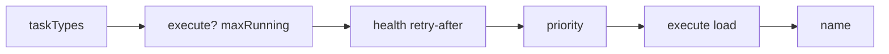
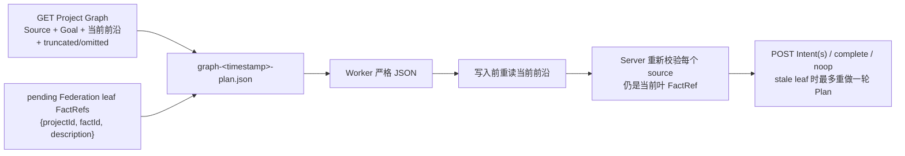
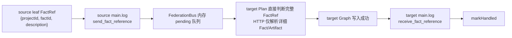
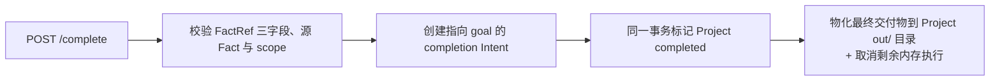
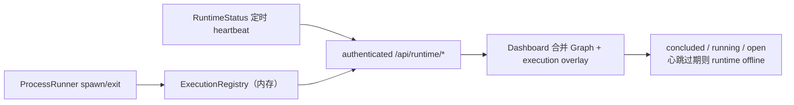

# Peak 数据流说明

本文描述 Peak 中所有「数据与契约」如何定义、持久化与流转：Graph 数据模型与不变量、持久化布局、Graph HTTP API、任务协议 JSON 合同、调度/Worker 接口、Board 配置 schema，以及各操作的端到端数据流。架构边界与设计原理见 [architecture.md](architecture.md)。

## 1. 数据模型与不变量

每个 Project 有且只有一张持久化 Graph，实体只有 Fact、Intent、Hint、Project 四种。

### 1.1 类型定义

```typescript
type ProjectStatus = "active" | "stopped" | "completed";

interface FactRef {
  projectId: string;       // 源 Project UUID，超链接地址的一部分
  factId: string;          // 源 Fact id，超链接地址的一部分
  description: string;     // 源 Fact 的规范、不可变摘要
}

interface ArtifactRef {
  path: string;       // Server 生成的 Project-relative 路径，固定为 artifacts/<sha256>
  sha256: string;
  mediaType: string;
  sizeBytes: number;
  filename: string | null; // 可选内容化输出名；非空时完成阶段物化到 Project out/ 目录
}

interface Fact {
  id: string;                     // origin | goal | f001...
  description: string;            // 普通 Fact <= 1 KiB；origin/goal <= 4 KiB
  artifact: ArtifactRef | null;   // 可选的单文件不可变详细内容
  createdAt: string;
}

interface Intent {
  id: string;                     // i001...
  from: FactRef[];
  to: FactRef | null;             // null = open, 非 null = concluded
  customProfile: string | null;   // 被选中 Execute profile 的 description
  customProfileDigest: string | null; // SHA-256(description + "#" + prompt) 前 16 位
  hintIds: string[];              // 创建该 Intent 时原子消费的 Hint
  description: string;            // 必填，trim 后非空，UTF-8 <= 2 KiB
  createdBy: string;               // 创建 actor，例如 plan:<execution-id>
  createdAt: string;               // 创建时间，本地 YYYYMMDDTHHMMSS.XXX
  concludedBy: string | null;      // open 时 null；成功 actor，例如 execute:/finalize:<execution-id>
  concludedAt: string | null;      // open 时 null；conclude 的本地墙上时间
}

interface Hint {
  id: string;                     // h001...
  content: string;
  creator: string;
  createdAt: string;
  consumedByIntentId: string | null;
  consumedAt: string | null;
}

interface ResolvedFactSource {
  ref: FactRef;
  fact: Omit<Fact, "artifact"> & {
    artifact: (Omit<ArtifactRef, "path"> & {
      inputPath: string;           // Graph Server 返回的规范本地绝对路径
      readOnly: true;
    }) | null;
  };
}

interface ProjectMeta {
  id: string;                     // UUID，不可修改
  title: string;                  // 可修改
  status: ProjectStatus;
  scope?: string;
  createdAt: string;
}
```

- Project ID 使用 UUID；普通 Fact、Intent、Hint 分别使用 shard 内单调计数生成的 `fN`、`iN`、`hN`。
- Project title 可修改；UUID 不可修改。

### 1.2 不变量

- 普通 Intent 至少有一个 source；
- source 必须存在且不能是任何 Project 的 `goal`；
- 每个 FactRef 必须完整包含 `projectId`、`factId`、`description`，且 description 必须与源不可变 Fact 完全一致；
- FactRef 是目标 Graph 中可独立展示的超链接节点，由 `projectId/factId` 追溯源 Fact，description 作为其不可变链接摘要；
- 外部 source 必须与目标 Project 同 Federation scope；
- source 不重复，顺序稳定；
- Intent 的 `customProfile` 与 `customProfileDigest` 必须同时为 null 或同时存在；Fact、Hint、FactRef 不得包含 profile；
- 每个普通 Intent 表示一次朝 Goal 前进的原子 DAG 转换：可从一个当前 Leaf 分叉或无状态更新，也可把多个当前 Leaf 合并，但只能产生一个新 Fact；只组合已有 Leaf Facts 且不继续采集证据的单结果综合仍可视为原子任务；
- Intent 和 completion 创建时的全部 source 必须是各自 Project 的当前 Leaf；历史非 Leaf FactRef 返回 `409`；已经合法创建的 open Intent 可在兄弟分支先完成后继续 conclude；
- 普通 Fact description 必须存在、trim 后非空且不超过 UTF-8 1 KiB，只承载可独立理解的简明摘要；保留的 `origin` 和 `goal` description 使用最大的 UTF-8 4 KiB 上限；
- Intent description 必须存在、trim 后非空且不超过 UTF-8 2 KiB；Hint content、Project title 和 actor 标签等持久化短文本不超过 UTF-8 1 KiB；
- Fact 可以不带 Artifact；需要文件承载详细分析、证据、表格或报告时最多绑定一个单文件 Artifact，且 Artifact 不能替代必填的 Fact 摘要；
- Execute 只能创建当前 Project 的 Fact；
- concluded Intent 不可修改；
- 每个 Project 最多一个 completion Intent；
- completion 的 target 是当前 Project `goal`；
- 被外部 Project 引用的 Project 禁止删除。

## 2. 持久化布局

默认 Peak Home 为 `~/.peak`，可通过 `PEAK_HOME` 或 CLI `--peak-home` 覆盖。

```text
~/.peak/projects/<uuid>/
├── analysis.db
├── artifacts/
│   └── <sha256>
├── out/                  # 物化的最终 Goal 交付物（内容化文件名）；不入归档（可由 artifacts/ 重现）
├── logs/
│   ├── main.log
│   └── graph-<YYYYMMDDTHHMMSS.XXX>-<8-hex-execution-id>-<plan|supervise|execute|finalize>.json
└── .tmp/                 # 临时 runtime scratch（CLI session 缓存）；不入归档，Project 不再 active 后清理
```

每个 UUID 目录都是独立 shard。Peak Home 另有后台进程控制文件 `server.pid`、`server.json` 和 `server.log`，供 `peak status/stop` 使用，不属于 Graph。Board 目录没有 workspace，也不接收交付物；最终 Goal 交付物只物化到 Project shard 的 `out/` 目录。

### 2.1 SQLite 表

`analysis.db` 仅包含：

```text
project, artifacts, facts, intents, intent_sources, hints, counters
```

SQLite 启用 foreign key 和 WAL。`artifacts` 只保存 `sha256, path, media_type, size_bytes, filename, created_at`；`facts.artifact_sha256` 可空；`facts.description` 和 `intents.description` 必须 `NOT NULL`，服务层额外校验 trim 后非空和 UTF-8 byte length。SQLite 不保存 Artifact 正文或大 BLOB。

跨 Project source 只在目标 Project 的 `intent_sources` 中保存完整 FactRef `{source_project_id, source_fact_id, source_description}`。`source_description` 是源 Fact 不可变摘要，使引用成为可独立显示、可追溯的超链接节点；不复制源 Fact 实体或 Artifact。`intent_sources` 定义：

```sql
CREATE TABLE intent_sources (
  intent_id          TEXT NOT NULL,
  position           INTEGER NOT NULL,
  source_project_id  TEXT NOT NULL,
  source_fact_id     TEXT NOT NULL,
  source_description TEXT NOT NULL,
  PRIMARY KEY (intent_id, position),
  UNIQUE (intent_id, source_project_id, source_fact_id)
);
```

### 2.2 Artifact

Artifact body 以 SHA-256 为文件名保存到当前 Project 的 `artifacts/`，SQLite 只保存 hash、相对路径、media type、大小、可选内容化输出文件名和创建时间。

Workers 不被分配 workspace、不写文件：需要文件的结果由 Execute 在合同中内联返回 `{filename, mediaType, content}`，Runtime 流式上传（POST `/api/projects/{id}/artifacts`，可选 `x-artifact-filename` 头）。上传流式计算 hash 并执行大小限制；可选高级配置 `phase.execute.maxArtifactBytes` 默认不写入 `task.json`，省略时限制为 10 MiB。`filename` 必须是基于内容的相对输出名（不超过 1 KiB，拒绝绝对路径、`\`、`.`/`..`/空段/隐藏段），绝不包含 i001/f001 等图节点编号；只有它非空时，完成阶段才把该 Artifact 物化到 Project shard 的 `out/` 目录。

Server 启动时清理超过 24 小时安全窗口且没有 Fact 引用的 Artifact。下载前必须校验 64 位小写十六进制 hash、普通文件和非 symlink。

### 2.3 日志与 Graph context

`main.log` 是追加式 NDJSON，记录经 Server 验证后的 Graph operation，以及 Federation 的 `send_fact_reference` / `receive_fact_reference`。`graph-*.json` 只记录执行时的图上下文，不保存 Worker 原始输出。

每次阶段执行前生成一个不可变 JSON snapshot。写入采用临时文件加原子 rename。execution ID 由 `randomBytes(4)` 生成八位小写十六进制字符串，并在内存 `ExecutionRegistry` 中检查冲突；Finalize 复用其绑定 Execute 的 ID。时间使用本地墙上时间，格式固定为 `YYYYMMDDTHHMMSS.XXX`，不携带时区。

Runtime 先通过 `GraphClient` 组装阶段接口，再由纯格式化逻辑放入英文 Prompt 和 snapshot。每个阶段 Graph view 都使用固定 256 KiB UTF-8 budget、稳定顺序和显式 `truncated/omitted` 元数据：Plan 包含 Source、Goal、leaf Facts、open Intents、未消费 Hints 和 pending FactRefs；Supervise 包含 Project、Facts、Intents、Hints；Execute/Finalize 包含 Intent 与 resolved sources。Execute source 不下载、不复制；Graph Server 直接返回规范本地 `inputPath` 和 `readOnly: true`，Runtime 在 worker 前后校验普通文件、size 和 SHA-256。

## 3. Graph HTTP API

HTTP 方法具有标准语义，不限制为 POST。主要路由：

```text
GET    /                                      Dashboard shell（不要求 Bearer Token）
GET    /preview.html                          Artifact 预览页 shell（不要求 Bearer Token）
GET    /api/projects
POST   /api/projects
GET    /api/projects/:id
DELETE /api/projects/:id
PUT    /api/projects/:id/title
PUT    /api/projects/:id/status               # 仅 active <-> stopped
GET    /api/projects/:id/facts/:factId
POST   /api/fact-refs/resolve
POST   /api/projects/:id/hints
POST   /api/projects/:id/intents
POST   /api/projects/:id/intents/:intentId/conclude
POST   /api/projects/:id/complete
POST   /api/projects/:id/reopen
POST   /api/projects/:id/artifacts
GET    /api/projects/:id/artifacts/:sha256
HEAD   /api/projects/:id/artifacts/:sha256
GET    /api/projects/:id/export?format=json|timeline|archive
GET    /api/scopes/:scope/export?format=json|timeline
GET    /api/runtime/status
GET    /api/runtime/projects/:id/executions
```

所有 JSON 输入都严格拒绝 unknown/missing field。普通 JSON body 上限为 1 MiB；Artifact 使用独立流式上传限制。API 响应不应被缓存。`completed` 只能由 complete endpoint 设置；恢复只能调用 reopen。`GET /api/projects/:id` 返回完整 `ProjectGraph`：`{ project: ProjectMeta, facts: Fact[], intents: Intent[], hints: Hint[] }`；`GET /api/projects` 返回 `ProjectMeta[]`。`PUT /api/projects/:id/title` 的 body 为 `{ "title": "..." }`；`PUT /api/projects/:id/status` 的 body 为 `{ "status": "active" | "stopped" }`，completed Project 必须先 reopen。`GraphClient` 是 Runtime 和 Node 客户端的薄 HTTP 封装，负责 JSON 请求、Bearer header、Artifact stream 上传/下载以及导出，不包含 Graph 业务旁路。

最后两个 Runtime route 由组合根通过通用 `apiExtensions` 注入，并沿用 `/api/*` 鉴权；裸 `GraphHttpServer` 和 `peak serve` 不注入，因而返回 404。`status` 返回 `{runtimeId, startedAt, heartbeatAt, sequence, schedulerRunning, heartbeatWindowMs}`；`executions` 返回指定 Project 的当前内存快照，不进入 Graph export。

Project 的 `format=archive` 只允许 completed 状态，返回 gzip tarball：`manifest.json`（归档格式标识、导出时间、可直接用于 `board.projects` 的 `{id,source,goal}` JSON 区块和 Artifact 清单）、`graph.json`、SQLite 在线备份得到的 `analysis.db`，以及 `artifacts/<sha256>`。导入时必须校验规范目录、SQLite 完整性与表集合、Graph JSON/数据库一致性、Artifact 元数据/大小/SHA-256，并拒绝覆盖相同 UUID。归档不复制或改写跨 Project `FactRef` 所指向的外部 Project。

### 3.1 Project

```json
// POST /api/projects
{ "title": "...", "target": "...", "goal": "...", "scope": "optional" }
```

创建时在同一 shard 生成 `origin`（来自 `target`）和 `goal`（来自 `goal`）Fact。

### 3.2 FactRef resolve

```json
// POST /api/fact-refs/resolve
{
  "targetProjectId": "...",
  "refs": [{ "projectId": "...", "factId": "f001", "description": "源 Fact 的不可变摘要" }]
}
```

Server 先校验每个 ref 的三个字段与源 Fact 完全一致，再返回对应的 Fact。没有 Artifact 时返回 `artifact: null`；否则返回带只读 `inputPath` 的 Artifact 元数据。Artifact 正文不进入响应，也不复制到目标 Project。

### 3.3 Hint

```json
// POST /api/projects/{id}/hints
{
  "content": "对当前 Graph 的具体建议",
  "creator": "supervise:<executionId>"
}
```

Server 校验 Project 存在、content 非空且不超过 UTF-8 1 KiB；与已有 Hint trim 后完全相同则返回 `409`。外部调用可以给任意状态的 Project 添加 Hint，但只有 active Project 会运行 Supervisor/Plan。

### 3.4 Intent

```json
// POST /api/projects/{id}/intents
{
  "from": [{ "projectId": "...", "factId": "f001", "description": "源 Fact 的不可变摘要" }],
  "customProfile": "Use for independent verification.",
  "customProfileDigest": "0123456789abcdef",
  "hintIds": ["h001"],
  "description": "需要执行或证明的具体事项",
  "createdBy": "plan:<executionId>"
}
```

`hintIds` 可省略或为空数组；提供时按顺序原子消费这些未消费 Hint，已被消费或不存在则返回冲突。创建 Intent 时，`customProfile` 与 `customProfileDigest` 必须同时存在或同时为 null；digest 必须是 16 位小写十六进制。

```json
// POST /api/projects/{id}/intents/{intentId}/conclude
{
  "description": "结论或摘要",
  "artifact": { "path": "artifacts/<sha256>", "sha256": "...", "mediaType": "text/markdown", "sizeBytes": 123 },
  "concludedBy": "execute:<executionId>"
}
```

Conclude transaction：Project 必须 active；Intent 必须 open；校验 Fact description 必填、trim 后非空且不超过 UTF-8 1 KiB；`artifact` 字段必须存在，但值可以是 `null` 或一个已注册的规范 ArtifactRef（`path`/`sha256`/`mediaType`/`sizeBytes` 必须与已注册索引完全一致）；创建不含 profile 的本地 Fact；更新 Intent.to；返回 Fact 和 Intent。并发 conclude 只有第一个成功，其余返回 `409`。

### 3.5 Complete

```json
// POST /api/projects/{id}/complete
{
  "from": [{ "projectId": "...", "factId": "f001", "description": "源 Fact 的不可变摘要" }],
  "hintIds": ["h001"],
  "description": "Goal 证明",
  "completedBy": "plan:<executionId>"
}
```

`hintIds` 可省略或为空数组；提供时在同一 transaction 内原子消费。

同一 transaction：校验 FactRef（字段完整、description 与源 Fact 完全一致、存在、无重复、不引用 `goal`、不越过 scope）；创建 `FactRef[] -> currentProject/goal` completion Intent；将 Project 标记为 completed；返回该 completion Intent。完成不等待其他 Project、广播、pending reference 或活动 Worker。晚到 conclude 返回冲突。

### 3.6 Reopen

```json
// POST /api/projects/{id}/reopen
{
  "description": "外部反馈，作为新的不可变本地 Fact",
  "creator": "human:web"
}
```

只允许显式调用，且只适用于 completed Project：同一 transaction 内删除当前 completion Intent（并解除其消费的 Hint），以当前全部本地 Leaf Facts 为 source 写描述为 `External feedback` 的 concluded Intent 和反馈 Fact，然后恢复 active。Hint 和 Federation 消息不能 reopen，反馈不得重新从历史非 Leaf `origin` 出发。`description` 使用 Fact description 规则（trim 后非空、UTF-8 <= 1 KiB），`creator` 使用短文本规则。

### 3.7 Artifact

```text
POST /api/projects/{id}/artifacts        流式上传（可选 x-artifact-filename 头）
GET  /api/projects/{id}/artifacts/{sha256}
HEAD /api/projects/{id}/artifacts/{sha256}
```

上传流程：streaming 写临时文件 → 计算 SHA-256 → 原子 rename 到 `artifacts/<sha256>` → 写 `artifacts` 索引 → 返回 ArtifactRef。客户端不能指定最终 path；拒绝 absolute path、`..`、symlink escape；上传和下载不把完整文件读入内存；未被 Fact 引用的 Artifact 按安全窗口 GC。

## 4. 任务协议

所有 worker 输出统一为严格 JSON 合同。解析优先接受最后一个 fenced JSON block，否则提取最外层 `{...}`（括号配平，忽略尾随散文）。解析后严格拒绝 unknown field、missing field、空 FactRef 列表、缺少任一 `projectId`/`factId`/`description` 的 FactRef、被改写的 FactRef description、空描述、超过 1 KiB 的普通 Fact description/Hint content，以及超过 2 KiB 的 Intent description。不能放宽 Plan、Supervise、Execute 的 typed shape。

拒绝的输入形式：无法提取单一 JSON 对象的内容、缺失或未知字段、缺失或空白的 Intent/Fact description、context 外 FactRef、非法 Artifact 路径、过长 description。允许在 prose 中提取最外层对象，或采用最后一个 fenced JSON block。Fact description 必须能独立表达结论；详细内容需要文件时才返回 Artifact。

### 4.1 Plan

决定下一步证明结构，三选一：

```json
{ "kind": "intents", "intents": [{ "from": [{ "projectId": "...", "factId": "f001", "description": "源 Fact 的不可变摘要" }], "hintIds": ["h001"], "customProfile": "Use for independent verification.", "description": "..." }] }
```

```json
{ "kind": "complete", "from": [{ "projectId": "...", "factId": "f001", "description": "源 Fact 的不可变摘要" }], "hintIds": ["h001"], "description": "..." }
```

```json
{ "kind": "noop" }
```

`intents` 数量为 `1..executeCapacity`（支持 execute 的 Worker 的 `maxRunning` 之和），这也是 Runtime 的 Execute 并发上限。Intent 只能引用当前 `PlanGraphView.leafFacts` 或 `pendingFactRefs` 中可见的完整 FactRef。Plan 根据视图中的 open Intents、未消费 Hints 和 `truncated/omitted` 避免重复并判断信息是否充分；`hintIds` 可省略或为空，同一 Hint 只能被一个 Intent/complete 消费。每个 Intent 只能产出一个 Fact，禁止捆绑无关转换、survey、matrix、多文件或多事件。Plan 必须原样返回 FactRef；Server 再次拒绝已变成历史非 Leaf 的 source。`customProfile` 可省略或为 null，非 null 时必须精确匹配可用 Execute profile description；`goal` 永远不是 source Leaf。

Plan AI 自主决定分支、深化、合并与完成；Runtime 不注入固定推理策略，只校验可见 source、原子单 Fact 转换、严格输出 shape 和 Intent 数量上限。

### 4.2 Supervise

独立审视当前 Graph，只提出改进 Hint，二选一：

```json
{ "kind": "hint", "content": "当前证明缺少对……的验证，建议……" }
```

```json
{ "kind": "noop" }
```

只对 active Project 运行；每轮最多一个 Hint；content 必填、trim 后非空、UTF-8 不超过 1 KiB；与已有 Hint trim 后完全相同则不写入；不创建 Intent/Fact，不完成或 reopen Project。

### 4.3 Execute

执行一个原子 open Intent 并产出一个 Fact。Fact 必须提供不超过 UTF-8 1 KiB、无需附件即可理解的 description。结果不需要文件时返回：

```json
{ "kind": "fact", "description": "可独立理解的结论", "artifact": null }
```

详细结果需要文件时返回恰好一个文件：

```json
{
  "kind": "fact",
  "description": "摘要",
  "artifact": {
    "filename": "reports/report.md",
    "mediaType": "text/markdown",
    "content": "完整文件正文（内联返回，Worker 不写文件）"
  }
}
```

`artifact` 字段不可省略，但可以为 `null`。非 null 时返回恰好一个文件的内容：`{filename, mediaType, content}`——`filename` 是基于内容的相对输出名（绝不使用 i001/f001 等图节点编号，如 report.md），`content` 是完整文件正文；Worker 不写任何文件，Runtime 上传内容到 Project `artifacts/` 后再 conclude。输出不能包含 `customProfile`；profile 只属于 phase/Intent，不传播到 Fact。

### 4.4 Finalize

不是任务类型，只在 Execute 已启动、不是外部取消、Project/Intent 仍 active/open、返回可恢复 session，且 Execute 失败、timeout 或格式无效时运行一次。Finalize 复用相同 execution ID、session、Graph view、profile 和 Execute Fact contract，并在 snapshot 中记录 bound Execute；它只整理已进行工作的最终严格结果，不创建新的 Graph operation。

## 5. 调度与 Worker 接口

### 5.1 ExecutionRegistry（内存）

```typescript
interface ActiveExecution {
  executionId: string;
  projectId: string;
  kind: TaskType;            // "plan" | "supervise" | "execute"
  intentId?: string;
  workerName?: string;
  processId?: number;
  startedAt: number;
  deadlineAt?: number;
  controller: AbortController;
}
```

ExecutionRegistry 仅在内存：每个 Project 最多一个 Plan；每个 Project 最多一个 Supervise；每个 Intent 最多一个 Execute；不同 Intent 可并发；Runtime 重启后 open Intent 重新可调度。公开 DTO 把时间格式化为本地 `YYYYMMDDTHHMMSS.XXX`，并把可选字段规范为 `null`；不暴露 controller、prompt、argv、env、输出或 session。

`executionId` 使用 `randomBytes(4).toString("hex")` 生成，并在 registry 内重试冲突，因此是八位小写十六进制；Finalize 不生成新 ID。

### 5.2 Plan checkpoint

内存 checkpoint 为 `{facts, hints, open, federation}`。首次观察、Fact/Hint 增加、open Intent 从非零变为零或 pending Federation 数变化时触发 Plan。

### 5.3 WorkerProtocol 合同

```typescript
interface WorkerProtocol {
  readonly type: WorkerType;
  readonly canResume: boolean;
  build(call: WorkerCall, session: SessionRef | undefined): ProcessSpec;
  prepareSession?(call: WorkerCall): SessionRef | undefined;
  parse(result: ProcessResult): { text: string; session?: SessionRef };
}
```

`WorkerRuntime` 构造 `WorkerCall`，调用 `protocol.build` 得到 `ProcessSpec`，交给共享的 `ProcessRunner` 调起 CLI 子进程，再用 `protocol.parse` 组装 `WorkerResult`，全程不按 backend 类型分支，也没有 `dispose()`。`SessionRef` 只包含 Worker type 和不透明值，只能交回相同 type 且 `canResume` 的 protocol，不进入 Graph、Board 配置、JSON checkpoint 或 Project 恢复状态。Worker 级配置通过 `config.env` 合并进子进程环境；没有 `args` 字段。

### 5.4 Worker 选择排序



Plan/Supervise 每次 dispatch 最多 3 次 CLI round-trip，固定间隔 2 秒，仅重试已启动且非外部取消的 provider failure、timeout 或 malformed output。Execute 不普通重试；满足恢复条件时只调用一次 Finalize，Finalize 不重试。固定 timeout 为 Plan 5 分钟、Supervise 5 分钟、Execute 10 分钟、Finalize 2 分钟。

## 6. Board 配置 schema

CLI 参数指向包含 `task.json` 的 Board 目录。Board 只是 Project 集合和共享运行资源，没有 description、Goal、Graph 或完成状态。

```text
my-board/
├── task.json
└── skills/                 # 仅在配置 Board-local Skill 时需要
    └── <name>/SKILL.md
```

顶层字段只能是 `board, workers, optional scheduler, optional phase`：

```json
{
  "board": {
    "name": "ai-agent-safety",
    "skills": ["ai-agent-safety"],
    "projects": [
      {
        "id": "",
        "source": "Latest AI Safety Intelligence",
        "goal": "Collect and analyze current AI safety evidence."
      },
      {
        "id": "",
        "source": "AI Agent Guardrail Design",
        "goal": "Produce an actionable AI Agent guardrail construction plan."
      }
    ]
  },
  "workers": [
    {
      "type": "pi",
      "model": "",
      "taskTypes": ["plan", "supervise"],
      "maxRunning": 1,
      "priority": 1,
      "env": {}
    },
    {
      "type": "pi",
      "model": "",
      "taskTypes": ["execute"],
      "maxRunning": 2,
      "priority": 1,
      "env": { "PI_MODEL": "openai-codex/gpt-5.1" }
    }
  ],
  "phase": {
    "plan": {
      "customProfile": {
        "description": "Use to keep planning bounded and independently verifiable.",
        "prompt": "Prefer non-overlapping atomic Intents."
      }
    },
    "supervise": {
      "intervalMs": 90000,
      "customProfile": {
        "description": "Use to audit proof quality and missing evidence.",
        "prompt": "Independently check proof quality and missing evidence."
      }
    },
    "execute": {
      "customProfiles": [
        { "description": "Use for primary-source research.", "prompt": "Collect primary evidence." },
        { "description": "Use for independent verification.", "prompt": "Independently verify selected claims." }
      ]
    }
  }
}
```

约束与持久化语义：

- `board.projects` 必须为非空数组；每项只能包含 `id`、`source`、`goal`；source 必须非空且在 Board 内唯一，并直接成为 immutable `origin` description；Board 没有 workspace；
- `id` 可省略或为空字符串；首次 `run` 成功创建 Project 后，Peak 以原子替换方式把生成的 UUID 写回该数组项；
- 非空 `id` 必须是 UUID，同一 Board 内不能重复；Runtime 按 id 附加原 Project并校验其 immutable Goal，不创建副本；
- 另一个 Board 可以配置相同 UUID 来复用同一 Project Graph、Facts 与 Artifacts；同一 active Project 不得被多个 Runtime 进程并发调度；
- `workers` 是非空数组；每项字段恰好为 `{type, model?, taskTypes, maxRunning, priority, env}`，Peak 生成内部 Worker identity；空 `model` 表示使用 Agent 工具默认模型；`env` 是传给该 CLI 子进程的字符串 map，不允许 free-form `args`；至少一个 Worker 必须支持 `supervise`，且至少一个必须支持 `execute`；
- `phase.plan.customProfile` 和 `phase.supervise.customProfile` 各自可选且最多一项；`phase.execute.customProfiles` 默认为空数组，description 必须唯一；
- 每个 profile 只能是 `{description,prompt}`；description 是供 AI 判断是否注入的短说明，必填且不超过 UTF-8 1 KiB；prompt 必填且不超过 UTF-8 8 KiB；
- Worker type 只能是 `opencode`、`codex`、`pi`、`claude-code`；task type 只能是 `plan`、`supervise`、`execute`；
- `priority` 数值越小越优先，可为 0；其余计数/间隔必须为正整数；
- unknown field 在所有层级都被拒绝；字符串 trim 后必须非空（`id` 和 `model` 的显式空字符串除外）；加载结果递归 freeze；
- `loadTaskConfig()` 只解析和验证；成功创建后的 UUID 回写由独立的原子 config 操作完成。

新建 Project 使用根据 name 生成的 immutable origin 和自己的 goal；按 id 附加时保留原 Project 的 title/origin 并校验 goal。各 Project 的状态、Graph、Artifact 与完成条件彼此独立，Project 配置不声明跨 Project 依赖。Worker 只接收当前 phase 所需的 Graph view。Board 内已注册 Project 只把符合范围的叶 `FactRef` 作为候选证据提供给 Plan；每个候选完整携带规范的 `projectId`、`factId` 和不可变 `description`。已附加 Project 启动时只广播当前普通叶 Fact，已经产出后续本地 Fact 的历史 Fact 不再作为当前候选。是否采用由 Plan AI 根据当前 Goal 判断；目标只保存 FactRef 超链接节点，不复制源 Fact 实体或 Artifact。

### 6.1 Skill 解析与生命周期

Board customization 只能通过 `board.skills`，配置时只允许名称（匹配小写字母、数字和连字符规则）。发现目录：

```text
OpenCode / Pi -> ~/.agents/skills/<name>/SKILL.md
Claude Code   -> ~/.claude/skills/<name>/SKILL.md
Codex         -> 不安装 Skill
Board fallback -> <board-dir>/skills/<name>/SKILL.md
```

初始化规则：目标位置已有合法全局 Skill 时直接使用，Board-local 同名 Skill 不覆盖它；目标不存在时才把 Board-local Skill 以 symlink/junction 临时链接过去；不覆盖真实文件、目录或其他链接；多个 Runtime 共享同一个 Peak 管理链接时使用内存引用计数；Runtime shutdown 时仅删除 Peak 创建且仍指向原 source 的临时链接；预先存在的全局 Skill 永不覆盖、永不删除；不下载 Skill。Skill 生命周期是 Board Runtime 级而非 Project 级：一个 Board 下的多个 Project 共享该租约，单个 Project 停止/完成不释放，整个 Runtime 关闭时释放。`--no-install-skills` 可跳过安装；`peak init` 不创建 `skills/` 目录。除成功创建 Project 后原子回写 UUID 外，Runtime 不修改配置文件。

## 7. 端到端数据流

### 7.1 Board Project 集合

`load board.projects` → id 为空时 `POST /api/projects` 并原子回写 UUID，id 已有时读取 Project 并校验 Goal → 打开 `projects/<uuid>/analysis.db` → 注册 ProjectLoop 和候选叶 FactRef → 启动 Scheduler。

### 7.2 Plan



### 7.3 Supervise


### 7.4 Execute


失败、malformed 或 timed-out 的 Execute 可通过 Finalize resume 同一 worker session 一次。Finalize 写自己的 Graph JSON 并返回相同 Fact 合同。完成时，带 `filename` 的 completion source Artifact 被物化到 Project shard 的 `out/` 目录（最终 Goal 交付物）。

### 7.5 Artifact

Execute 内联 `{filename, mediaType, content}` → `GraphClient` 流式上传 → Server 计算 SHA-256 并写入 `artifacts/<sha256>` 与元数据 → Fact 绑定 `artifact_sha256` → 完成时仅将带 filename 的 proof Artifact 物化到 Project shard 的 `out/` 目录。Artifact 只承载可选的单文件详情；Fact description 始终必填且可独立理解。

### 7.6 Federation



只有完整 FactRef `{projectId, factId, description}` 被持久化在目标 `intent_sources`，其中 description 是不可变超链接摘要。新下游叶 Fact 广播时会在 send event 中记录其取代的本地 source FactRef，并从目标尚未处理的 pending frontier 中移除这些上游引用；已经写入目标 Graph 的历史 FactRef 不删除。source Fact 实体和 Artifact 留在 source Project；target 需要 Artifact 等详细内容时通过 `/api/fact-refs/resolve` 和 Artifact HTTP route 读取。FederationBus 无数据库，只从 `main.log` 恢复。失败时不 mark handled。

### 7.7 Completion 与 Reopen




完成是 Project-local 且即时；只有显式 `/reopen` 才能恢复。

### 7.8 Runtime 运行态 overlay



`peak serve` 没有该 overlay；Dashboard 收到 404 时清除 execution 数据并继续使用 Graph API。
