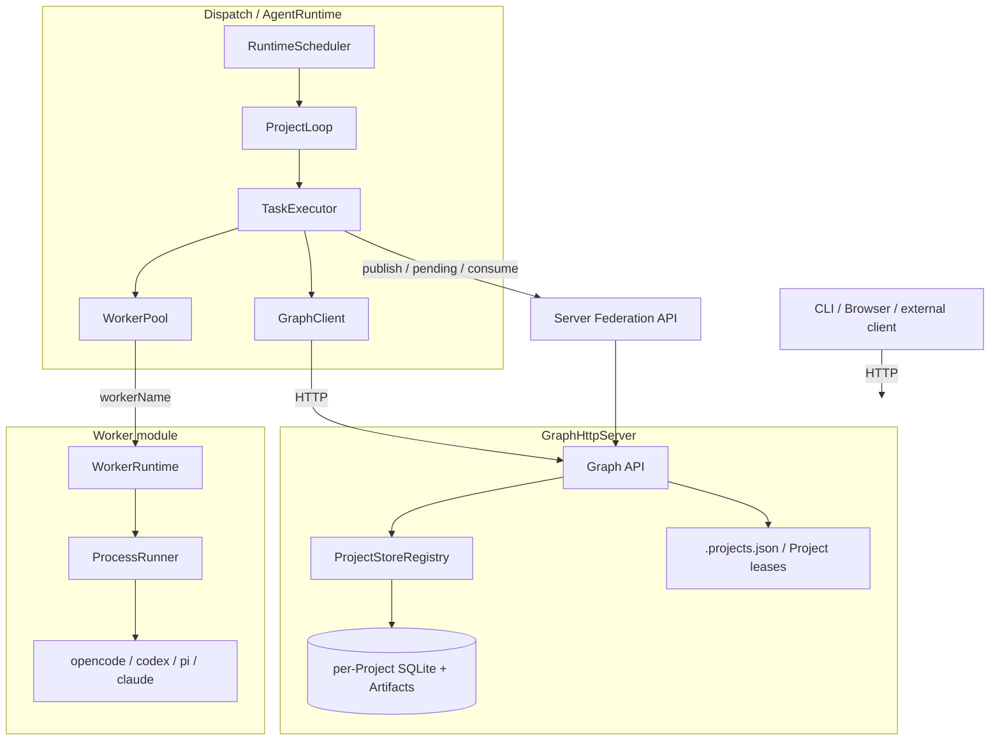
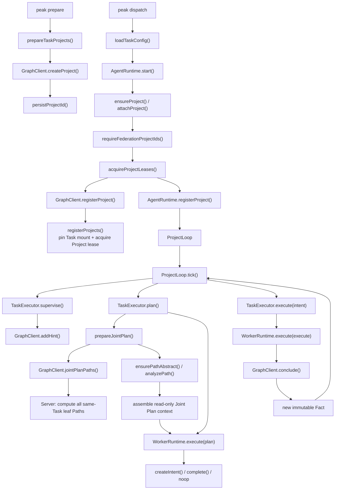

# Peak Architecture

Peak is an agent runtime built around a proof Graph. Each Project owns an independent Graph; a Board only composes Projects, Workers, and shared runtime configuration. Graph, Runtime, Worker, and UI cooperate through fixed boundaries, while domain methods come only from Skills.

For concrete data structures, HTTP routes, and phase JSON contracts, see [Data Flow](data-flow.md).

## 1. Core principles

- **Project is the state boundary**: every Project persists, runs, and completes independently.
- **Project is the cross-process ownership boundary**: one Dispatch owns a Project at a time, while Plan, Supervise, and multiple Intent Executes remain fine-grained and concurrent inside it; Task only adds a fixed Federation mount.
- **HTTP is the only Graph protocol**: Runtime and external clients access `GraphHttpServer` through `GraphClient`.
- **Graph stores proof state only**: Facts, Intents, Hints, and Project metadata. The Server records fixed Task Federation mounts and TTL-bound Project leases in `.projects.json`; neither enters a Project Graph or archive.
- **Workers are isolated from Graph**: a Worker receives a Prompt, never Graph objects, SQLite, an HTTP client, or Federation objects.
- **Facts are immutable**: changes are expressed as `leaf Fact(s) -> Intent -> new Fact`.
- **External results are references**: Federation supplies an external leaf FactRef and read-only Path Abstract; neither can become a local Intent source.
- **Outputs cross a strict boundary**: Worker output must match the phase contract and pass Server validation before Graph mutation.

## 2. Topology



### 2.1 Core function call pipeline



The primary loop is `ProjectLoop -> Joint Plan -> Intent -> Execute -> Fact -> next Joint Plan`. Federation only discovers same-Task Project Paths before Plan; it never owns the Project state machine.

## 3. Module boundaries

| Module | Responsibility |
| --- | --- |
| `src/graph/` | Graph types, HTTP API, SQLite/Artifact stores, Federation, archives |
| `src/runtime/` | Scheduling, phase contexts, contract parsing, WorkerPool, execution state |
| `src/worker/` | CLI protocols, WorkerRuntime, ProcessRunner; unaware of TaskType |
| `src/utils/` | Board configuration, paths, processes, Project registry, Docker startup |
| `src/ui/` | Optional Dashboard, Artifact preview, and task management pages |
| `src/cli.ts` | Composition root for commands and process lifecycle |

Dependency rules:

1. Stores are private to Graph Server and are not exported from the public entry point.
2. Runtime can access Graph only through HTTP; `runtime/` module imports of `graph/` are limited to the HTTP client (`GraphClient`), DTO types, the client-side Joint Plan adapter, and phase-contract validators — never stores or server implementations.
3. Generic HTTP/serialization primitives (`ApiError`, `localTimestamp`, `toJson`) are owned by `utils/helpers` and shared by Server and Runtime; `graph/api.ts` keeps only API-contract validators and re-exports the primitives so the public surface is unchanged.
4. `src/worker/` does not import `runtime/`, `graph/`, or `utils/`.
5. UI is only an HTTP client; removing it does not change Graph correctness.

## 4. Graph model

Every Project begins with:

- `origin`, from `board.projects[].source`;
- `goal`, from `board.projects[].goal`.

The proof Graph uses three ordinary entities:

- **Fact**: an immutable conclusion, optionally linked to one content-addressed Artifact;
- **Intent**: starts from one or more current local leaves and produces exactly one new Fact;
- **Hint**: an independent suggestion outside the causal edges, atomically consumable by Plan.

A `FactRef` is always the complete `{projectId,id,description}` shape, and its description must match the source Fact exactly. Ordinary Intents and completion can reference only current local leaves of the current Project. Cross-Project sources are rejected at the Server boundary.

Completion atomically creates a `leaf FactRef[] -> goal` Intent and marks the Project `completed`. Explicit reopen removes the completion, writes external feedback as a new Fact, and restores `active`.

## 5. Runtime phases

| Phase | Purpose | Fixed timeout |
| --- | --- | ---: |
| Plan | Create Intents, complete, or noop | 5 minutes |
| Supervise | Add one Hint or noop | 5 minutes |
| Execute | Execute one open Intent and return one Fact | 10 minutes |
| Finalize | Resume one started but failed Execute | 2 minutes |
| Analyze | Build a Path Abstract for a leaf chain | 5 minutes |

Finalize and Analyze are not `taskTypes`. Analyze reuses Plan routing; Finalize reuses the original Execute Worker and session.

Phase behavior stays in the existing profiles: `board.skills` declares the Task allow list, while `customProfile.skills` assigns a subset to Plan, Supervise, or an Execute profile. Only the active profile's Skills enter its prompt. Finalize inherits Execute; Analyze is deliberately unconfigurable and receives no Skills. The local phase snapshot records that selected subset under `customProfile.skills` for provenance, without exposing Worker routing or configuration.

### Plan context

Plan receives exactly two sections:

```text
projects[currentProjectId]
├── source
├── goal
├── leafFacts
├── openIntents
└── unconsumedHints

external[]
├── factRef {projectId,id,description}
├── pathOverview
└── verifiedCore[]
```

All current-Project data is wrapped under `projects[projectId]`; title is omitted because it duplicates source. Joint Plan builds `external` from the current leaf Paths of other same-Task Projects. Every phase context has a 256 KiB budget and reports `truncated` and `omitted` explicitly.

### Execute file boundary

Execute may read resolved source Artifacts and use the current Project `.tmp/` directory for temporary reads and writes. Every source Artifact is first materialized into the execution substrate (local: `.tmp/sources/`; docker: container `/work/sources/` via `docker cp`, pulled back out for verification) — when the local Projects root has no body, the canonical bytes are fetched from the Graph API, so Serve and Dispatch may live on different hosts or use different Project roots; the placed copy is sha256-verified before and after the run, and worker tampering is rejected. The final result must use the strict inline contract:

```json
{ "kind": "fact", "description": "...", "artifact": null }
```

or include one `{filename,mediaType,content}` Artifact. Runtime uploads only contract content; files left in `.tmp/` never become results automatically. `.tmp/` is removed after the Project stops being active.

## 6. Scheduling and Workers

Each tick fills due Supervise work, a required Plan, then open Intent Executes. `ExecutionRegistry` permits at most one Plan and one Supervise per Project, and one Execute per Intent.

`task.json.workers[].taskTypes` is configuration-layer routing only. Runtime `WorkerPool`:

- filters by `taskTypes`;
- sorts by `priority`, Execute load, and name;
- manages Execute `maxRunning`, reservations, and a 30-second failure cooldown.

After a workerName is selected, `WorkerRuntime` receives only `{type,model?,env}`. It does not receive TaskType and does not own routing or capacity.

`ProcessRunner` is the only subprocess entry point. Prompts use stdin, cwd and temporary environment variables are pinned to Project `.tmp/`, cancellation or timeout terminates the process tree, and stdout/stderr are each limited to 10 MiB.

Total Execute capacity is the sum of `maxRunning` for all Execute routes. The same value caps the number of Intents produced by one Plan round.

## 7. Federation and Path Abstracts

Runtime creates `artifacts/path_abs_<factId>` for every local leaf:

- Analyze receives the current Fact and the Path Abstracts of its direct predecessors;
- it returns `{pathOverview,verifiedCore}`;
- cached results are reused, while repeated Worker failure produces a structured fallback.

`goal` is the proof endpoint for Project completion, not a Joint Path Analyze node. Even with a completion edge `fN -> goal`, the Joint Path ends strictly at `fN` and only `path_abs_fN` exists; `path_abs_goal` is never created or exposed.

A Task's declared Projects form one fixed Federation group. Joint Plan must read the current Paths of every member; Projects that must not exchange results belong to different Tasks. There is no switch or runtime membership mutation. The first Project lease atomically pins the complete UUID set in `.projects.json`; later Dispatch processes are rejected if they submit a different set.

Joint Plan is an HTTP pull, not a broadcast queue. Before every Plan, Server computes the current leaf Paths of the other mounted Projects, regardless of whether each source is active or completed. Runtime queries Path Abstracts through the central Graph HTTP API and analyzes missing entries recursively and incrementally: an existing `path_abs_fN` terminates recursion; otherwise all direct predecessor abstracts are completed before only Fact N is analyzed. The resulting Path Abstract DTOs are added directly to `external` and are never copied into the target Project.

Before every local Plan Worker call, Runtime completes the current Project's entire leaf PathAbstract frontier. A Project completed by Plan therefore already has every Path Abstract required by its Archive; export only verifies and packages them and never runs Analyze.

There are no publish, pending, consume, send/receive logs, or in-memory FederationBus. When a leaf is consumed, the next Joint Plan reads the new frontier directly from Graph. Completed Project Archives already contain Path Abstracts, so imported members reuse them and recursively analyze only missing entries.

## 8. Deployment and consistency

- `peak serve` and `peak dispatch` are separate roles. Multiple Dispatch processes may scale horizontally and claim distinct Projects with `--project`.
- Before Analyze/Plan/Execute begins, Dispatch atomically acquires its Project lease over Server HTTP. Leases live in `.projects.json`, use a 15-second TTL, and renew every 5 seconds.
- A competing claim receives HTTP 409 while the lease is live. Normal shutdown releases immediately; after a crash or partition stops heartbeats, Server time expires the lease and permits takeover.
- A transient transport failure does not immediately stop scheduling. Dispatch stops only after an explicit lease-loss response or after the last Server-issued expiry has passed.
- The Runtime always schedules on the host. Task-level `execution.mode` selects `local` or `docker`; Docker creates one long-lived `sleep infinity` container per Project and releases it by reason once the Project leaves active state: completed Projects remove the container (`rm -f`), stopped Projects only park it (`docker stop`) to keep its filesystem, so re-activation is a fast `docker start` with no rebuild; Docker or image unavailability falls the whole Task back to local.
- `peak serve --host/--port` owns the Server address independently; Task configuration has no Server port and Dispatch must connect with `--graph-url`.
- The task image is self-contained: decx, frida/radare2, nmap/nuclei/ffuf/sqlmap/impacket, etc.
- docker-mode containers are zero-mount: graph via prompt, API keys via worker env, Skills via `docker cp`, working dir `/work`; `execution.networkMode` is the only Docker-specific Task setting.
- Android devices attach by reusing the host adb server (`container/device-bridge.sh`) — no USB passthrough or `privileged` mode.
- Graph API has no token or authentication layer; deployment owns the network boundary.
- Artifact paths must pass resolution, boundary, and symlink checks.
- Graph operations are logged only after Server validation succeeds.
- Named Artifacts from completion sources are materialized under that Project's `out/`.
- Execution, sessions, reservations, and cooldown never enter Graph or archives; only control-plane Project lease heartbeats enter `.projects.json`.

See [Usage](usage.md) for Board configuration and CLI commands, and [Development](development.md) for build and test workflows.
