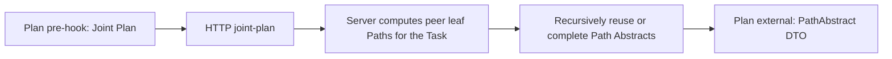

# Peak Data Flow

This document describes how data enters Peak, passes through Runtime and Workers, is committed to Graph, and becomes read-only references across Projects. See [Architecture](architecture.md) for component boundaries.

## 1. Core data

```typescript
type ProjectStatus = "active" | "stopped" | "completed";

interface FactRef {
  projectId: string;
  id: string;
  description: string;
}

interface Fact {
  id: string;
  description: string;
  artifact: ArtifactRef | null;
  createdAt: string;
}

interface Intent {
  id: string;
  from: FactRef[];
  to: FactRef | null;
  description: string;
  hintIds: string[];
  customProfile: string | null;
  customProfileDigest: string | null;
}

interface Hint {
  id: string;
  content: string;
  creator: string;
  consumedByIntentId: string | null;
}

interface PathAbstract {
  factRef: FactRef;
  pathOverview: string;
  verifiedCore: string[];
}
```

Primary invariants:

- Facts are immutable; an ordinary Fact description is required and limited to 1 KiB UTF-8.
- Every FactRef contains all three fields, and its description must equal the source Fact description.
- Intent sources must be current local leaves of the current Project and cannot be `goal`.
- One ordinary Intent produces one new Fact; a Project has at most one completion Intent.
- Hints are outside causal edges and may be atomically consumed when creating an Intent or completion.
- A Fact may link to at most one immutable single-file Artifact; the Artifact never replaces the Fact description.

## 2. Persistence

```text
~/.peak/projects/<projectId>/
├── project.db
├── artifacts/
│   ├── <sha256>
│   └── path_abs_<factId>
├── out/
├── logs/
│   ├── main.log
│   └── graph-<timestamp>-<executionId>-<phase>.json
└── .tmp/
```

- `project.db` stores Project, Fact, Intent, source, Hint, Artifact metadata, and counters.
- `artifacts/<sha256>` stores content-addressed Artifact bodies.
- `artifacts/path_abs_<factId>` stores structured Path Abstracts.
- `out/` contains final deliverables of a completed Project and can be rebuilt from Artifacts.
- `logs/main.log` is NDJSON for validated Graph operations, Federation events, and Runtime events (`worker_started`/`worker_completed`/`worker_timeout`/`worker_failed`/`worker_cancelled`, `execution_target_released`, phase retries and failures).
- `graph-*.json` is an immutable phase-context snapshot. It records the selected profile as `{description,skills,digest}` but never stores top-level Skills, Worker configuration, the rendered prompt, or Worker output.
- `.tmp/` is the only Worker scratch directory. It is excluded from archives and removed after the Project stops being active.

Every Project is an independent Graph shard with no shared Project SQLite database. The Server records Project scheduling leases and their heartbeat/expiry in the unarchived `.projects.json`; other Runtime process, session, reservation, and cooldown state is not persisted.

## 3. Graph HTTP API

HTTP is the only live Graph protocol. Main routes:

| Domain | Routes |
| --- | --- |
| Project | `GET/POST /api/projects`, `GET/DELETE /api/projects/:id`, `PUT /api/projects/:id/status` |
| Fact | `GET /api/projects/:id/facts/:factId`, `POST /api/fact-refs/resolve` |
| Intent | `POST /api/projects/:id/intents`, `POST .../intents/:intentId/conclude` |
| Hint | `POST /api/projects/:id/hints` |
| Lifecycle | `POST /api/projects/:id/complete`, `POST /api/projects/:id/reopen` |
| Artifact | `POST /api/projects/:id/artifacts`, `GET/HEAD .../artifacts/:sha256` |
| Path Abstract | `GET/POST /api/projects/:id/path-abstracts/:factId` |
| Federation | `POST /api/federation/publish|pending|consume` |
| Project lease | `POST/PUT/DELETE /api/projects/:id/registration` (acquire/heartbeat/release) |
| Export | `GET /api/projects/:id/export?format=json|timeline|archive` |
| Runtime overlay | `GET /api/runtime/status`, `GET /api/runtime/projects/:id/executions` |

All JSON inputs reject unknown and missing fields. Ordinary JSON bodies are limited to 1 MiB; Artifacts use a separate streaming limit. Graph API has no token validation.

`GraphClient` is only an HTTP client and provides no local bypass around Server validation. Short-lived Dispatch execution state remains in Dispatch memory and is not exposed as a Server Graph API.

## 4. Board configuration flow

```json
{
  "board": {
    "name": "example",
    "skills": ["example-skill"],
    "projects": [
      { "id": "", "source": "Input", "goal": "Expected outcome" }
    ]
  },
  "workers": [
    {
      "type": "pi",
      "model": "",
      "taskTypes": ["plan", "supervise"],
      "maxRunning": 1,
      "priority": 1,
      "env": {}
    },
    {
      "type": "pi",
      "model": "",
      "taskTypes": ["execute"],
      "maxRunning": 2,
      "priority": 1,
      "env": {}
    }
  ]
}
```

Load flow:

1. `loadTaskConfig()` strictly validates and freezes configuration; Task contains no Server address.
2. Dispatch connects to an independent `peak serve` through `--graph-url`.
3. A full-Task Dispatch may create missing Projects sequentially; sharded `--project` startup requires every UUID to be fixed first.
4. The first Project lease pins the complete Task UUID set in `.projects.json`; later membership mismatches are rejected.
5. Existing IDs attach the original Graph, and Runtime creates one independent `ProjectLoop` per leased Project.

`taskTypes`, `maxRunning`, and `priority` are routing data consumed only by Runtime `WorkerPool`. The Worker module receives only `{type,model?,env}`.

## 5. Phase contexts and output contracts

Each phase first creates a read-only context within a 256 KiB budget and writes a `graph-*.json` snapshot before rendering the Prompt. The snapshot contains phase and execution provenance, the bounded context, hashes of the configuration and rendered prompt, and only the active profile's `{description,skills,digest}` metadata. `skills` is never a top-level field, and routing entries from `workers[]` are never copied into the snapshot. Peak extracts the last fenced JSON block or the outermost JSON object from Worker output, then applies strict shape validation.

### 5.1 Plan

Input:

```typescript
{
  projects: {
    [currentProjectId]: {
      source,
      goal,
      leafFacts,
      openIntents,
      unconsumedHints
    }
  },
  external: [
    { factRef: { projectId, id, description }, pathOverview, verifiedCore }
  ],
  truncated,
  omitted
}
```

Output is one of:

```json
{ "kind": "intents", "intents": [{ "from": [{ "projectId": "...", "id": "f0001", "description": "..." }], "hintIds": [], "customProfile": null, "description": "..." }] }
```

```json
{ "kind": "complete", "from": [{ "projectId": "...", "id": "f0001", "description": "..." }], "hintIds": [], "description": "..." }
```

```json
{ "kind": "noop" }
```

Plan can return only visible local leaf FactRefs exactly as received. `external` cannot appear in `from`. Runtime reloads the frontier before writing, and Server validates every leaf again. If concurrent work makes a source stale, Peak may rerun Plan once.

### 5.2 Supervise

Input contains the current Project, Facts, Intents, Hints, and truncation metadata. Output is:

```json
{ "kind": "hint", "content": "..." }
```

or `{ "kind": "noop" }`. A round adds at most one non-duplicate Hint.

### 5.3 Execute and Finalize

Execute receives the current Project, one open Intent, and resolved sources. A source Artifact is exposed as a canonical absolute `inputPath` with `readOnly:true`; Runtime verifies file type, size, and SHA-256 before and after execution.

Output is:

```json
{ "kind": "fact", "description": "...", "artifact": null }
```

or:

```json
{
  "kind": "fact",
  "description": "...",
  "artifact": {
    "filename": "report.md",
    "mediaType": "text/markdown",
    "content": "..."
  }
}
```

A Worker may read and write Project `.tmp/`, but the final result accepts only one inline Artifact from the contract. Runtime uploads that content, then concludes the Intent in a transaction that creates one Fact and updates `Intent.to`.

If a started Execute fails, times out, or produces invalid output, Peak may run Finalize once when session-resume conditions hold. Finalize uses the same Worker, execution ID, context, and output contract.

### 5.4 Analyze

Analyze receives the current Fact and, for every direct predecessor, its full FactRef and parsed Path Abstract DTO. Output is:

```json
{
  "pathOverview": "Overview from origin to the current Fact",
  "verifiedCore": ["Verified core content"]
}
```

The result is atomically stored as `artifacts/path_abs_<factId>`. Existing output is reused. Repeated Worker failure produces a structured fallback.

## 6. End-to-end flows

### 6.1 Plan to Fact

```mermaid
flowchart LR
  A["GraphClient reads current frontier"] --> B["Build Plan context + snapshot"]
  B --> C["Worker returns intents / complete / noop"]
  C --> D["Runtime reloads frontier"]
  D --> E["Graph Server validates and writes Intent"]
  E --> F["Execute resolves sources"]
  F --> G["Worker returns Fact contract"]
  G --> H["Optional Artifact upload"]
  H --> I["conclude: new Fact + Intent.to"]
```



Execute failure does not create a synthetic Fact. The Intent remains open and can be scheduled by a later tick.

### 6.2 Artifact

```text
inline content
-> GraphClient streaming upload
-> Server computes SHA-256
-> artifacts/<sha256>
-> ArtifactRef links to Fact
-> completion materializes filename under out/
```

Clients cannot select the final Artifact path. Server rejects absolute paths, traversal, and symlinks.

### 6.3 Federation



The Task Project list is the fixed Federation boundary: Joint Plan reads the current Paths of every other same-Task Project, with no switch or dynamic membership. Dispatch processes never exchange data directly, and there is no publish, recovery, or consumption queue; every Plan reads the latest frontier through Server HTTP.

A completed Project Archive carries Graph, SQLite, content Artifacts, and `path_abs_<factId>` for every current leaf. Joint Plan uses `computePaths()` and the existing Path Abstracts directly after import; an existing abstract terminates recursion and Analyze runs only for a missing entry.

### 6.4 Complete and reopen

```text
complete: current local leaves -> completion Intent -> goal -> status=completed
reopen: remove completion -> external feedback Fact -> status=active
```

Server performs both operations transactionally. Hints and Joint Plan inputs never reopen a Project automatically.

## 7. Runtime policy

| Phase | Timeout | Retry |
| --- | ---: | --- |
| Plan | 5 minutes | Up to 3 attempts; one extra Plan dispatch for a stale leaf |
| Supervise | 5 minutes | Up to 3 attempts |
| Execute | 10 minutes | No ordinary retry; Finalize once when eligible |
| Finalize | 2 minutes | None |
| Analyze | 5 minutes | Up to 3 attempts, then fallback |

Plan, Supervise, and Analyze retry only started, non-cancelled provider failures, timeouts, or malformed output, with a two-second delay.

Execute capacity is the sum of `maxRunning` for Workers whose `taskTypes` includes `execute`. After Runtime restart, Graph Intents that remain open become schedulable again; no in-memory state is presented as persisted Graph state.
