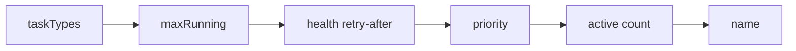
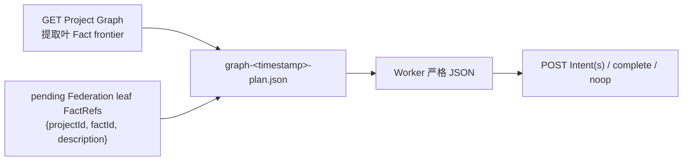
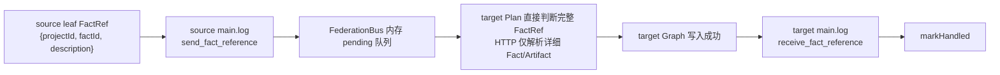
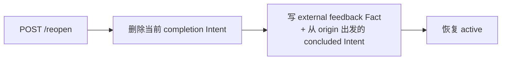

# Peak 接口定义与数据流

本文是 Peak 的接口契约与数据流参考：Graph 数据模型 TypeScript 类型、HTTP API、任务协议 JSON 合同、SQLite 模式、持久化布局、Board 配置 schema，以及各操作的端到端数据流。架构边界与设计原理见 [architecture.md](architecture.md)。

## 1. Graph 数据模型

每个 Project 有且只有一张持久化 Graph。

### 1.1 类型定义

```typescript
type ProjectStatus = "active" | "stopped" | "completed";

interface FactRef {
  projectId: string;       // 源 Project UUID，超链接地址的一部分
  factId: string;          // 源 Fact id，超链接地址的一部分
  description: string;     // 源 Fact 的规范、不可变摘要
}

interface ArtifactRef {
  path: string;       // Server 生成的 Project-relative 路径，固定为 artifacts/<sha256>
  sha256: string;
  mediaType: string;
  sizeBytes: number;
}

interface Fact {
  id: string;                     // origin | goal | f001...
  description: string;            // 普通 Fact <= 1 KiB；origin/goal <= 4 KiB
  artifact: ArtifactRef | null;   // 可选详细内容
  createdAt: string;
}

interface Intent {
  id: string;                     // i001...
  from: FactRef[];
  to: FactRef | null;             // null = open, 非 null = concluded
  description: string;            // 必填，trim 后非空，UTF-8 <= 2 KiB
  createdBy: string;
  createdAt: string;
  concludedBy: string | null;
  concludedAt: string | null;
}

interface Hint {
  id: string;                     // h001...
  content: string;
  creator: string;
  createdAt: string;
}

interface ProjectMeta {
  id: string;                     // UUID，不可修改
  title: string;                  // 可修改
  status: ProjectStatus;
  scope?: string;
  createdAt: string;
}
```

- Project ID 使用 UUID；普通 Fact、Intent、Hint 分别使用 shard 内单调计数生成的 `fN`、`iN`、`hN`。
- Project title 可修改；UUID 不可修改。

### 1.2 不变量

- 普通 Intent 至少有一个 source；
- source 必须存在且不能是任何 Project 的 `goal`；
- 每个 FactRef 必须完整包含 `projectId`、`factId`、`description`，且 description 必须与源不可变 Fact 完全一致；
- FactRef 是目标 Graph 中可独立展示的超链接节点，由 `projectId/factId` 追溯源 Fact，description 作为其不可变链接摘要；
- 外部 source 必须与目标 Project 同 Federation scope；
- source 不重复，顺序稳定；
- 普通 Fact description 必须存在、trim 后非空且不超过 UTF-8 1 KiB，只承载可独立理解的简明摘要；保留的 `origin` 和 `goal` description 使用最大的 UTF-8 4 KiB 上限；
- Intent description 必须存在、trim 后非空且不超过 UTF-8 2 KiB；Hint content、Project title 和 actor 标签等持久化短文本不超过 UTF-8 1 KiB；
- 详细分析、证据、表格和报告必须放入 Artifact；Artifact 不能替代必填的 Fact 摘要；
- Execute 只能创建当前 Project 的 Fact；
- concluded Intent 不可修改；
- 每个 Project 最多一个 completion Intent；
- completion 的 target 是当前 Project `goal`；
- 被外部 Project 引用的 Project 禁止删除。

## 2. 持久化布局

默认 Peak Home 为 `~/.peak`，可通过 `PEAK_HOME` 或 CLI `--peak-home` 覆盖。

```text
~/.peak/projects/<uuid>/
├── analysis.db
├── artifacts/
│   └── <sha256>
└── logs/
    ├── main.log
    └── graph-<monotonic-utc-timestamp>-<plan|supervise|execute|finalize>.json
```

每个 UUID 目录都是独立 shard，不存在共享 Project 数据库或当前项目指针文件。

### 2.1 SQLite 表

`analysis.db` 仅包含：

```text
project, artifacts, facts, intents, intent_sources, hints, counters
```

SQLite 启用 foreign key 和 WAL。`artifacts` 只保存 `sha256, path, media_type, size_bytes, created_at`；`facts.artifact_sha256` 可空；`facts.description` 和 `intents.description` 必须 `NOT NULL`，服务层额外校验 trim 后非空和 UTF-8 byte length。SQLite 不保存 Artifact 正文或大 BLOB。

跨 Project source 只在目标 Project 的 `intent_sources` 中保存完整 FactRef `{source_project_id, source_fact_id, source_description}`。`source_description` 是源 Fact 不可变摘要，使引用成为可独立显示、可追溯的超链接节点；不复制源 Fact 实体或 Artifact。`intent_sources` 定义：

```sql
CREATE TABLE intent_sources (
  intent_id          TEXT NOT NULL,
  position           INTEGER NOT NULL,
  source_project_id  TEXT NOT NULL,
  source_fact_id     TEXT NOT NULL,
  source_description TEXT NOT NULL,
  PRIMARY KEY (intent_id, position),
  UNIQUE (intent_id, source_project_id, source_fact_id)
);
```

### 2.2 Artifact

Artifact body 以 SHA-256 为文件名保存到当前 Project 的 `artifacts/`，SQLite 只保存 hash、相对路径、media type、大小和创建时间。

上传必须流式计算 hash 并执行大小限制。Runtime 只允许上传 `board.workspace` 内的普通文件：

- `localPath` 必须为相对路径；
- realpath 不能越过 workspace；
- 候选路径不能是 symlink；
- 文件大小不能超过 `phase.execute.maxArtifactBytes`。

Server 启动时清理超过 24 小时安全窗口且没有 Fact 引用的 Artifact。下载前必须校验 64 位小写十六进制 hash、普通文件和非 symlink。

### 2.3 日志与 Graph context

`main.log` 是追加式 NDJSON，记录经 Server 验证后的 Graph operation，以及 Federation 的 `send_fact_reference` / `receive_fact_reference`。`graph-*.json` 只记录执行时的图上下文，不保存 Worker 原始输出。

每次阶段执行前生成一个不可变、紧凑的 JSON snapshot。写入采用临时文件加原子 rename，文件名使用进程内单调 UTC 时间戳。Snapshot 包含阶段所需的 Board、proof frontier 或 Graph、assignment、source、Federation reference 和已物化 Artifact 路径；它不是在线 Graph 句柄。Prompt 只传 JSON 的绝对路径和输出合同。Plan snapshot 只包含当前本地叶 Fact、open Intent、Hint 和 pending Federation 叶 FactRef，并由 Runtime 生成规范 `availableFactRefs`；其中每项已经完整包含 `projectId`、`factId`、`description`，Plan 不负责获取或加工引用数据；Supervise snapshot 使用完整 Graph；Finalize 使用与 Execute 相同的绑定上下文，并写自己的 `graph-<timestamp>-finalize.json`。

源 Artifact 会通过 Graph HTTP API 下载到系统临时目录：

```text
<tmp>/peak-inputs/<execution-id>/<sha256>
```

`TaskExecutor` 不直接读取 Project `artifacts/`。错误日志只输出 bounded preview，不持久化原始 stdout/stderr。

## 3. Graph HTTP API

HTTP 方法具有标准语义，不限制为 POST。主要路由：

```text
GET    /                                      Dashboard shell（不要求 Bearer Token）
GET    /api/projects
POST   /api/projects
GET    /api/projects/:id
DELETE /api/projects/:id
PUT    /api/projects/:id/title
PUT    /api/projects/:id/status               # 仅 active <-> stopped
GET    /api/projects/:id/facts/:factId
POST   /api/fact-refs/resolve
POST   /api/projects/:id/hints
POST   /api/projects/:id/intents
POST   /api/projects/:id/intents/:intentId/conclude
POST   /api/projects/:id/complete
POST   /api/projects/:id/reopen
POST   /api/projects/:id/artifacts
GET    /api/projects/:id/artifacts/:sha256
HEAD   /api/projects/:id/artifacts/:sha256
GET    /api/projects/:id/export?format=json|timeline
GET    /api/scopes/:scope/export?format=json|timeline
```

所有 JSON 输入都严格拒绝 unknown/missing field。普通 JSON body 上限为 1 MiB；Artifact 使用独立流式上传限制。API 响应不应被缓存。`completed` 只能由 complete endpoint 设置；恢复只能调用 reopen。`GraphClient` 是 Runtime 和 Node 客户端的薄 HTTP 封装，负责 JSON 请求、Bearer header、Artifact stream 上传/下载以及 JSON/timeline 导出，不包含 Graph 业务旁路。

### 3.1 Project

```json
// POST /api/projects
{ "title": "...", "target": "...", "goal": "...", "scope": "optional" }
```

创建时在同一 shard 生成 `origin`（来自 `target`）和 `goal`（来自 `goal`）Fact。

### 3.2 FactRef resolve

```json
// POST /api/fact-refs/resolve
{
  "targetProjectId": "...",
  "refs": [{ "projectId": "...", "factId": "f001", "description": "源 Fact 的不可变摘要" }]
}
```

Server 先校验每个 ref 的三个字段与源 Fact 完全一致，再返回对应的 Fact（含 description 与 ArtifactRef）。Artifact 正文不进入响应，也不复制到目标 Project。

### 3.3 Hint

```json
// POST /api/projects/{id}/hints
{
  "content": "对当前 Graph 的具体建议",
  "creator": "supervise:<executionId>"
}
```

Server 校验 Project 存在、content 非空且不超过 UTF-8 1 KiB；与已有 Hint trim 后完全相同则返回 `409`。外部调用可以给任意状态的 Project 添加 Hint，但只有 active Project 会运行 Supervisor/Plan。

### 3.4 Intent

```json
// POST /api/projects/{id}/intents
{
  "from": [{ "projectId": "...", "factId": "f001", "description": "源 Fact 的不可变摘要" }],
  "description": "需要执行或证明的具体事项",
  "createdBy": "plan:<executionId>"
}
```

```json
// POST /api/projects/{id}/intents/{intentId}/conclude
{
  "description": "结论或摘要",
  "artifact": null,
  "concludedBy": "execute:<executionId>"
}
```

Conclude transaction：Project 必须 active；Intent 必须 open；校验 Fact description 必填、trim 后非空且不超过 UTF-8 1 KiB，并校验可选 ArtifactRef；创建本地 Fact；更新 Intent.to；返回 Fact 和 Intent。详细内容超过摘要范围时必须写入 Artifact。并发 conclude 只有第一个成功，其余返回 `409`。

### 3.5 Complete

```json
// POST /api/projects/{id}/complete
{
  "from": [{ "projectId": "...", "factId": "f001", "description": "源 Fact 的不可变摘要" }],
  "description": "Goal 证明",
  "completedBy": "plan:<executionId>"
}
```

同一 transaction：校验 FactRef（字段完整、description 与源 Fact 完全一致、存在、无重复、不引用 `goal`、不越过 scope）；创建 `FactRef[] -> currentProject/goal` completion Intent；将 Project 标记为 completed；返回该 completion Intent。完成不等待其他 Project、广播、pending reference 或活动 Worker。晚到 conclude 返回冲突。

### 3.6 Reopen

```text
POST /api/projects/{id}/reopen
```

只允许显式调用：删除当前 completion Intent，写 external feedback Fact/Intent，并恢复 active。Hint 和 Federation 消息不能 reopen。

### 3.7 Artifact

```text
POST /api/projects/{id}/artifacts        流式上传
GET  /api/projects/{id}/artifacts/{sha256}
HEAD /api/projects/{id}/artifacts/{sha256}
```

上传流程：streaming 写临时文件 → 计算 SHA-256 → 原子 rename 到 `artifacts/<sha256>` → 写 `artifacts` 索引 → 返回 ArtifactRef。客户端不能指定最终 path；拒绝 absolute path、`..`、symlink escape；上传和下载不把完整文件读入内存；未被 Fact 引用的 Artifact 按安全窗口 GC。

## 4. 任务协议

所有 worker 输出统一为严格 JSON 合同。解析优先接受最后一个 fenced JSON block，否则提取最外层 `{...}`。解析后严格拒绝 unknown field、missing field、空 FactRef 列表、缺少任一 `projectId`/`factId`/`description` 的 FactRef、被改写的 FactRef description、空描述、超过 1 KiB 的普通 Fact description/Hint content，以及超过 2 KiB 的 Intent description。不能放宽 Plan、Supervise、Execute 的 typed shape。

拒绝的输入形式：Markdown fence/prose、多个 JSON、缺失或未知字段、缺失或空白的 Intent/Fact description、context 外 FactRef、非法 Artifact 路径、过长 description。Fact 详细内容必须通过 Artifact 返回。

### 4.1 Plan

决定下一步证明结构，三选一：

```json
{ "kind": "intents", "intents": [{ "from": [{ "projectId": "...", "factId": "f001", "description": "源 Fact 的不可变摘要" }], "description": "..." }] }
```

```json
{ "kind": "complete", "from": [{ "projectId": "...", "factId": "f001", "description": "源 Fact 的不可变摘要" }], "description": "..." }
```

```json
{ "kind": "noop" }
```

`intents` 数量为 `1..phase.plan.maxIntents`，且只能引用 Snapshot 的 `availableFactRefs` 中可见的本地叶 Fact 或 pending Federation 叶 FactRef。Plan 必须原样返回所选节点的 `projectId`、`factId`、`description`；数据获取、规范化和一致性验证由代码完成。叶 Fact 是尚未作为 source 产出更晚本地 Fact 的当前证明前沿；`goal` 永远不是 source 叶 Fact。已有下游 Fact 时，上游 Fact 从 Plan snapshot 中省略，因为下游 Fact 代表更可信的当前状态。叶 Fact 可以事实正确但仍缺少前置条件，Plan 可据此创建新的 Intent。Plan 不执行 Intent、不直接创建 Fact、不操作其他 Project。

### 4.2 Supervise

独立审视当前 Graph，只提出改进 Hint，二选一：

```json
{ "kind": "hint", "content": "当前证明缺少对……的验证，建议……" }
```

```json
{ "kind": "noop" }
```

只对 active Project 运行；每轮最多一个 Hint；content 必填、trim 后非空、UTF-8 不超过 1 KiB；与已有 Hint trim 后完全相同则不写入；不创建 Intent/Fact，不完成或 reopen Project。

### 4.3 Execute

执行一个 open Intent 并产出 Fact。短结果：

```json
{ "kind": "fact", "description": "..." }
```

Fact 必须提供不超过 UTF-8 1 KiB 的简明 description；详细结果通过 Artifact 承载：

```json
{
  "kind": "fact",
  "description": "摘要",
  "artifact": {
    "localPath": "reports/report.md",
    "mediaType": "text/markdown"
  }
}
```

`artifact` 可省略。Worker cwd 是 `board.workspace`。`TaskExecutor` 将 `localPath` 解析到该 workspace，拒绝 symlink/越界/超限文件，通过 GraphClient 上传后再 conclude。

### 4.4 Finalize

不是任务类型，只在 Execute 失败、timeout 或格式无效且 Worker 支持 resume 时运行一次。resume 同一 session；不继续探索；只整理已确认结果；输出与 Execute 相同合同。

## 5. 调度与 Worker 接口

### 5.1 ExecutionRegistry（内存）

```typescript
interface ActiveExecution {
  executionId: string;
  projectId: string;
  kind: TaskType;            // "plan" | "supervise" | "execute"
  intentId?: string;
  workerName?: string;
  controller: AbortController;
}
```

ExecutionRegistry 仅在内存：每个 Project 最多一个 Plan；每个 Project 最多一个 Supervise；每个 Intent 最多一个 Execute；不同 Intent 可并发；Runtime 重启后 open Intent 重新可调度。

### 5.2 Plan checkpoint

```typescript
interface Checkpoint {
  facts: number;        // Fact 数
  hints: number;        // Hint 数
  open: number;         // open Intent 数
  federation: number;   // pending Federation 数
}
```

触发：首次观察、Fact/Hint 增加、open Intent 清零、新 Federation reference。

### 5.3 WorkerDriver 合同

```typescript
interface WorkerDriver {
  readonly type: WorkerType;
  readonly canResume: boolean;
  execute(request: WorkerRequest): Promise<WorkerResult>;
  dispose(): void;
}
```

`WorkerRuntime` 只构造一次 `WorkerRequest` 并调用 `driver.execute()`，不按 SDK/CLI 类型分支。`SessionRef` 只包含 Worker type 和不透明值，只能交回相同 type 且 `canResume` 的 Driver，不进入 Graph、Board 配置、JSON checkpoint 或 Project 恢复状态。

### 5.4 Worker 选择排序



## 6. Board 配置 schema

CLI 参数指向包含 `task.json` 的 Board 目录。Board 只是 Project 集合和共享运行资源，没有 description、Goal、Graph 或完成状态。

```text
my-board/
├── task.json
├── workspace files...
└── skills/                 # 仅在配置 Board-local Skill 时需要
    └── <name>/SKILL.md
```

顶层字段只能是 `board, workers, optional scheduler, optional phase`：

```json
{
  "board": {
    "name": "ai-agent-safety",
    "workspace": ".",
    "skills": ["ai-agent-safety"],
    "projects": [
      {
        "id": "",
        "name": "Latest AI Safety Intelligence",
        "goal": "Collect and analyze current AI safety evidence."
      },
      {
        "id": "",
        "name": "AI Agent Guardrail Design",
        "goal": "Produce an actionable AI Agent guardrail construction plan."
      }
    ]
  },
  "workers": [
    {
      "type": "pi",
      "model": "zai-coding-cn/glm-5.2",
      "taskTypes": ["plan", "supervise"],
      "maxRunning": 1,
      "priority": 98,
      "args": []
    },
    {
      "type": "codex",
      "model": "",
      "taskTypes": ["plan"],
      "maxRunning": 1,
      "priority": 99,
      "args": []
    },
    {
      "type": "opencode",
      "model": "minimax/MiniMax-M3",
      "taskTypes": ["execute"],
      "maxRunning": 2,
      "priority": 99,
      "args": []
    }
  ],
  "phase": {
    "plan": { "maxIntents": 4 },
    "supervise": { "intervalMs": 90000 },
    "execute": { "maxArtifactBytes": 10485760 }
  }
}
```

约束与持久化语义：

- `board.projects` 必须为非空数组；每项只能包含 `id`、`name`、`goal`；name 必须非空且在 Board 内唯一；
- `id` 可省略或为空字符串；首次 `run` 成功创建 Project 后，Peak 以原子替换方式把生成的 UUID 写回该数组项；
- 非空 `id` 必须是 UUID，同一 Board 内不能重复；Runtime 按 id 附加原 Project并校验其 immutable Goal，不创建副本；
- 另一个 Board 可以配置相同 UUID 来复用同一 Project Graph、Facts 与 Artifacts；同一 active Project 不得被多个 Runtime 进程并发调度；
- `workers` 是非空数组；Peak 生成内部 Worker identity；空 `model` 表示使用 Agent 工具默认模型；至少一个 Worker 必须支持 `supervise`；
- Worker type 只能是 `opencode`、`codex`、`pi`、`claude-code`；task type 只能是 `plan`、`supervise`、`execute`；
- `priority` 数值越小越优先，可为 0；其余计数/间隔必须为正整数；
- unknown field 在所有层级都被拒绝；字符串 trim 后必须非空（`id` 和 `model` 的显式空字符串除外）；加载结果递归 freeze；
- `loadTaskConfig()` 只解析和验证；成功创建后的 UUID 回写由独立的原子 config 操作完成。

新建 Project 使用根据 name 生成的 immutable origin 和自己的 goal；按 id 附加时保留原 Project 的 title/origin 并校验 goal。各 Project 的状态、Graph、Artifact 与完成条件彼此独立，Project 配置不声明跨 Project 依赖。Worker JSON context 包含完整 Board 与当前 Project。Board 内已注册 Project 只把符合范围的叶 `FactRef` 作为候选证据提供给 Plan；每个候选完整携带规范的 `projectId`、`factId` 和不可变 `description`。已附加 Project 启动时只广播当前普通叶 Fact，已经产出后续本地 Fact 的历史 Fact 不再作为当前候选。是否采用由 Plan AI 根据当前 Goal 判断；目标只保存 FactRef 超链接节点，不复制源 Fact 实体或 Artifact。

### 6.1 Skill 解析与生命周期

Board customization 只能通过 `board.skills`，配置时只允许名称（匹配小写字母、数字和连字符规则）。发现目录：

```text
OpenCode / Pi -> ~/.agents/skills/<name>/SKILL.md
Claude Code   -> ~/.claude/skills/<name>/SKILL.md
Codex         -> 不安装 Skill
Board fallback -> <board-dir>/skills/<name>/SKILL.md
```

初始化规则：目标位置已有合法全局 Skill 时直接使用，Board-local 同名 Skill 不覆盖它；目标不存在时才把 Board-local Skill 以 symlink/junction 临时链接过去；不覆盖真实文件、目录或其他链接；多个 Runtime 共享同一个 Peak 管理链接时使用内存引用计数；Runtime shutdown 时仅删除 Peak 创建且仍指向原 source 的临时链接；预先存在的全局 Skill 永不覆盖、永不删除；不下载 Skill。Skill 生命周期是 Board Runtime 级而非 Project 级：一个 Board 下的多个 Project 共享该租约，单个 Project 停止/完成不释放，整个 Runtime 关闭时释放。`--no-install-skills` 可跳过安装；`peak init` 不创建 `skills/` 目录。除成功创建 Project 后原子回写 UUID 外，Runtime 不修改配置文件。

## 7. 数据流

### 7.1 Board Project 集合


### 7.2 Plan



### 7.3 Supervise


### 7.4 Execute


失败、malformed 或 timed-out 的 Execute 可通过 Finalize resume 同一 worker session 一次。Finalize 写自己的 Graph JSON 并返回相同 Fact 合同。

### 7.5 Artifact


Artifact 承载 Fact 的详细内容；不超过 UTF-8 1 KiB 的 Fact description 始终必填，只作为可独立理解的摘要。

### 7.6 Federation



只有完整 FactRef `{projectId, factId, description}` 被持久化在目标 `intent_sources`，其中 description 是不可变超链接摘要。新下游叶 Fact 广播时会在 send event 中记录其取代的本地 source FactRef，并从目标尚未处理的 pending frontier 中移除这些上游引用；已经写入目标 Graph 的历史 FactRef 不删除。source Fact 实体和 Artifact 留在 source Project；target 需要 Artifact 等详细内容时通过 `/api/fact-refs/resolve` 和 Artifact HTTP route 读取。FederationBus 无数据库，只从 `main.log` 恢复。失败时不 mark handled。

### 7.7 Completion 与 Reopen




完成是 Project-local 且即时；只有显式 `/reopen` 才能恢复。
