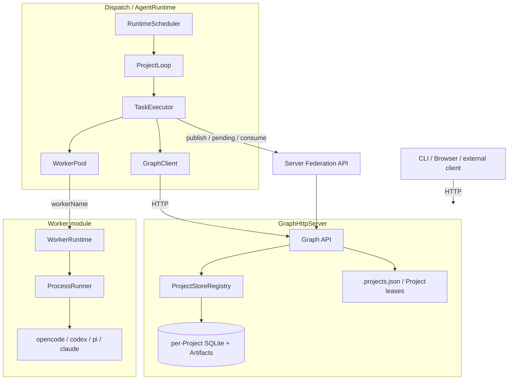
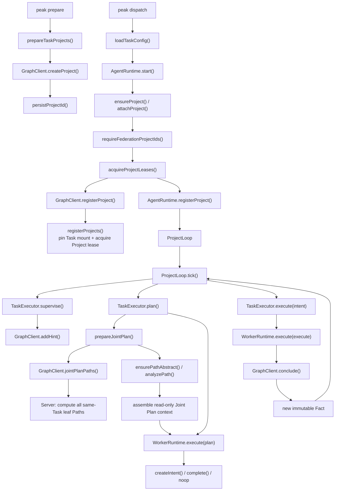

# Peak 架构

Peak 是基于证明图（proof Graph）的 Agent 运行时。每个 Project 拥有独立 Graph；Board 只负责组合 Project、Worker 与运行配置。Graph、Runtime、Worker 和 UI 之间通过固定边界协作，领域方法只由 Skill 提供。

具体数据结构、HTTP 路由和阶段 JSON 合同见 [数据流](data-flow.md)。

## 1. 核心原则

- **Project 是状态边界**：每个 Project 独立持久化、调度和完成。
- **Project 是跨进程所有权边界**：一个 Project 同时只由一个 Dispatch 拥有，但其内部仍细粒度并发 Plan、Supervise 和多个 Intent Execute；Task 只补充固定的 Federation 挂载。
- **HTTP 是唯一 Graph 协议**：Runtime 和外部客户端都经 `GraphClient` 访问 `GraphHttpServer`。
- **Graph 只保存证明状态**：Fact、Intent、Hint 和 Project；Server 在 `.projects.json` 记录固定 Task Federation 挂载和带 TTL 的 Project 租约，两者都不进入 Project Graph 或归档。
- **Worker 与 Graph 隔离**：Worker 只接收 Prompt，不获得 Graph、SQLite、HTTP client 或 Federation 对象。
- **Fact 不可变**：更新通过 `leaf Fact(s) -> Intent -> new Fact` 表达。
- **外部结果只作参考**：Federation 提供外部 leaf FactRef 和只读 Path Abstract，不能作为本地 Intent source。
- **严格输出边界**：Worker 输出必须满足阶段合同，Server 再次校验后才写 Graph。

## 2. 总体结构



### 2.1 核心函数调用流水线



关键主线是 `ProjectLoop -> Joint Plan -> Intent -> Execute -> Fact -> 下一轮 Joint Plan`。Federation 只负责在 Plan 前发现同 Task 的 Project Paths，不接管 Project 状态机。

## 3. 模块边界

| 模块 | 责任 |
| --- | --- |
| `src/graph/` | Graph 类型、HTTP API、SQLite/Artifact store、Federation、归档 |
| `src/runtime/` | 调度、阶段上下文、合同解析、WorkerPool、执行状态 |
| `src/worker/` | CLI 协议、WorkerRuntime、ProcessRunner；不感知 TaskType |
| `src/utils/` | Board 配置、路径、进程、Project 注册和 Docker 启动 |
| `src/ui/` | 可选 Dashboard、Artifact 预览和任务管理页面 |
| `src/cli.ts` | 命令与进程生命周期的组合根 |

关键依赖方向：

1. Store 只属于 Graph Server，不从公共入口导出。
2. Runtime 只能通过 HTTP 访问 Graph；`runtime/` 对 `graph/` 的模块引用仅限于 HTTP client（`GraphClient`）、DTO 类型、客户端 Joint Plan 适配器和阶段合同验证函数，绝不引用 store 或 server 实现。
3. 通用 HTTP/序列化原语（`ApiError`、`localTimestamp`、`toJson`）归 `utils/helpers`，Server 与 Runtime 共用；`graph/api.ts` 仅保留 API 合同验证器并 re-export 原语以保持公共出口不变。
4. `src/worker/` 不引用 `runtime/`、`graph/` 或 `utils/`。
5. UI 只是 HTTP 客户端；移除 UI 不影响 Graph 正确性。

## 4. Graph 模型

每个 Project 创建时包含：

- `origin`：来自 `board.projects[].source`；
- `goal`：来自 `board.projects[].goal`。

普通证明链由三类实体组成：

- **Fact**：不可变结论，可选绑定一个内容寻址 Artifact；
- **Intent**：从一个或多个当前本地 leaf 出发，最终产生恰好一个新 Fact；
- **Hint**：独立建议，不参与因果边，可被 Plan 原子消费。

`FactRef` 始终是完整的 `{projectId,id,description}`。description 必须与源 Fact 完全一致。普通 Intent 和 completion 只能引用当前 Project 的当前本地 leaf；跨 Project source 在 Server 边界拒绝。

完成时，Server 原子创建 `leaf FactRef[] -> goal` 的 completion Intent，并把 Project 标记为 `completed`。显式 reopen 会移除 completion、把外部反馈写成新 Fact，并恢复 `active`。

## 5. Runtime 阶段

| 阶段 | 作用 | 固定超时 |
| --- | --- | ---: |
| Plan | 创建 Intent、完成或 noop | 5 分钟 |
| Supervise | 添加一个 Hint 或 noop | 5 分钟 |
| Execute | 执行一个 open Intent，返回一个 Fact | 10 分钟 |
| Finalize | 恢复一次已启动但失败的 Execute | 2 分钟 |
| Analyze | 为 leaf 链生成 Path Abstract | 5 分钟 |

Finalize 和 Analyze 不是 `taskTypes`。Analyze 复用 Plan 路由；Finalize 复用原 Execute Worker 与 session。

阶段行为保留在现有 profile 中：`board.skills` 声明 Task 允许列表，`customProfile.skills` 为 Plan、Supervise 或某个 Execute profile 选择其子集。只有当前 profile 选中的 Skills 会进入对应 Prompt；Finalize 继承 Execute，Analyze 固定不可配置且不接收 Skills。本地阶段快照会在 `customProfile.skills` 下记录这个已选子集用于溯源，但不暴露 Worker 路由或配置。

### Plan 上下文

Plan 上下文固定由两部分组成：

```text
projects[currentProjectId]
├── source
├── goal
├── leafFacts
├── openIntents
└── unconsumedHints

external[]
├── factRef {projectId,id,description}
├── pathOverview
└── verifiedCore[]
```

当前 Project 的信息全部位于 `projects[projectId]` 下；不再提供与 source 重复的 title。`external` 由 Joint Plan 从同 Task 其他 Project 的当前 leaf Paths 构建，只能辅助判断。每个阶段上下文最多 256 KiB，并显式报告 `truncated` 和 `omitted`。

### Execute 文件边界

Execute 可以读取已解析的 source Artifact，也可以在当前 Project `.tmp/` 中读写临时文件。每个 source Artifact 会先物化到执行基板（local：`.tmp/sources/`；docker：容器 `/work/sources/`，经 `docker cp` 写入、读取时拉回校验），本地 Projects root 没有 body 时自动从 Graph API 拉取——因此 Serve 与 Dispatch 可以跨主机或使用不同 Projects root；运行前后都会校验物化副本的 sha256，Worker 篡改会被拒绝。最终结果必须内联返回严格合同：

```json
{ "kind": "fact", "description": "...", "artifact": null }
```

或返回一个 `{filename,mediaType,content}` Artifact。只有合同中的内容会被 Runtime 上传并绑定到 Fact；`.tmp/` 文件不会自动成为结果。Project 不再 active 后 `.tmp/` 会被清理。

## 6. 调度与 Worker

每个 tick 依次补充到期 Supervise、需要重做的 Plan 和未运行的 open Intent Execute。`ExecutionRegistry` 保证每个 Project 最多一个 Plan、一个 Supervise，每个 Intent 最多一个 Execute。

`task.json.workers[].taskTypes` 只属于配置路由。Runtime `WorkerPool` 负责：

- 按 `taskTypes` 过滤；
- 按 `priority`、Execute load、名称排序；
- 管理 Execute 的 `maxRunning`、reservation 和 30 秒失败冷却。

选定 workerName 后，传入 `WorkerRuntime` 的定义只包含 `{type,model?,env}`。`WorkerRuntime` 不接收 TaskType，也不管理路由或容量。

`ProcessRunner` 是唯一子进程入口：Prompt 走 stdin，cwd 和临时环境变量固定到 Project `.tmp/`，取消或超时终止整个进程树，stdout/stderr 各限制 10 MiB。

Execute 总容量为所有 Execute 路由的 `maxRunning` 之和，同时也是 Plan 单轮可创建 Intent 的上限。

## 7. Federation 与 Path Abstract

Runtime 为每个本地 leaf 生成 `artifacts/path_abs_<factId>`：

- Analyze 输入当前 Fact，以及其直接前驱的 Path Abstract；
- 输出 `{pathOverview,verifiedCore}`；
- 结果存在后直接复用，失败时写入结构化降级摘要。

`goal` 是 Project 完成状态的证明终点，不是 Joint Path 的 Analyze 节点。即使存在 completion 边 `fN -> goal`，Joint Path 仍严格截止到 `fN`，只生成 `path_abs_fN`；永远不会生成或传播 `path_abs_goal`。

同一个 Task 中声明的 Projects 固定组成一个 Federation group：只要 Task 包含多个 Projects，Joint Plan 就必须读取全部成员的当前 Paths；需要隔离的 Projects 必须放入不同 Task，不存在额外开关或运行时成员移入/移出。第一个 Project lease 原子地把完整 UUID 集合固定到 `.projects.json`；后续 Dispatch 提交不同集合会被拒绝。

Joint Plan 是 HTTP pull，而不是广播队列。每次 Plan 前，Server 根据固定 Task mount 直接计算其他成员的当前 leaf Paths，不区分源 Project 是 active 还是 completed。Runtime 通过中央 Graph HTTP API 查询 Path Abstract，并对缺失项递归执行增量 Analyze：若 `path_abs_fN` 已存在就立即复用；否则先补齐全部直接前驱的 Path Abstract，再只分析 Fact N。最终的 Path Abstract DTO 直接加入 `external`，不复制到目标 Project 本地。

每次本地 Plan Worker 调用前，Runtime 都先补齐当前 Project 的完整 leaf PathAbstract frontier。因此 Plan 完成 Project 时，Archive 所需的 Path Abstract 已经齐全；export 只验证并打包，绝不在导出阶段执行 Analyze。

因此不再存在 publish、pending、consume、发送/接收日志或 Server 内存 `FederationBus`。leaf 被后继 Fact 消费后，下一次 Joint Plan 直接从最新 Graph 得到新 frontier。completed Project Archive 已包含 Path Abstract；导入并加入 Task 后直接复用，缺失项才触发递归 Analyze。

## 8. 部署与一致性

- `peak serve` 与 `peak dispatch` 是独立角色；多个 Dispatch 可横向启动并分别使用 `--project` 领取 Project。
- Dispatch 在开始 Analyze/Plan/Execute 前，通过 Server HTTP 原子领取 Project 租约；租约保存在 `.projects.json`，默认 TTL 15 秒、每 5 秒续约。
- TTL 内其他 Dispatch 领取同一 Project 得到 HTTP 409；正常退出立即释放，崩溃或断网停止续约后由 Server 时钟判定过期并允许接管。
- 临时网络失败不会立刻停止调度；只有 Server 明确返回租约丢失，或最后一次 Server 授予的到期时间已过，Dispatch 才停止 Scheduler 并退出。
- Runtime 始终在宿主机调度；Task 级 `execution.mode` 选择 `local` 或 `docker`。Docker 模式为每个 Project 创建一个独立长驻容器；Project 离开 active 状态时按原因释放——completed 删除容器（`rm -f`），stopped 仅停容器（`docker stop`）保留文件系统，重新激活时 `docker start` 秒级恢复，无需重建；Docker 或镜像不可用时整个 Task 回退 local。
- `peak serve --host/--port` 独立决定 Server 监听地址；Task 配置不包含 Server 端口，Dispatch 必须显式连接 `--graph-url`。
- 任务镜像自包含：预装 decx、frida/radare2、nmap/nuclei/ffuf/sqlmap/impacket 等。
- docker 模式容器零挂载：graph 走 prompt、API key 走 worker env、Skills 走 `docker cp`、工作目录容器内 `/work`；唯一 Docker 专用配置是 `execution.networkMode`。
- Android 设备通过宿主机 adb server 复用接入（`container/device-bridge.sh`），无需 USB 直通或 `privileged`。
- Graph API 不实现 token 或鉴权，网络边界由部署环境负责。
- Artifact 路径必须经过 resolve、边界和 symlink 校验。
- Graph operation 只有在 Server 校验成功后才写日志。
- completed Project 的带 filename Artifact 会物化到该 Project 的 `out/`。
- 执行、session、reservation 和 cooldown 不进入 Graph 或归档；只有控制面的 Project lease heartbeat 进入 `.projects.json`。

运行方式、Board 配置和 CLI 见 [使用指南](usage.md)；构建与测试见 [开发指南](development.md)。
