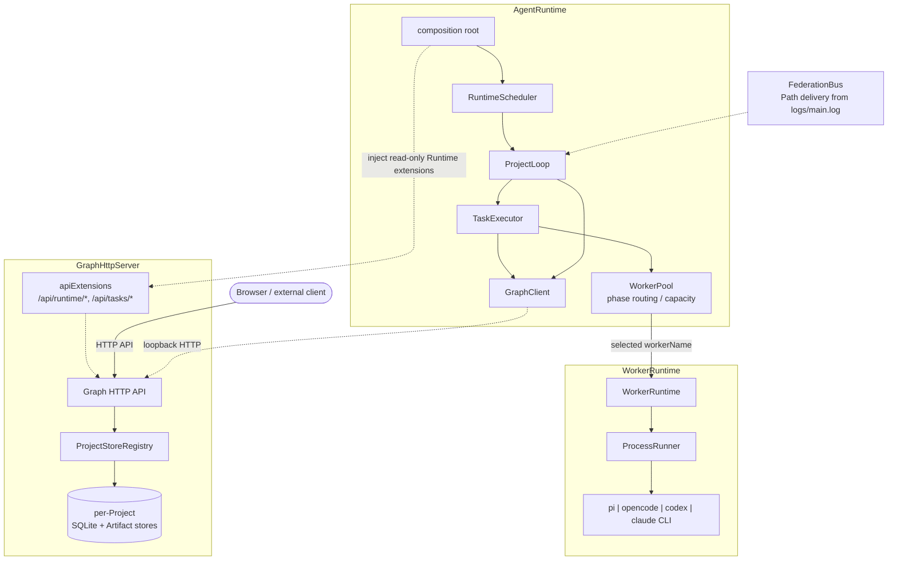
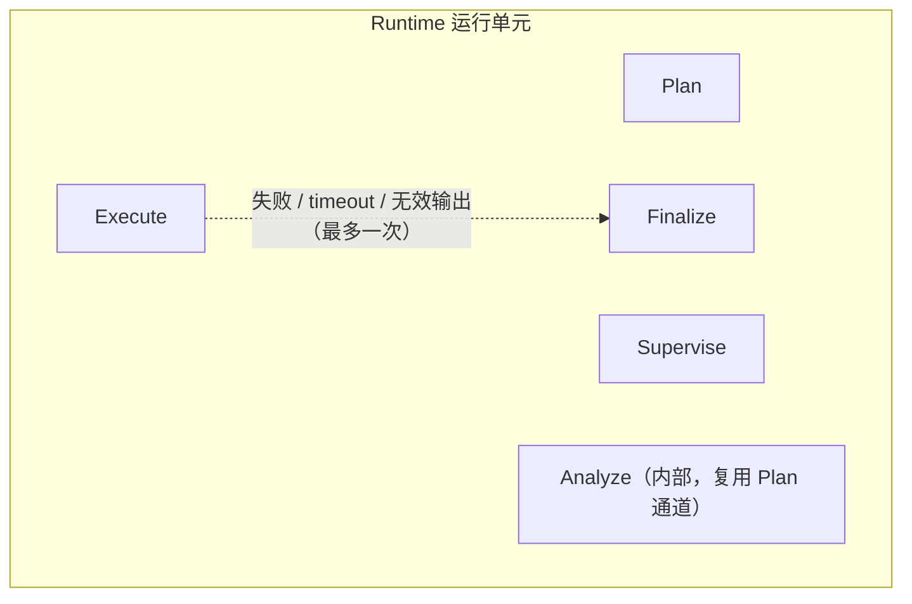

# Peak 核心架构与设计原理

Peak 是基于分布式证明图（proof Graph）的通用 Agent 运行时。每个 Project 是独立 Graph 分片，Project 之间通过 `FactRef` 组成证明链。Graph、调度、Worker、Federation、存储和 Web UI 都保持领域无关；具体任务方法只通过 Skill 提供。运行时为 ESM，要求 Node.js `>=22.19.0`。

本文描述 Peak 的架构边界与设计原理。Graph 数据类型、HTTP API、任务协议 JSON 合同、SQLite 模式、持久化布局与各操作的数据流见 [data-flow.md](data-flow.md)。

## 1. 设计目标

- Board 只是 Project 集合和共享运行配置，没有自己的 Goal、Graph 或完成状态；
- 每个 Project 是独立 Graph 分片，状态、Artifact 与完成条件彼此独立；空配置 id 在首次创建后原子回写，已有 UUID 直接复用原 Graph；
- Project UUID 可被另一个 Board 引用以复用长期结果，但同一 active Project 不允许被多个 Runtime 进程并发调度；
- Project 之间的跨分片复用通过 Federation 广播的只读链路完成（见 §8）；`FactRef` 超链接节点（`projectId`、`id` 与源 Fact 不可变 `description`）仍作为 Graph 数据类型保留，目标 Project 只保存引用、不复制源 Fact 实体或 Artifact；
- HTTP API 是 Graph 的唯一在线读写接口，Graph 与 `GraphHttpServer` 绑定；
- 运行时内部也必须经 loopback HTTP 通过 `GraphClient` 读写 Graph，不直接访问 SQLite 或 Artifact store；
- Web UI 是可选、可替换的展示与人工操作客户端，不属于 Graph 协议，Graph 正确性不依赖 UI；
- Worker 只接收按阶段组装的只读 Graph JSON 渲染进 Prompt 文本（快照另存到 `logs/graph-*.json`），不接触 Graph/store 对象、SQLite 路径、HTTP 客户端或 `FederationBus`；Plan 所需的外部结果由 Runtime 解析为完整 FactRef 与只读 `path_abs_<factId>` 文件路径后直接注入；
- 领域能力只来自 Skill，不使用 Workflow；
- 内置 Graph Supervisor 是固定控制协议，只审视图并提出 Hint；
- 执行、取消、Worker 负载与冷却、Reservation、调度 checkpoint 和短期 Agent session 只存在于内存。

## 2. 总体架构



核心边界：

1. `GraphHttpServer` 绑定 Graph，HTTP API 是唯一在线 Graph 协议。
2. 运行时内部也必须通过 `GraphClient` 经 loopback HTTP 读写 Graph，不能直接调用 SQLite 或 Artifact store。
3. 一个 Board 通过 `board.projects` 声明非空 Project 集合；Runtime 创建缺少 id 的 Project 并将 UUID 回写 `task.json`，已有 id 则附加并复用其 Graph。
4. `ProjectStoreRegistry` 为每个 UUID Project 打开独立的 SQLite 和 Artifact shard，不存在共享数据库或内存数据库。
5. Worker 只接收 Prompt；Prompt 文本内含按阶段组装的只读 Graph JSON（不可变快照同时写入 `logs/graph-*.json`）。Worker 不获得 Graph/store 对象、SQLite 路径、HTTP 客户端或 `FederationBus`；外部结果由 Runtime 解析为只读本地文件路径（见 §8）。
6. Web UI 只是可替换的 HTTP 客户端。Server 从 `/` 提供内置 Dashboard、从 `/preview.html` 提供 Artifact 预览页、从 `/tasks.html` 提供任务管理页仅是发布便利（root handler 可处理任意非 `/api` 的 GET 路径，内置实现只应答这三个路径，其余返回 false 走 404；页面内容优先取自构建期内嵌资源，缺失时回退 dist 磁盘文件），Graph 正确性不依赖 UI。
7. 执行、取消、Worker 负载与冷却、Reservation、调度 checkpoint 和短期 Agent session 都只存在于内存中。

## 3. 模块职责

| 模块 | 职责 |
| --- | --- |
| `src/utils/` | 严格解析 Board、解析路径、初始化 Board、原子回写 Project UUID、解析并临时安装 Skill、共享 helper、Project 注册表、Server 进程管理、任务/容器管理 |
| `src/graph/` | Graph 类型、HTTP API/Client、私有 SQLite/Artifact store、Federation、Project 归档导入导出 |
| `src/runtime/` | Runtime 组装、调度、WorkerPool 阶段路由/容量/冷却、每 Project 循环、执行注册表、阶段合同、Graph context、内置 Prompt |
| `src/worker/` | 无状态 CLI 协议（Pi/OpenCode/Codex/Claude Code）、按 workerName 执行的 WorkerRuntime、ProcessRunner；不感知 TaskType |
| `src/ui/` | 可选的自包含 Dashboard、Artifact 预览页与任务管理页资源 |
| `src/cli.ts` | `start`、`resume`、`serve`、`status`、`stop`、`export`、`import`、`init`、`workers` 与进程/信号生命周期 |

`sqlite-store.ts`、`artifact-store.ts` 和 `project-store-registry.ts` 是 Graph Server 私有实现；`graph/http-server.ts` 通过 `ProjectStoreRegistry` 间接访问 store，三者均不从 `index.ts` 导出（`utils/docker.ts`、`utils/project-registry.ts`、`utils/server-process.ts`、`utils/task-manager.ts`、`worker/registry.ts` 与各 backend 同样只服务内部组合层）。`graph/` 不得 import `ui/`；Runtime/CLI 组合层可向 `GraphHttpServer` 注入可选 root handler 与 `apiExtensions`（Runtime 注入 `/api/runtime/*`，`peak serve` 注入任务管理 `/api/tasks/*`）。`src/worker/` 自有其协议、配置与调用类型，不反向引用 `runtime/`、`graph/` 或 `utils/`。

## 4. Graph 模型概念

每个 Project 有且只有一张持久化 Graph。模型只有 Fact、Intent、Hint、Project 四种核心实体。description 上限：Project title 1 KiB，`origin`/`goal`（即 Board 的 `source`/`goal`）4 KiB，普通 Fact 1 KiB，Intent 2 KiB，Hint content 与 creator 1 KiB（均为 UTF-8 字节，trim 后非空）。

### 4.1 初始 Fact

创建 Project 时在同一 Project shard 中创建两个保留 Fact：

- `origin`：新建时直接使用当前 `board.projects[].source`；按 id 复用时保持原值；
- `goal`：描述来自当前 `board.projects[].goal`。

Board 自身没有 description、Goal、Graph 或完成状态。每个 Project 独立完成，Project 定义不声明彼此依赖或预设应使用哪些其他 Project 结果。Runtime 只把符合范围的跨 Project 链路作为候选证据提供给 AI，由 AI 根据当前 Goal 判断是否采用。FactRef 是可独立展示、可追溯到源 Project/Fact 的超链接节点，完整包含 `projectId`、`id` 和源 Fact 的不可变 `description`；Server 强制 projectId 等于当前 Project，跨 Project FactRef 在 Server 边界直接拒绝。

`goal` 是当前 Project 的唯一完成目标。普通 Intent 不能把 `goal` 作为 source；只有完成操作创建的特殊 Intent 可以把 `goal` 作为 `to`。

### 4.2 Fact 不可变、叶节点与 description 优先

Fact 一经创建即不可修改，没有可变状态；变化和纠错通过 `current leaf Fact(s) -> Intent -> new Fact` 表达。当前叶 Fact 是尚未作为 source 产出更晚本地 Fact 的节点；一个 concluded Intent 产出下游 Fact 后，其本地 source Fact 保留为历史节点但不再是 Leaf，新 Fact 成为当前状态的一部分。DAG 支持从一个 Leaf 分叉、用新 Fact 无状态更新旧 Leaf，以及把多个 Leaf 合并为一个新 Fact。`goal` 是保留 target，不属于 source 叶节点。创建普通 Intent 或 completion 时，所有 source 必须仍是各自 Project 的当前 Leaf；历史非 Leaf source 在 Server 边界被拒绝。每个普通 Fact 的 `description` 必须独立表达结论。Fact 可以不带 Artifact；只有详细内容需要文件时才绑定一个不可变、内容寻址的单文件 Artifact。一个 Intent 表达一次朝 Goal 前进的原子状态转换并只产生一个 Fact；多 Leaf 综合只有在不继续采集证据并只产出一个有界结果时才算原子任务。

### 4.3 普通 Intent 与 conclusion

普通 Intent：

- 必须有一个或多个完整的 `{projectId, id, description}` `FactRef` source；
- 创建时 `to: null`，表示尚未完成；
- source 只能来自当前 Project 的当前本地 Leaf（Federation 不再注入外部 FactRef；跨 Project FactRef 在 Server 边界直接拒绝，仅历史 Graph 中可能仍存在可读展示的旧记录）；
- conclusion 在一个事务中创建一个新的本地 Fact，并把 Intent 的 `to` 指向该 Fact；
- 已 conclusion 的 Intent 不能再次 conclusion；并发 conclude 只有第一个成功。

Intent 的执行产出的长结果属于结果 Fact，Intent 本身不保存 worker、claim、heartbeat、attempt、retry 或 session。

### 4.4 完成

完成是当前 Project 的本地、原子、即时操作。Server 校验所有 proof `FactRef` 存在、无重复、description 匹配、不引用 `goal`、是本 Project 的当前本地 Leaf（跨 Project proof 直接拒绝），随后在一个事务中：创建从这些 proof FactRef 指向当前 Project `goal` 的唯一完成 Intent，并将 Project 状态改为 `completed`。已有 completion 的 Project 再次 complete 返回冲突。

完成不等待其他 Project 完成，也不等待尚未消费的 Federation delivery。完成后调度器取消该 Project 的活动内存执行，但 Graph 仍可读取和导出。完成时，Runtime 把 completion source Fact 中带 `filename` 的 Artifact 内容物化到该 Project shard 的 `out/` 目录（`~/.peak/projects/<uuid>/out/`，即最终 Goal 交付物，文件名基于内容、不包含图节点编号），供用户直接使用。

### 4.5 Hint 不参与因果

Hint 是独立的 Graph 输入，不参与因果边，也不自动 resume 或 reopen Project。它可被添加到 active、stopped 或 completed Project；trim 后内容相同的 Hint 被视为重复并返回冲突。Reopen 只适用于 completed Project：它删除当前 completion Intent，以当前全部本地 Leaf Facts 为 source，记录外部反馈为一个新的不可变本地 Fact，并创建描述为 `External feedback` 的 concluded Intent，然后把 Project 改回 `active`。原 Leaf 保留为历史节点，反馈 Fact 成为新的当前 Leaf；不会错误地从已经非 Leaf 的 `origin` 重新分叉。

## 5. Runtime 阶段设计

Peak 的运行单元固定为 Plan、Supervise、Execute，加上两个特殊阶段：仅用于 Execute 恢复的可选 Finalize，以及仅为 Federation 链路生成摘要的内部 Analyze（见 §8）：



内置英文 Prompt 位于 `src/runtime/prompts/`（plan / supervise / execute / execute-finalize / analyze 五个模板），只提供上下文、不可变边界和严格合同，把执行选择与判断交给 AI；Board 不能覆盖其阶段合同和安全边界。`task.json` 可为 Plan、Supervise 各配置一个可选 `customProfile`，并为 Execute 配置可多选的 `customProfile` 数组。每项都是 `{description,prompt}`：description 向 AI 解释何时应该注入该 prompt；定制内容只作为阶段附加指令。Plan 选中的 Execute profile 只在 Intent 上持久化 description 和 `SHA-256(description + "#" + prompt)` 的前 16 位十六进制签名；Fact、Hint、FactRef 不保存 profile。

### 5.1 Plan

Plan 不读取完整历史 Graph，而由 Runtime 通过 `GraphClient` 组装只读 `PlanGraphView`。`projects[projectId]` 严格包裹当前 Project 的五类信息：`source`、`goal`、`leafFacts`、`openIntents`（剥除内部 profile digest）和 `unconsumedHints`；不包含与 source 重复的 Project title。`external` 只包含同 scope 其他 Project 广播的当前 leaf，每项提供完整 `{projectId,id,description}` FactRef 及经 Runtime 校验后的只读 `artifacts/path_abs_<factId>` 绝对路径，属于参考信息，不能作为 Intent source。completed Project 仍以 completion 的最终 source leaf 广播相同结构。所有阶段视图都遵守固定 256 KiB UTF-8 预算，并以稳定顺序报告 `truncated` 与各列表的 `omitted` 数量；Plan 必须据此判断当前前沿是否足以规划。每个新 Intent 必须从一个或多个当前本地 Leaf 出发，通过分叉、无状态更新或合并产出恰好一个更接近 Goal 的 Fact，并避开 open Intent 已覆盖的转换。写入前 Runtime 重读当前前沿，HTTP Server 再次校验 source 仍是当前 Leaf；若并发 Execute 恰好消费了 source，Plan 从新前沿重新 dispatch，最多两轮。`complete` 同样只能从当前 Leaf 原子完成 Project。

Plan AI 自主判断何时分支、深化、合并或完成。Runtime 只强制 current-source、原子单 Fact 转换、严格合同和 `executeCapacity` 上限，不用内置 Prompt 规定领域分析方法或固定推理策略。

### 5.2 Supervise

Supervise 是固定控制协议。Runtime 通过 `GraphClient` 组装包含当前 Project、Facts、Intents、Hints 以及统一 `truncated/omitted` 元数据的只读 `SuperviseGraphView`；每轮最多通过 Hint endpoint 提交一个 Hint，也可以 noop。Supervise 不能创建 Fact/Intent、不能完成或 reopen Project、也不能使用工具执行任务。与已有 Hint 内容重复时不重复写入。新 Hint 进入 Graph 后触发下一轮 Plan。stopped/completed Project 不再监督。

### 5.3 Execute

Execute 针对一个 `to: null` 的原子 Intent。Runtime 通过 `GraphClient` 解析 FactRef，并组装包含当前 Project、Intent、resolved sources 以及统一 `truncated/omitted` 元数据的只读 `ExecuteGraphView`。没有 Artifact 的 source 直接以 `artifact: null` 表示；已有 source Artifact 不下载、不复制，Graph Server 返回规范本地 `inputPath` 与 `readOnly: true`，Runtime 在 worker 执行前后校验文件类型、大小和 SHA-256。Intent 的 profile description 和 digest 必须仍与当前配置匹配，随后才注入对应 prompt。Worker 可以读输入并只在当前 Project 的 `.tmp/` 下产生临时文件；最终结果仍必须在合同内联返回 `{filename, mediaType, content}`（filename 是基于内容的输出名，绝不使用 i0001/f0001 等图节点编号；大小上限为 `phase.execute.maxArtifactBytes`，默认 10 MiB），`.tmp/` 中的任意文件都不会自动成为结果。Runtime 把合同内容上传到 Project 的 `artifacts/`（内容寻址），并把该 Artifact 绑定到结果 Fact。执行成功产出恰好一个本地不可变 Fact，并可选择绑定零或一个单文件 Artifact；Fact 不携带 profile。失败不会创建伪 Fact 或持久化失败记录，Intent 保持 open，后续 tick 可以重试。

### 5.4 Finalize

Finalize **不是任务类型**。当 Execute 已实际启动，且 Worker 失败、timeout 或输出合同无效时，Runtime 可使用同一 Worker 的 resumable session 执行一次 Finalize。还必须满足：不是外部取消、AbortSignal 未中止、Project 仍为 active、Intent 仍为 open、Worker 返回了兼容的 `SessionRef`。

Finalize 复用 Execute 的 execution ID、Agent session、Graph view、selected profile 和 Fact 输出合同，并记录 `boundExecution` 指向 Execute snapshot。它只用于把已经开始但返回失败或格式不合格的 Execute 整理为严格结果，不创建新 Intent，也不创建新的 Graph operation 类型；成功 conclusion 的 actor 为 `finalize:<execution-id>`（普通 Execute 为 `execute:<execution-id>`）。

### 5.5 Analyze（内部阶段）

Analyze **不是任务类型**，Board 不可配置、不可见。它只为 Federation 服务，并复用 Plan Worker 控制通道（按 `plan` taskType 选 Worker、与 Plan 同模型、不占 Execute 容量）。对当前第 n 个 Fact，输入仅包含该 Fact 的完整信息，以及所有直接前驱（从 origin 到当前 leaf 的上一层 Fact）各自的 `path_abs_<factId>` 路径与已解析内容；合并节点因此可有多个前驱。严格输出合同为 `{pathOverview, verifiedCore}`：路径概述和已经验证的核心内容。结果以只读 JSON 原子写入源 Project 的 `artifacts/path_abs_<factId>`，命中后不重复分析；Worker 失败时写入基于 Fact description 和前驱概述的结构化降级结果。`TaskExecutor.syncPaths` 在 Runtime 启动和每次 Plan dispatch 前递归补齐当前 leaf 所需的前驱链，再广播 leaf 与该文件路径。详见 §8。

### 5.6 阶段超时

| 阶段 | Timeout |
| --- | ---: |
| Plan | 5 分钟 |
| Supervise | 5 分钟 |
| Execute | 10 分钟 |
| Finalize | 2 分钟 |
| Analyze | 5 分钟 |

这些 timeout 是固定 Runtime policy，不是 Board 配置字段。Plan、Supervise 和 Analyze 每次 dispatch 最多尝试 3 次，间隔 2 秒；只有已经启动且非外部取消的 provider failure、timeout 或 malformed output 才重试。Execute 不做普通重试，只保留一次 Finalize resume；Finalize 本身不重试。

## 6. 调度设计

每个 scheduler tick 对 active Project 按以下顺序补充工作：

1. 到期且未运行的 Supervise；
2. Graph checkpoint 显示需要重新 Plan 时的 Plan；
3. 尚未有对应活动 execution 的 open Intent Execute。

Plan checkpoint 关注 Fact 数、Hint 数、open Intent 从有到无的变化和 pending Federation 数。首次 tick 必须 Plan。Supervise 使用内存计时器（`ProjectLoop` 内的 `SuperviseTimer`）按 `phase.supervise.intervalMs`（默认 60 秒）轮询，不写 Graph cursor；Runtime 重启后 active Project 可立即监督。Supervise 与 Plan 走独立控制通道，不占 Execute 容量。

容量唯一来源是 Execute Worker 的 `maxRunning` 合计：

- `executeCapacity = sum(maxRunning for workers whose taskTypes contains "execute")`：同时表示 Plan 单次最多创建的 Intent 数和 Runtime 同时可运行的 Execute 总数。
- `scheduler.maxRunningProjects`（默认 4）：每 tick 参与调度的 Project 上限；
- `scheduler.intervalMs`（默认 3000）：scheduler tick 周期，同时用作 Runtime 心跳间隔。
- 不再有 `maxConcurrent`、`maxProjectConcurrent`、`refillPerTick` 或 `phase.plan.maxIntents` 字段。

Project 间使用轮转 cursor。Graph 中不持久化 claim；防止同一阶段或 Intent 被同一 Runtime 重复调度依赖内存 `ExecutionRegistry`（每 Project 至多一个 Plan、一个 Supervise，由 `has(projectId, kind)` 强制）。Project 进入 stopped/completed 后取消其活动 execution。Runtime 重启后 open Intent 重新可调度。

## 7. Runtime 路由与 Worker 层设计

### 7.1 选择与冷却

`task.json.workers[].taskTypes` 仅由配置层解析为 Runtime 路由声明。`WorkerPool` 先过滤支持目标阶段且不在失败冷却期的配置项；仅 Execute 还要求 load 小于 `maxRunning`，再按 `priority`、Execute load、名称排序。Execute reservation 在 execution 开始前占位；Plan/Supervise 不占 Execute 容量。同一 Worker 非零退出后进入 30 秒内存冷却。`TaskType`、`taskTypes`、priority、capacity 和 cooldown 都不进入 `src/worker/`。

### 7.2 WorkerProtocol 统一合同

配置层选出 workerName 后，`WorkerPool` 只把剥离路由字段的 `{type,model?,env}` 定义交给 `WorkerRuntime`。每个 backend 是无状态 `WorkerProtocol`（`build`/`prepareSession?`/`parse`），只描述 CLI argv、会话延续和输出解析。`WorkerRuntime.execute(workerName, ...)` 构造 `WorkerCall`，经共享 `ProcessRunner` 调起子进程并解析结果；它不接收 TaskType、不选择阶段、不管理容量或冷却，也不按 backend 类型分支。

Protocol 只处理对应工具的调用和输出/session 差异，不读 Graph、不选择任务阶段、不解析阶段 JSON 合同。`SessionRef` 只包含 Worker type 和不透明值，只能交回相同 type 且 `canResume` 的 protocol，不进入 Graph、Board 配置、JSON checkpoint 或 Project 恢复状态。Worker 级 Provider/模型配置通过 `config.env` 合并进子进程环境，模型选择经 `config.model` 追加 `--model` 参数，不再有 `args` 字段。

| Type | 执行方式 | Resume |
| --- | --- | --- |
| `opencode` | `opencode run --format json [--session id] [--model m] -`（stdin） | session id |
| `codex` | 首次 `codex exec --json [--model m] -`；恢复 `codex exec resume <id> --json …`（stdin） | thread id |
| `pi` | `node <pi cli> --mode json --session-dir <shard> [--session id] [--model m] -p`（stdin） | session id（来自 `session` 头事件；会话文件由 Pi CLI 持久化在 Project `.tmp` shard） |
| `claude-code` | 首次 `claude --session-id <uuid> --dangerously-skip-permissions -p --output-format json`；恢复 `claude -r <id> …`（stdin） | 显式 session id（`prepareSession` 预生成 UUID） |

### 7.3 ProcessRunner

CLI Worker 通过 `ProcessRunner`：

- 参数使用 argv 数组，Prompt 通过 stdin；Windows 上 argv 经 cmd.exe 解析以命中 npm shim；
- cwd 固定为当前 Project 的 `.tmp` 临时目录，`PWD`/`TMPDIR`/`TMP`/`TEMP` 也固定指向该目录，避免 Agent CLI 的相对路径或临时写入污染 Board 根目录；该目录不是持久 workspace，Project 不再 active 后会清理；
- 环境合并顺序为 `process.env → spec.env（协议级） → worker.config.env（Worker 级，优先级最高） → 固定 cwd/临时变量 + PEAK_AGENT_ACTIVE=1`，使 `PI_MODEL`、`ANTHROPIC_API_KEY` 等 Worker 配置覆盖宿主默认；
- 每次调用启动一个独立进程；
- timeout/cancellation 终止整个进程树（Windows 使用 `taskkill /T /F`，POSIX 使用 detached process group）；
- stdout、stderr 各自最多捕获 10 MiB；
- 返回 `started`、`returncode`、`timedOut`、`cancelled` 等结构化状态。

### 7.4 Runtime 运行态与 Intent 状态

运行态只存在于 Runtime 内存，不进入 SQLite、Graph、Artifact 或 export。`RuntimeStatus` 用固定 `setInterval`（间隔取 `scheduler.intervalMs`，默认 3 秒）持续更新 `heartbeatAt`（epoch ms）和递增 `sequence`，通过 `GET /api/runtime/status` 暴露；UI 用 `heartbeatAt` 与固定窗口（`heartbeatWindowMs`，15s）判定 Runtime online/offline。`ExecutionRegistry` 是纯内存组件，活动 execution 的不可变快照字段恰好为 `{executionId, projectId, kind, intentId, workerName, processId, startedAt, deadlineAt}`，通过 `GET /api/runtime/projects/{id}/executions` 暴露，不暴露 `AbortController`、prompt、输出、argv、env 或 session。

Intent 在 UI 上只有三种状态加一个页面级 Runtime 状态：

| 条件 | UI 状态 | 含义 |
| --- | --- | --- |
| `intent.to` 非空 | concluded | Graph 已产生目标 Fact |
| `intent.to` 为空且存在活动 Execute | running | Runtime 正在处理该 Intent |
| `intent.to` 为空且无活动 Execute | open | 等待调度或重新执行 |
| Runtime 心跳过期 | runtime offline | 页面级状态，清除 execution overlay，未结论 Intent 回退为 open |

`peak serve` 不注入 Runtime extensions，因此 `/api/runtime/*` 缺省返回 404，Dashboard 视为正常降级而非 Graph 故障。

Provider、模型凭据和 Agent CLI 自身配置始终由对应工具管理。Peak 不提供 Provider credential 字段，也不直接调用模型 API。所有 Worker 都是 CLI 子进程，由统一的 `ProcessRunner` 调起；Peak 不再内置任何进程内 Agent SDK，`pi` Worker 在运行时解析用户已安装的 `@earendil-works/pi-coding-agent` CLI 入口。

## 8. Federation 设计

同一 AgentRuntime 注册的同 scope Project（Board Project 默认都无 scope）之间广播当前 leaf 的完整 FactRef 与 `artifacts/path_abs_<factId>` 相对路径。FederationBus 的持久事件仍保存链路分段，以便在 leaf 被新 conclusion 消费后自动退休旧广播；它不建表、不读取 SQLite、不写 Graph、不决定完成。接收侧在组装 Plan 前通过已注册的 Project 根目录解析路径，拒绝路径不匹配、符号链接、非普通文件或 FactRef 不完整的广播，再把绝对只读路径加入 `external`。目标 Project 不复制源 Fact 或文件，也不能把外部 FactRef 用作 `intent.from`。Runtime 启动和每次 Plan dispatch 前由 `syncPaths` 递归补齐本地 leaf 的路径抽象并广播；active 与 completed Project 使用同一规则，completed Project 广播 completion 的最终 source leaf。

发送与接收的持久锚点是各 Project 的 `logs/main.log`：Runtime 注册 Project 时重放 `main.log`，从 `send_path_reference` 与 `receive_path_reference` 的差集恢复 pending delivery。durable 的 send/receive 操作先追加到所属 Project 的 `main.log`，再推进内存 FederationBus 状态。旧的 `send_fact_reference`/`receive_fact_reference` 事件不再解析，历史日志中的对应记录直接忽略。

规则：

- 只广播当前 leaf 的链路；leaf 被新 conclusion 消费后，其旧链路从目标 pending 队列自动退休；
- 外部 leaf 与路径抽象只读参考，不进入目标 Graph；target Project 不复制 source Fact 或路径抽象文件；
- 相同 scope（包括都未配置 scope）的已注册 Project 可以传递链路；不同 scope 不投递；
- pending delivery 不阻塞 source Project 完成；
- completed Project 不再调度，但其 Graph/Artifact 继续可读，启动时照常广播其 leaf 链路。

## 9. CLI 生命周期

```text
peak init [board-directory]
peak start [board-directory] [--project <configured-source>] [server options] [--no-install-skills]
peak resume <project-uuid> [board-directory] [--project <configured-source>] [server options]
peak serve [--host <host>] [--port <port>] [--peak-home <dir>]
peak status [--peak-home <dir>]
peak stop [task-name] [--peak-home <dir>]
peak export <project-uuid> [archive] [--peak-home <dir>]
peak import <archive> [--peak-home <dir>]
peak workers
```

- `start` 创建或附加全部配置 Project，并在 detached 后台进程启动 Plan / Supervise / Execute；`--project <source>` 可只启动一个，默认端口为 `0`（ephemeral）。
- `resume` 按 UUID 附加一个持久化 Project 并校验 Goal，同样后台启动；匹配不唯一时要求 `--project <source>`。
- `serve` 在后台只启动持久化 Graph API、Web UI 和任务管理控制面（`/api/tasks/*` 与 `/tasks.html`），不启动 Scheduler/Worker；默认端口为 `8000`。
- `status` 校验 PID 并输出模式、PID、Web URL、启动时间、Board 和日志路径；`stop [task-name]` 仅终止指定 task，未指定 task 名时终止全部 task（含 docker 条目）与 Server。
- `export` 只导出 completed Project（active/stopped 拒绝），输出路径必须不存在，生成含 Board JSON 区块、完整 Graph JSON、一致性 SQLite 快照和全部已注册 Artifact 的可移植 gzip tarball；`import` 校验 Graph JSON/数据库/Artifact manifest/逐文件 SHA-256 一致后以原 UUID 恢复，目标 UUID 已存在时拒绝（不覆盖已有 Project）。
- `init` 脚手架一个带空 `task.json` 的 Board 目录（不创建 `skills/`）。
- `workers` 输出支持的 Worker type（`opencode`/`codex`/`pi`/`claude-code`）和 task type（`plan`/`supervise`/`execute`）。
- 通用 server 选项：`--host`、`--port`、`--peak-home`（默认 `~/.peak` 或 `PEAK_HOME`）。Graph HTTP API、CLI、Docker 和 Web UI 均不实现访问 token。`start`/`resume` 另支持 `--graph-url` 以 attach-only 模式接入外部 Graph API（不内嵌 Graph Server，`--host/--port` 不再适用，且不会创建 Project）。
- 后台 Runtime 在 Project stopped/completed 后仍存活，允许 UI 检视、添加 Hint、改变状态和 reopen；完成状态与 deliverable 路径写入 `server.log`，只由 `peak stop`、信号或 fatal monitor error 关闭。

Runtime shutdown 顺序保证：停止调度并取消全部 execution（`ProcessRunner` 终止子进程树）、停止 Runtime heartbeat、清理临时 Skill 链接、关闭 HTTP Server，最后关闭 SQLite handle。Pi session 文件由 Pi CLI 管理，Peak 不维护需要 dispose 的进程内 session。

## 10. 可选 Web UI

Dashboard 是不依赖 CDN 的单文件 HTML/CSS/JavaScript 客户端，每 2.5 秒轮询 Project 列表和当前 Graph（页面隐藏时暂停自动刷新），通过相同的 `/api/*` 操作读写。本地 Fact 和跨 Project FactRef 超链接均渲染为可独立阅读的节点，FactRef 使用自身持久化的 description 并可由 projectId/id 追溯源 Fact；Intent 渲染为有向边，Hint 渲染为独立节点；支持 Project 选择、stop/resume、显式 reopen、添加 Hint（creator 默认 `human:web` 且可编辑）、pan/wheel zoom/fit、JSON snapshot 和 completed Project 归档下载。Hint creator 偏好保存在 `localStorage`。轮询发现的新 Fact/Intent/Hint 节点和新 Intent 边以淡入加短暂高亮出现（首次渲染不播放），running 中的 Intent 边、标签和终点有脉冲动画；`prefers-reduced-motion` 下这些动画全部关闭。

Fact/FactRef 详情面板在节点带 Artifact 时显示 `Preview artifact` 链接，指向 `/preview.html?project=<projectId>&artifact=<sha256>&filename=<name>`。预览页同样是无 CDN 依赖的自包含页面，通过 `GET /api/projects/{id}/artifacts/{sha256}` 读取内容，按 media type 内联渲染图片、音频、视频、PDF 与文本/JSON，HTML Artifact 在无权限的 sandbox iframe 中以 CSP `default-src 'none'` 渲染，其余类型仅提供下载按钮。任务管理页 `/tasks.html` 对应 `/api/tasks/*` 控制面。

UI 不得直接读取文件系统、SQLite 或 Runtime 内存，也不得改变 Fact immutable、Hint、completion 和 reopen 语义。移除、替换或独立托管 Dashboard 都不改变 Graph 行为。

## 11. 安全与一致性原则

- 所有 Project ID、FactRef、Artifact hash 和 Graph JSON shape 必须在 Server 边界验证；
- 文件 URL 路径使用 `fileURLToPath()`，不能依赖 `URL.pathname`；
- 所有 Artifact/交付物路径必须经过 resolve/realpath/boundary/symlink 检查；
- Store handle 必须在删除 Project 或测试临时目录前关闭；
- Graph operation 必须通过 Server 校验后才写日志；
- Worker 不可信输出必须经过阶段合同解析和 Server 二次验证；
- Board 不能覆盖内置 Prompt 合同，也不能注入 HTTP client、Provider credential 或直接 store 路径；task 中的 phase-scoped custom Prompt 只能附加分析指令；
- Graph API 不提供鉴权层；网络暴露边界由部署环境负责。
